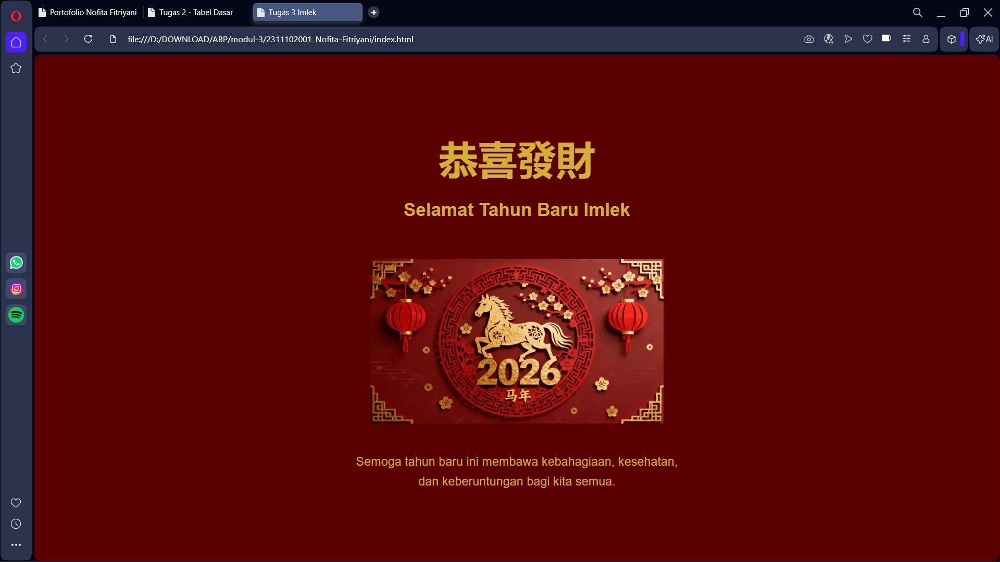

<h1 align="center">LAPORAN PRAKTIKUM</h1>
<h1 align="center">APLIKASI BERBASIS PLATFORM</h1>

<br>

<h2 align="center">MODUL 2</h2>
<h2 align="center">CSS</h2>

<br><br>

<p align="center">

</p>
<br><br><br>

<h2 align="center">Disusun Oleh :</h2>

<p align="center" style="font-size:28px;">
  <b>Nofita Fitriyani</b><br>
  <b>2311102001</b><br>
  <b>S1 IF-11-REG 01</b>
</p>
<br>
<h2 align="center">Dosen Pengampu :</h2>

<p align="center" style="font-size:28px;">
  <b>Dimas Fanny Hebrasianto Permadi, S.ST., M.Kom</b>
</p>
<br>
<h2 align="center">Asisten Praktikum :</h2>

<p align="center" style="font-size:28px;">
  <b>Apri Pandu Wicaksono</b><br>
  <b>Rangga Pradarrell Fathi</b>
</p>
<br>
<h1 align="center">LABORATORIUM HIGH PERFORMANCE</h1>
<h1 align="center">FAKULTAS INFORMATIKA</h1>
<h1 align="center">UNIVERSITAS TELKOM PURWOKERTO</h1>
<h1 align="center">TAHUN 2026</h1>

<hr>

### Dasar Teori
Cascading Style Sheets (CSS) merupakan bahasa yang membantu memperindah tampilan dari laman web
yang telah dibangun dengan HTML. CSS mendeskripsikan bagaimana bentuk tampilan elemen HTML
seharusnya saat ditampilkan pada laman browser.
Dengan menggunakan CSS, pengembang web dapat mengatur berbagai aspek visual seperti warna, ukuran teks, jenis font, jarak antar elemen, posisi elemen, hingga tata letak halaman secara keseluruhan. CSS memungkinkan halaman web yang awalnya hanya berupa struktur teks sederhana menjadi lebih menarik dan mudah dibaca.

CSS memiliki beberapa metode penggunaan, yaitu inline CSS, internal CSS, dan external CSS. Inline CSS dituliskan langsung pada elemen HTML menggunakan atribut `style`. Internal CSS dituliskan di dalam tag `<style>` pada bagian `<head>` dokumen HTML. Sedangkan external CSS dituliskan pada file terpisah dengan ekstensi `.css`, kemudian dihubungkan dengan file HTML menggunakan tag `<link>`. Penggunaan external CSS umumnya lebih disarankan karena membuat struktur kode lebih rapi dan mudah dikelola.

Beberapa properti dasar dalam CSS yang sering digunakan antara lain `background-color` untuk mengatur warna latar belakang, `color` untuk mengatur warna teks, `font-family` untuk menentukan jenis font yang digunakan, serta `text-align` untuk mengatur posisi teks. Selain itu terdapat juga properti seperti `margin` dan `padding` yang digunakan untuk mengatur jarak antar elemen pada halaman.
Dengan memanfaatkan CSS, tampilan sebuah halaman web dapat dibuat lebih menarik, terstruktur, dan nyaman dilihat oleh pengguna.

### Source Code HTML
```html
<!DOCTYPE html>
<html lang="id">
<head>
    <meta charset="UTF-8">
    <title>Tugas 3 Imlek</title>

    <link rel="stylesheet" href="style.css">
</head>

<body>

<div class="container">

    <h1>恭喜發財</h1>
    <h2>Selamat Tahun Baru Imlek</h2>

    

    <h3>
        Semoga tahun baru ini membawa kebahagiaan,
        kesehatan, dan keberuntungan bagi kita semua.
    </h3>

</div>

</body>
</html>
```
### Source Code CSS

```
body{
    background-color:#5a0000;
    color:#d4af37;
    font-family: Arial, sans-serif;
    text-align:center;
}

.container{
    margin-top:120px;
}

h1{
    font-size:60px;
    margin-bottom:10px;
}

h2{
    font-size:28px;
    margin-bottom:20px;
}

h3{
    width:500px;
    margin:auto;
    font-weight:normal;
    line-height:1.6;
}

img{
    width:450px;
    margin:40px 0;
}

```
### Output 



### Penjelasan Kode Program
Pada bagian body, digunakan beberapa properti CSS untuk mengatur tampilan dasar halaman. Properti background-color digunakan untuk menentukan warna latar belakang halaman. Properti color digunakan untuk mengatur warna teks agar lebih kontras dengan latar belakang. Properti font-family digunakan untuk menentukan jenis huruf yang digunakan pada halaman, sedangkan text-align:center digunakan agar seluruh teks berada di posisi tengah.

Bagian .container digunakan sebagai pembungkus utama dari konten halaman. Properti margin-top digunakan untuk memberikan jarak dari bagian atas halaman agar tampilan tidak terlalu menempel pada bagian atas browser.

Pada bagian h1, properti font-size digunakan untuk memperbesar ukuran teks sehingga judul utama terlihat lebih menonjol. Properti margin-bottom digunakan untuk memberikan jarak antara judul dengan elemen berikutnya.

Pada bagian h2, properti font-size digunakan untuk mengatur ukuran subjudul agar sedikit lebih kecil dari judul utama, sedangkan margin-bottom digunakan untuk memberikan jarak dengan elemen berikutnya.

Pada bagian h3, digunakan properti width untuk membatasi lebar teks sehingga tidak terlalu melebar pada layar. Properti margin:auto digunakan untuk menempatkan elemen di tengah halaman. Properti font-weight:normal digunakan untuk mengatur ketebalan teks agar tidak terlalu tebal, sedangkan line-height digunakan untuk memberikan jarak antar baris teks sehingga lebih mudah dibaca.

Pada bagian img, properti width digunakan untuk menentukan ukuran lebar gambar yang ditampilkan pada halaman. Properti margin digunakan untuk memberikan jarak antara gambar dengan elemen lain di sekitarnya agar tampilan halaman terlihat lebih rapi.

### Kesimpulan
Berdasarkan praktikum yang telah dilakukan, dapat disimpulkan bahwa CSS merupakan bahasa yang digunakan untuk mengatur tampilan halaman web agar lebih menarik dan terstruktur. Dengan menggunakan CSS, pengembang dapat mengatur warna, ukuran teks, posisi elemen, serta jarak antar elemen pada halaman web. Penggunaan CSS juga membuat halaman web lebih rapi karena memisahkan struktur halaman dengan tampilan visualnya.