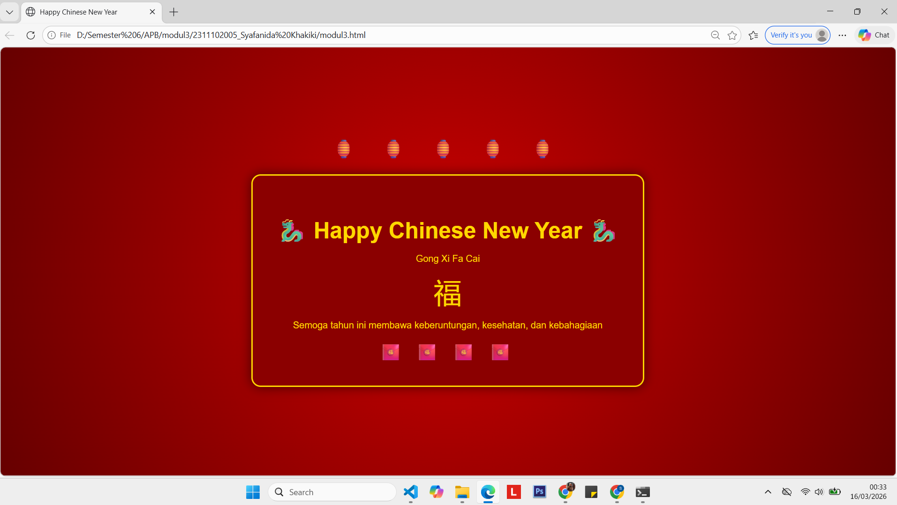

<div align="center">
  <br />
  <h1>LAPORAN PRAKTIKUM <br>APLIKASI BERBASIS PLATFORM</h1>
  <br />
  <h2>MODUL 3 <br></h2>
  <br />
  <br />
   
  <br />
  <br />
  <br />
  <h3>Disusun Oleh :</h3>
  <p>
    <strong>Syafanida Khakiki</strong><br>
    <strong>2311102005</strong><br>
    <strong>S1 IF-11-REG 01</strong>
  </p>
  <br />
  <h3>Dosen Pengampu :</h3>
  <p>
    <strong>Dimas Fanny Hebrasianto Permadi, S.ST., M.Kom</strong>
  </p>
  <br />
  <br />
    <h4>Asisten Praktikum :</h4>
    <strong> Apri Pandu Wicaksono </strong> <br>
    <strong>Rangga Pradarrell Fathi</strong>
  <br />
  <h2>LABORATORIUM HIGH PERFORMANCE
 <br>FAKULTAS INFORMATIKA <br>UNIVERSITAS TELKOM PURWOKERTO <br>2026</h2>
</div>


---

# 1. Dasar Teori

---
HTML (HyperText Markup Language) adalah bahasa yang digunakan untuk membuat struktur halaman web. HTML digunakan untuk menampilkan berbagai elemen seperti teks, gambar, dan layout halaman.

CSS (Cascading Style Sheets) digunakan untuk mengatur tampilan dari halaman HTML seperti warna, ukuran teks, posisi elemen, dan dekorasi visual.

Pada tugas ini dibuat halaman web bertema Perayaan Tahun Baru Imlek menggunakan HTML dan CSS tanpa library maupun JavaScript. Tampilan menggunakan warna khas Imlek yaitu merah dan emas serta dekorasi emoji lampion, naga, dan angpao agar terlihat lebih menarik.

---
# 2. Penjelasan Kode HTML
Halaman dibuat menggunakan struktur dasar HTML dan styling menggunakan CSS yang ditulis di dalam tag <style>.
### Kode HTML (`modul-3.html`)

```html
<!DOCTYPE html>
<html>

<head>
    <title>Happy Chinese New Year</title>

    <style>
        body {
            margin: 0;
            font-family: Arial, sans-serif;
            background: radial-gradient(circle, #cc0000, #660000);
            height: 100vh;
            display: flex;
            justify-content: center;
            align-items: center;
            flex-direction: column;
            color: gold;
        }

        /* lampion atas */
        .lampion {
            font-size: 40px;
            letter-spacing: 20px;
            margin-bottom: 30px;
        }

        /* kartu ucapan */
        .card {
            background: #8b0000;
            padding: 50px;
            border-radius: 20px;
            text-align: center;
            border: 3px solid gold;
            box-shadow: 0 0 25px rgba(0, 0, 0, 0.6);
        }

        h1 {
            font-size: 48px;
            margin-bottom: 10px;
        }

        p {
            font-size: 20px;
        }

        .symbol {
            font-size: 60px;
            margin: 15px 0;
        }

        /* dekorasi bawah */
        .decor {
            font-size: 35px;
            margin-top: 20px;
            letter-spacing: 10px;
        }
    </style>
</head>

<body>

    <div class="lampion">
        🏮 🏮 🏮 🏮 🏮
    </div>

    <div class="card">

        <h1>🐉 Happy Chinese New Year 🐉</h1>

        <p>Gong Xi Fa Cai</p>

        <div class="symbol">福</div>

        <p>Semoga tahun ini membawa keberuntungan, kesehatan, dan kebahagiaan</p>

        <div class="decor">
            🧧 🧧 🧧 🧧
        </div>

    </div>

</body>

</html>
```

# 3. Tampilan Hasil
Berikut tampilan halaman web di browser:


### Penjelasan Code
`<!DOCTYPE html>`
Menentukan bahwa dokumen menggunakan standar HTML5. <br>
`<html>`
Elemen utama yang membungkus seluruh isi halaman web.<br>
`<head>`
Berisi informasi halaman seperti judul halaman dan kode CSS.<br>
`<title>`
Menampilkan judul halaman pada tab browser.<br>
`<style>`
Digunakan untuk menuliskan kode CSS yang mengatur tampilan halaman.<br>
`<body>`
Berisi seluruh konten yang ditampilkan di halaman web.<br>
`<div>`
Digunakan untuk mengelompokkan elemen dalam halaman seperti bagian lampion, kartu ucapan, dan dekorasi.<br>
`<h1>` dan `<p>`
Digunakan untuk menampilkan judul dan teks pada halaman.<br>
Class CSS `(.lampion, .card, .symbol, .decor)`
Digunakan untuk memberikan style pada elemen tertentu agar tampilan lebih teratur.
