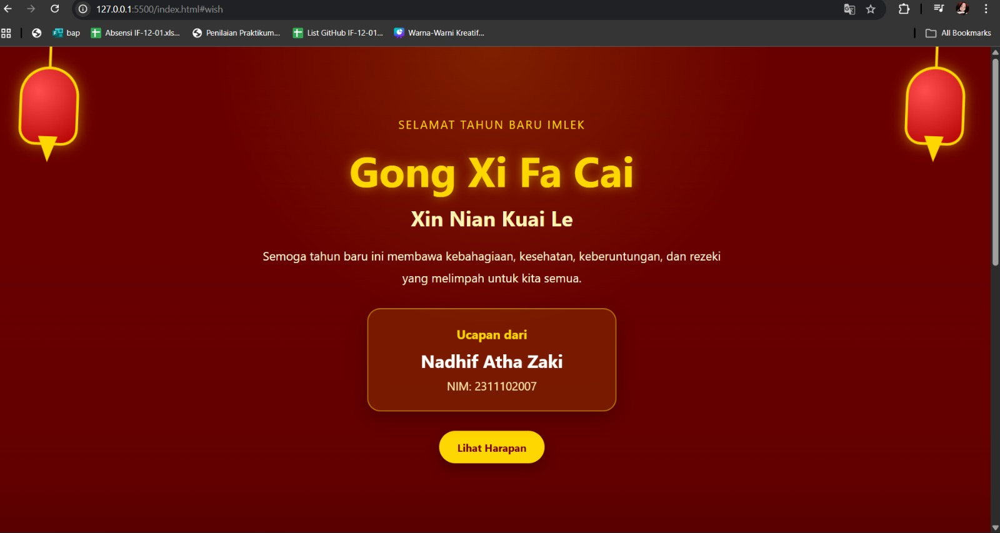

<div align="center">
  <br />
  <h1>LAPORAN PRAKTIKUM <br>APLIKASI BERBASIS PLATFORM</h1>
  <br />
  <h3>MODUL 3 <br> CSS - CASCADING STYLE SHEET</h3>
  <br />
  <br />
   
  <br />
  <br />
  <br />
  <br />
  <h3>Disusun Oleh :</h3>
  <p>
    <strong>Nadhif Atha Zaki</strong><br>
    <strong>2311102007</strong><br>
    <strong>S1 IF-11-REG01</strong>
  </p>
  <br />
  <h3>Dosen Pengampu :</h3>
  <p>
    <strong>Dimas Fanny Hebrasianto Permadi, S.ST., M.Kom</strong>
  </p>
  <br />
  <br />
    <h4>Asisten Praktikum :</h4>
    <strong> Apri Pandu Wicaksono </strong> <br>
    <strong>Rangga Pradarrell Fathi</strong>
  <br />
  <h3>LABORATORIUM HIGH PERFORMANCE
 <br>FAKULTAS INFORMATIKA <br>UNIVERSITAS TELKOM PURWOKERTO <br>2026</h3>
</div>

---

## 1. Dasar Teori

**CSS (Cascading Style Sheets)** merupakan bahasa yang digunakan bersama HTML untuk mengatur tampilan visual pada halaman web. Jika HTML berperan sebagai struktur atau kerangka dasar sebuah halaman, maka CSS bertugas memperindah tampilannya seperti pengaturan warna, tata letak, ukuran elemen, hingga dekorasi visual lainnya.

CSS bekerja dengan cara memilih elemen HTML menggunakan **selector** seperti tag, *class*, atau *id*, kemudian menerapkan aturan gaya berupa properti tertentu seperti warna, ukuran teks, jarak, dan sebagainya. Dengan menggunakan CSS, pengembang dapat memisahkan antara struktur konten (HTML) dan tampilan visual (CSS), sehingga kode menjadi lebih terorganisir dan lebih mudah untuk dikelola atau diperbarui.

Secara umum terdapat tiga metode untuk menambahkan CSS ke dalam dokumen HTML, yaitu:

1. **Inline CSS**  
   Gaya dituliskan langsung pada elemen HTML menggunakan atribut `style`.

2. **Internal CSS**  
   Aturan CSS ditulis di dalam tag `<style>` yang ditempatkan pada bagian `<head>` dokumen HTML.

3. **External CSS**  
   Aturan CSS disimpan pada file terpisah dengan ekstensi `.css`, kemudian dihubungkan ke file HTML menggunakan tag `<link>`. Cara ini merupakan praktik yang paling dianjurkan dalam pengembangan web karena membuat pengelolaan kode menjadi lebih terstruktur, terutama pada proyek yang lebih besar.

## 2. Penjelasan Kode HTML dan CSS

Berikut ini adalah implementasi desain kartu ucapan yang digabungkan antara struktur kerangka dasar HTML murni dan desain modern visual yang diambil dari *External CSS*, beserta hasil tampilannya.

### Kode HTML (`imlek.html`)

```html
<!DOCTYPE html>
<html lang="id">
<head>
  <meta charset="UTF-8" />
  <meta name="viewport" content="width=device-width, initial-scale=1.0" />
  <title>Ucapan Imlek - Nadhif Atha Zaki</title>
  <link rel="stylesheet" href="style.css" />
</head>
<body>
  <div class="lantern lantern-left"></div>
  <div class="lantern lantern-right"></div>

  <header class="hero">
    <div class="overlay"></div>
    <div class="container">
      <p class="mini-text">Selamat Tahun Baru Imlek</p>
      <h1>Gong Xi Fa Cai</h1>
      <h2>Xin Nian Kuai Le</h2>
      <p class="description">
        Semoga tahun baru ini membawa kebahagiaan, kesehatan, keberuntungan,
        dan rezeki yang melimpah untuk kita semua.
      </p>

      <div class="profile-card">
        <h3>Ucapan dari</h3>
        <p class="name">Nadhif Atha Zaki</p>
        <p class="nim">NIM: 2311102007</p>
      </div>

      <a href="#wish" class="btn">Lihat Harapan</a>
    </div>
  </header>

  <main>
    <section class="section" id="wish">
      <div class="content-box">
        <h2>Harapan di Tahun Baru Imlek</h2>
        <p>
          Tahun Baru Imlek menjadi momen yang penuh makna untuk memulai lembaran baru
          dengan semangat, harapan, dan doa terbaik. Semoga setiap langkah yang dijalani
          dipenuhi kedamaian, kesuksesan, dan kebersamaan bersama keluarga serta orang-orang tersayang.
        </p>
      </div>
    </section>

    <section class="section alt-section">
      <div class="cards">
        <div class="card">
          <div class="icon">🧧</div>
          <h3>Keberuntungan</h3>
          <p>Semoga datang banyak peluang baik dan keberuntungan sepanjang tahun.</p>
        </div>
        <div class="card">
          <div class="icon">🏮</div>
          <h3>Kebahagiaan</h3>
          <p>Semoga hati selalu dipenuhi sukacita, kedamaian, dan semangat baru.</p>
        </div>
        <div class="card">
          <div class="icon">🐉</div>
          <h3>Kesuksesan</h3>
          <p>Semoga semua cita-cita, usaha, dan impian dapat tercapai dengan lancar.</p>
        </div>
      </div>
    </section>
  </main>

  <footer>
    <p>© 2026 | Website Ucapan Imlek</p>
    <p>Nadhif Atha Zaki - 2311102007</p>
  </footer>
</body>
</html>
```

### Kode CSS (`style.css`)

```css
** {
  margin: 0;
  padding: 0;
  box-sizing: border-box;
  font-family: "Segoe UI", Tahoma, Geneva, Verdana, sans-serif;
}

html {
  scroll-behavior: smooth;
}

body {
  background: linear-gradient(180deg, #7a0000 0%, #a80000 40%, #5e0000 100%);
  color: #fff8dc;
  min-height: 100vh;
  overflow-x: hidden;
}

/* Lentera */
.lantern {
  width: 90px;
  height: 120px;
  background: radial-gradient(circle at 30% 30%, #ff4d4d, #b30000);
  border: 4px solid #ffd700;
  border-radius: 45px 45px 25px 25px;
  position: fixed;
  top: 30px;
  z-index: 10;
  box-shadow: 0 0 20px rgba(255, 215, 0, 0.5);
  animation: swing 3s ease-in-out infinite;
}

.lantern::before {
  content: "";
  position: absolute;
  width: 4px;
  height: 50px;
  background: #ffd700;
  top: -50px;
  left: 50%;
  transform: translateX(-50%);
}

.lantern::after {
  content: "";
  position: absolute;
  width: 30px;
  height: 40px;
  background: #ffd700;
  bottom: -30px;
  left: 50%;
  transform: translateX(-50%);
  clip-path: polygon(50% 100%, 0 0, 100% 0);
}

.lantern-left {
  left: 40px;
}

.lantern-right {
  right: 40px;
}

@keyframes swing {
  0%, 100% {
    transform: rotate(3deg);
  }
  50% {
    transform: rotate(-3deg);
  }
}

/* Hero */
.hero {
  position: relative;
  min-height: 100vh;
  display: flex;
  align-items: center;
  justify-content: center;
  text-align: center;
  padding: 40px 20px;
}

.overlay {
  position: absolute;
  inset: 0;
  background:
    radial-gradient(circle at top, rgba(255, 215, 0, 0.15), transparent 40%),
    linear-gradient(to bottom, rgba(0, 0, 0, 0.15), rgba(0, 0, 0, 0.45));
}

.container {
  position: relative;
  z-index: 2;
  max-width: 850px;
}

.mini-text {
  font-size: 1.1rem;
  letter-spacing: 2px;
  color: #ffd700;
  margin-bottom: 15px;
  text-transform: uppercase;
}

.hero h1 {
  font-size: 4rem;
  color: #ffd700;
  text-shadow: 0 0 15px rgba(255, 215, 0, 0.5);
  margin-bottom: 10px;
}

.hero h2 {
  font-size: 2rem;
  color: #fff2b3;
  margin-bottom: 20px;
}

.description {
  font-size: 1.15rem;
  line-height: 1.8;
  max-width: 700px;
  margin: 0 auto 30px;
  color: #fff5d6;
}

.profile-card {
  background: rgba(255, 215, 0, 0.12);
  border: 2px solid rgba(255, 215, 0, 0.45);
  border-radius: 20px;
  padding: 25px;
  max-width: 380px;
  margin: 0 auto 30px;
  box-shadow: 0 10px 30px rgba(0, 0, 0, 0.25);
  backdrop-filter: blur(6px);
}

.profile-card h3 {
  color: #ffd700;
  margin-bottom: 10px;
  font-size: 1.2rem;
}

.name {
  font-size: 1.7rem;
  font-weight: bold;
  margin-bottom: 8px;
  color: #ffffff;
}

.nim {
  font-size: 1.1rem;
  color: #ffe9a8;
}

.btn {
  display: inline-block;
  text-decoration: none;
  background: #ffd700;
  color: #7a0000;
  font-weight: bold;
  padding: 14px 28px;
  border-radius: 30px;
  transition: 0.3s ease;
  box-shadow: 0 8px 20px rgba(0, 0, 0, 0.25);
}

.btn:hover {
  background: #fff1a8;
  transform: translateY(-3px);
}

/* Section */
.section {
  padding: 80px 20px;
}

.content-box {
  max-width: 900px;
  margin: 0 auto;
  text-align: center;
  background: rgba(255, 255, 255, 0.08);
  border: 2px solid rgba(255, 215, 0, 0.25);
  border-radius: 22px;
  padding: 40px 30px;
}

.content-box h2 {
  font-size: 2.2rem;
  color: #ffd700;
  margin-bottom: 20px;
}

.content-box p {
  font-size: 1.1rem;
  line-height: 1.9;
  color: #fff5d6;
}

.alt-section {
  background: rgba(0, 0, 0, 0.12);
}

.cards {
  max-width: 1100px;
  margin: 0 auto;
  display: grid;
  grid-template-columns: repeat(3, 1fr);
  gap: 25px;
}

.card {
  background: rgba(255, 255, 255, 0.09);
  border: 2px solid rgba(255, 215, 0, 0.28);
  border-radius: 20px;
  padding: 30px 22px;
  text-align: center;
  transition: 0.3s ease;
}

.card:hover {
  transform: translateY(-6px);
  box-shadow: 0 12px 24px rgba(0, 0, 0, 0.2);
}

.icon {
  font-size: 3rem;
  margin-bottom: 15px;
}

.card h3 {
  color: #ffd700;
  margin-bottom: 10px;
  font-size: 1.4rem;
}

.card p {
  color: #fff5d6;
  line-height: 1.7;
}

/* Footer */
footer {
  text-align: center;
  padding: 30px 20px;
  background: rgba(0, 0, 0, 0.2);
  color: #ffe9a8;
  font-size: 0.95rem;
}

footer p:first-child {
  margin-bottom: 8px;
}

/* Responsive */
@media (max-width: 900px) {
  .hero h1 {
    font-size: 3rem;
  }

  .hero h2 {
    font-size: 1.5rem;
  }

  .cards {
    grid-template-columns: 1fr;
  }
}

@media (max-width: 600px) {
  .lantern {
    width: 65px;
    height: 90px;
  }

  .lantern-left {
    left: 15px;
  }

  .lantern-right {
    right: 15px;
  }

  .hero h1 {
    font-size: 2.3rem;
  }

  .hero h2 {
    font-size: 1.2rem;
  }

  .description,
  .content-box p,
  .card p {
    font-size: 1rem;
  }

  .profile-card {
    padding: 20px;
  }

  .name {
    font-size: 1.4rem;
  }
}
```

### Hasil Tampilan (Screenshot)


### Penjelasan Code

#### 1. HTML

- Pada bagian `<head>`, tag `<meta charset="UTF-8">` digunakan agar halaman dapat menampilkan karakter dengan baik, sedangkan tag `<meta name="viewport">` berfungsi supaya tampilan website tetap responsif saat dibuka di perangkat mobile. Tag `<title>` dipakai untuk memberi judul halaman pada tab browser, dan tag `<link rel="stylesheet" href="style.css">` digunakan untuk menghubungkan file HTML dengan file CSS eksternal.

- Pada bagian awal `<body>`, terdapat dua elemen `<div>` dengan class `lantern lantern-left` dan `lantern lantern-right`. Kedua elemen ini berfungsi sebagai ornamen lampion di sisi kiri dan kanan halaman. Bentuk visualnya tidak dibuat langsung di HTML, tetapi diatur melalui CSS.

- Pada bagian `<header class="hero">`, elemen ini menjadi bagian utama atau tampilan pembuka website. Di dalamnya terdapat `<div class="overlay">` yang berfungsi sebagai lapisan tambahan untuk memberi efek gelap dan gradasi pada latar belakang agar teks terlihat lebih jelas.

- Di dalam `<div class="container">`, terdapat beberapa elemen teks seperti `<p class="mini-text">`, `<h1>`, `<h2>`, dan `<p class="description">` yang digunakan untuk menampilkan ucapan Imlek, judul utama, subjudul, dan deskripsi harapan tahun baru.

- Pada bagian `<div class="profile-card">`, elemen ini digunakan untuk menampilkan identitas pembuat ucapan, yaitu nama **Nadhif Atha Zaki** dan **NIM 2311102007**. Struktur ini dibuat terpisah agar dapat diberi tampilan khusus seperti kartu profil.

- Tag `<a href="#wish" class="btn">` digunakan sebagai tombol navigasi. Saat tombol diklik, halaman akan langsung berpindah ke bagian dengan id `wish`, yaitu bagian harapan Tahun Baru Imlek.

- Pada bagian `<main>`, terdapat dua section utama. Section pertama dengan id `wish` berisi teks harapan di Tahun Baru Imlek, sedangkan section kedua menampilkan tiga kartu ucapan dengan ikon emoji, yaitu keberuntungan, kebahagiaan, dan kesuksesan.

- Pada bagian `<footer>`, digunakan tag `<p>` untuk menampilkan informasi penutup website, yaitu copyright dan identitas pembuat halaman.

#### 2. Styling CSS (`style.css`)

- Pada selector universal `*`, properti `margin: 0`, `padding: 0`, dan `box-sizing: border-box` digunakan untuk mereset tampilan default browser agar semua elemen memiliki jarak awal yang konsisten. Properti `font-family` digunakan untuk menentukan jenis huruf utama pada seluruh halaman.

- Pada elemen `body`, properti `background: linear-gradient(...)` digunakan untuk membuat latar belakang berwarna merah gradasi yang sesuai dengan nuansa Imlek. Properti `color` mengatur warna teks utama, sedangkan `min-height: 100vh` memastikan tinggi halaman minimal memenuhi layar.

- Pada class `.lantern`, CSS digunakan untuk membentuk ornamen lampion dengan ukuran tertentu, warna merah, border emas, dan efek bayangan. Pseudo-element `::before` dipakai untuk membuat tali lampion, sedangkan `::after` digunakan untuk membuat bagian hiasan bawah lampion. Properti `animation` dengan `@keyframes swing` memberi efek lampion bergoyang.

- Pada class `.hero`, digunakan properti seperti `min-height: 100vh`, `display: flex`, `align-items: center`, dan `justify-content: center` agar konten utama tampil tepat di tengah layar, baik secara horizontal maupun vertikal. Properti `text-align: center` membuat seluruh isi teks rata tengah.

- Pada class `.overlay`, properti `position: absolute` dan `inset: 0` membuat lapisan ini menutupi seluruh area hero. Background gradasi pada overlay berfungsi menambahkan efek visual dan membantu meningkatkan keterbacaan teks.

- Pada class `.container`, properti `position: relative` dan `z-index: 2` digunakan agar konten utama tampil di atas lapisan overlay. `max-width` membatasi lebar konten supaya tetap rapi di layar besar.

- Pada class seperti `.mini-text`, `.hero h1`, `.hero h2`, dan `.description`, CSS mengatur ukuran huruf, warna teks, jarak antar elemen, serta efek bayangan teks agar tampilan judul terlihat lebih menarik.

- Pada class `.profile-card`, properti `background`, `border`, `border-radius`, `padding`, dan `box-shadow` digunakan untuk membuat tampilan kartu identitas yang elegan. Efek `backdrop-filter: blur(6px)` memberi kesan transparan modern pada kartu.

- Pada class `.btn`, properti `display: inline-block`, `padding`, `border-radius`, `background`, dan `text-decoration` digunakan untuk membuat tombol dengan tampilan bulat, berwarna emas, dan mudah dikenali. Efek `:hover` menambahkan perubahan warna dan gerakan kecil saat kursor diarahkan ke tombol.

- Pada class `.section`, `.content-box`, `.cards`, dan `.card`, CSS digunakan untuk mengatur jarak antar bagian, latar belakang transparan, tata letak grid, serta tampilan kartu ucapan. Properti `grid-template-columns: repeat(3, 1fr)` membuat tiga kartu tampil sejajar pada layar besar.

- Pada class `.card:hover`, digunakan efek `transform` dan `box-shadow` untuk memberikan animasi ringan saat kartu disentuh pointer, sehingga tampilan terasa lebih interaktif.

- Pada bagian `footer`, CSS mengatur teks agar rata tengah, memberi jarak yang cukup, dan menambahkan latar belakang gelap transparan agar bagian penutup tetap selaras dengan tema utama.

- Pada bagian `@media`, CSS digunakan untuk membuat tampilan website responsif. Saat layar mengecil, ukuran lampion, judul, dan teks akan disesuaikan, serta susunan kartu berubah dari tiga kolom menjadi satu kolom agar tetap nyaman dilihat di perangkat mobile.

## Refrensi
- [Materi Modul 3](https://drive.google.com/file/d/1kd7ogQkR_rsNCnKDcJDmavY8FiOyTLzs/view?usp=sharing)