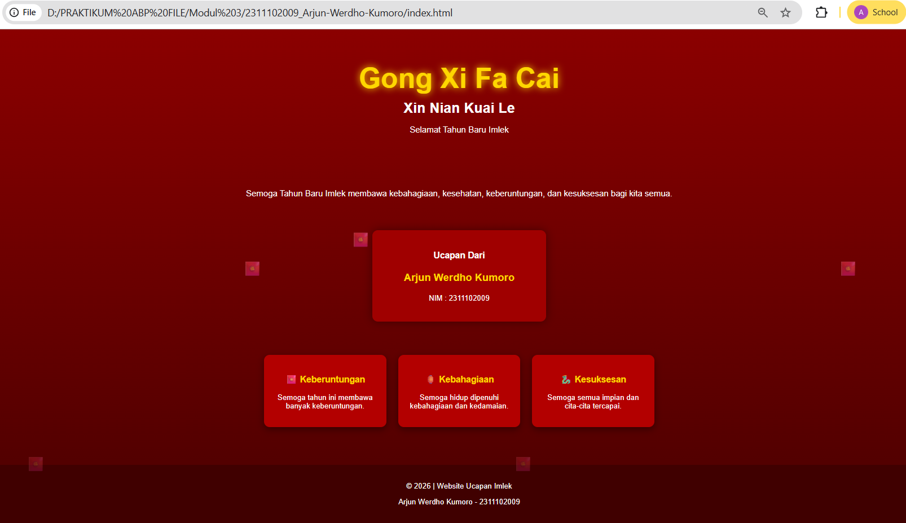

<div align="center">
  <br />
  <h1>LAPORAN PRAKTIKUM <br>APLIKASI BERBASIS PLATFORM</h1>
  <br />
  <h3>MODUL 3 <br> CSS</h3>
  <br />
    
  <br /><br /><br />

  <h3>Disusun Oleh :</h3>
  <p>
    <strong>Arjun Werdho Kumoro</strong><br>
    <strong>2311102009</strong><br>
    <strong>IF-11-REG01</strong>
  </p>

  <br />

  <h3>Dosen Pengampu :</h3>
  <p>
    <strong>Dimas Fanny Hebrasianto Permadi, S.ST., M.Kom</strong>
  </p>

  <br />

  <h4>Asisten Praktikum :</h4>
  <strong>Apri Pandu Wicaksono</strong><br>
  <strong>Rangga Pradarrell Fathi</strong>

  <br /><br />

  <h3>
  LABORATORIUM HIGH PERFORMANCE <br>
  FAKULTAS INFORMATIKA <br>
  UNIVERSITAS TELKOM PURWOKERTO <br>
  2026
  </h3>
</div>

---

# DASAR TEORI

Cascading Style Sheets (CSS) merupakan bahasa yang digunakan untuk mengatur tampilan dan desain dari halaman web yang dibuat menggunakan HTML. Dengan menggunakan CSS, pengembang web dapat mengontrol berbagai aspek tampilan seperti warna, ukuran teks, posisi elemen, hingga tata letak halaman sehingga tampilan website menjadi lebih menarik dan terstruktur. CSS bekerja dengan cara mendeskripsikan bagaimana suatu elemen HTML akan ditampilkan pada browser.

Struktur penulisan CSS terdiri dari selector dan declaration block. Selector digunakan untuk memilih elemen HTML yang akan diberikan gaya, sedangkan declaration block berisi properti dan nilai yang menentukan tampilan elemen tersebut. Dengan menggunakan CSS, halaman web dapat memiliki desain yang konsisten dan lebih mudah dikelola.

Dalam penggunaannya, CSS dapat diterapkan dengan tiga cara yaitu inline CSS, internal CSS, dan external CSS. Inline CSS dituliskan langsung pada atribut style di dalam tag HTML dan biasanya hanya digunakan untuk satu elemen. Internal CSS dituliskan di dalam tag `<style>` yang berada pada bagian `<head>` dokumen HTML. Sedangkan external CSS merupakan cara yang paling umum digunakan karena kode CSS disimpan dalam file terpisah dengan ekstensi .css dan dihubungkan dengan file HTML menggunakan tag `<link>`.

Selain itu, CSS juga menyediakan berbagai properti untuk mengatur tampilan teks seperti font-family, font-size, font-weight, dan color. Properti tersebut memungkinkan pengembang web untuk membuat tampilan halaman menjadi lebih menarik dan mudah dibaca oleh pengguna.
---

# UNGUIDED

## Code HTML

```html
<!DOCTYPE html>
<html lang="id">
<head>
<meta charset="UTF-8">
<meta name="viewport" content="width=device-width, initial-scale=1.0">
<title>Ucapan Imlek - Arjun Werdho Kumoro</title>
<link rel="stylesheet" href="style.css">
</head>

<body>

<!-- ANIMASI ANGPAO -->
<div class="angpao-container">
<span>🧧</span>
<span>🧧</span>
<span>🧧</span>
<span>🧧</span>
<span>🧧</span>
<span>🧧</span>
<span>🧧</span>
<span>🧧</span>
</div>

<header>
<h1>Gong Xi Fa Cai</h1>
<h2>Xin Nian Kuai Le</h2>
<p class="sub">Selamat Tahun Baru Imlek</p>
</header>

<section class="ucapan">
<p>
Semoga Tahun Baru Imlek membawa kebahagiaan,
kesehatan, keberuntungan, dan kesuksesan
bagi kita semua.
</p>
</section>

<section class="profil">
<h3>Ucapan Dari</h3>
<p class="nama">Arjun Werdho Kumoro</p>
<p class="nim">NIM : 2311102009</p>
</section>

<section class="harapan">

<div class="card">
<h3>🧧 Keberuntungan</h3>
<p>Semoga tahun ini membawa banyak keberuntungan.</p>
</div>

<div class="card">
<h3>🏮 Kebahagiaan</h3>
<p>Semoga hidup dipenuhi kebahagiaan dan kedamaian.</p>
</div>

<div class="card">
<h3>🐉 Kesuksesan</h3>
<p>Semoga semua impian dan cita-cita tercapai.</p>
</div>

</section>

<footer>
<p>© 2026 | Website Ucapan Imlek</p>
<p>Arjun Werdho Kumoro - 2311102009</p>
</footer>

</body>
</html>
```
## Code CSS
```html
body{
margin:0;
font-family:Arial, Helvetica, sans-serif;
background:linear-gradient(#8b0000,#4b0000);
color:white;
text-align:center;
overflow-x:hidden;
}

/* HEADER */

header{
padding:60px 20px;
}

header h1{
font-size:60px;
color:gold;
text-shadow:0 0 15px gold;
margin:10px;
}

header h2{
font-size:30px;
margin:10px;
}

.sub{
font-size:18px;
}

/* UCAPAN */

.ucapan{
width:70%;
margin:auto;
font-size:18px;
padding:20px;
}

/* PROFIL */

.profil{
background:#a00000;
width:320px;
margin:30px auto;
padding:25px;
border-radius:12px;
box-shadow:0 0 20px rgba(0,0,0,0.4);
}

.nama{
font-size:22px;
color:gold;
font-weight:bold;
}

.nim{
font-size:16px;
}

/* CARD */

.harapan{
display:flex;
justify-content:center;
flex-wrap:wrap;
gap:25px;
padding:40px;
}

.card{
background:#b30000;
width:220px;
padding:20px;
border-radius:12px;
transition:0.3s;
box-shadow:0 5px 15px rgba(0,0,0,0.4);
}

.card:hover{
transform:translateY(-10px) scale(1.05);
background:#d40000;
}

.card h3{
color:gold;
}

/* FOOTER */

footer{
background:#400000;
padding:20px;
margin-top:40px;
}

/* ANGPAO ANIMATION */

.angpao-container span{
position:fixed;
top:-50px;
font-size:30px;
animation:fall linear infinite;
}

.angpao-container span:nth-child(1){left:10%;animation-duration:5s;}
.angpao-container span:nth-child(2){left:20%;animation-duration:6s;}
.angpao-container span:nth-child(3){left:30%;animation-duration:4s;}
.angpao-container span:nth-child(4){left:40%;animation-duration:7s;}
.angpao-container span:nth-child(5){left:55%;animation-duration:5s;}
.angpao-container span:nth-child(6){left:70%;animation-duration:6s;}
.angpao-container span:nth-child(7){left:85%;animation-duration:4s;}
.angpao-container span:nth-child(8){left:95%;animation-duration:7s;}

@keyframes fall{

0%{
transform:translateY(-50px);
opacity:1;
}

100%{
transform:translateY(110vh);
opacity:0;
}

}
```
## Output

# Penjelasan

Halaman web ini dibuat untuk menampilkan ucapan Selamat Tahun Baru Imlek dengan tampilan yang menarik menggunakan HTML dan CSS. Pada bagian HTML dibuat beberapa struktur elemen seperti header untuk menampilkan judul utama, section untuk menampilkan isi ucapan dan harapan, serta footer untuk menampilkan informasi pembuat halaman.

Pada bagian CSS ditentukan beberapa warna utama seperti merah dan emas yang identik dengan perayaan Imlek. Selain itu CSS juga digunakan untuk mengatur tata letak halaman agar seluruh konten berada di tengah layar serta menambahkan latar belakang dengan gradasi warna sehingga tampilan halaman terlihat lebih menarik.

Teks utama “Gong Xi Fa Cai” diberikan efek text-shadow sehingga terlihat bercahaya dan lebih menonjol sebagai judul utama halaman. Selanjutnya ditambahkan beberapa elemen dekoratif seperti kartu harapan yang akan sedikit membesar ketika kursor diarahkan ke atasnya menggunakan efek hover dan transform.

Selain itu terdapat elemen angpao (🧧) yang dianimasikan menggunakan CSS animation dengan keyframes fall. Animasi tersebut membuat angpao terlihat jatuh dari bagian atas layar ke bawah secara terus-menerus sehingga memberikan kesan dekoratif pada halaman. Dengan kombinasi HTML dan CSS tersebut, halaman web dapat menampilkan ucapan Tahun Baru Imlek yang dekoratif serta memiliki animasi sederhana yang membuat tampilan lebih menarik.