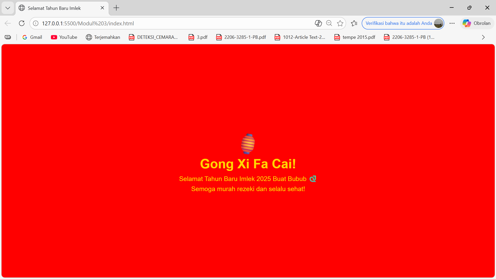

<div align="center">

# LAPORAN PRAKTIKUM
# APLIKASI BERBASIS PLATFORM

---

## MODUL 3
## HALAMAN PERAYAAN IMLEK

---


---

**Disusun Oleh :**

**ANNISA AL JAUHAR**

**2311102014**

**S1 IF-11-REG01**

---

**Dosen Pengampu :**

Dimas Fanny Hebrasianto Permadi, S.ST., M.Kom

---

**PROGRAM STUDI S1 INFORMATIKA**

**FAKULTAS INFORMATIKA**

**UNIVERSITAS TELKOM PURWOKERTO**

**2025/2026**

</div>

---

## 1. Dasar Teori

CSS (Cascading Style Sheets) merupakan bahasa yang digunakan untuk mengatur tampilan dan gaya visual dari elemen-elemen HTML pada halaman web. CSS bekerja dengan cara memilih elemen HTML tertentu dan menerapkan properti gaya seperti warna, ukuran, posisi, dan animasi.

Dalam pembuatan halaman web, CSS dapat ditulis langsung di dalam file HTML menggunakan tag `<style>` yang ditempatkan di dalam `<head>`. Cara ini disebut Internal CSS dan cocok digunakan untuk halaman web sederhana yang hanya terdiri dari satu file.

CSS menyediakan berbagai properti untuk mengatur tata letak halaman, salah satunya adalah **Flexbox**. Flexbox merupakan sistem layout satu dimensi yang memudahkan pengaturan posisi elemen secara horizontal maupun vertikal. Properti `display: flex` digunakan untuk mengaktifkan Flexbox, `justify-content: center` untuk meratakan konten secara horizontal, dan `align-items: center` untuk meratakan konten secara vertikal.

CSS juga menyediakan fitur **CSS Animation** yang memungkinkan pembuatan animasi tanpa menggunakan JavaScript sama sekali. Animasi dibuat menggunakan `@keyframes` yang mendefinisikan kondisi awal dan akhir dari sebuah animasi. Properti `animation` kemudian digunakan untuk menerapkan animasi tersebut ke elemen HTML, dengan mengatur nama animasi, durasi, pengulangan, dan arah animasi.

Properti `transform: rotate()` digunakan untuk memutar elemen pada sudut tertentu. Kombinasi antara `@keyframes` dan `transform: rotate()` menghasilkan efek goyang yang diterapkan pada elemen lampion di halaman ini.

---

## 2. Penjelasan Kode

Berikut adalah implementasi halaman perayaan Imlek menggunakan CSS murni tanpa library dan tanpa JavaScript.

### Kode HTML (index.html)
```html
<!DOCTYPE html>
<!-- 
    Nama  : Annisa Al Jauhar
    NIM   : 2311102014
    Kelas : S1 IF-11-REG01
-->
<html>
<head>
    <title>Selamat Tahun Baru Imlek</title>
    <style>
        body {
            background-color: red;
            display: flex;
            justify-content: center;
            align-items: center;
            height: 100vh;
            margin: 0;
            font-family: Arial, sans-serif;
        }

        .container {
            text-align: center;
            color: gold;
        }

        .judul {
            font-size: 50px;
            font-weight: bold;
        }

        .subjudul {
            font-size: 25px;
            margin-top: 10px;
        }

        .lampion {
            font-size: 80px;
            animation: goyang 1s infinite alternate;
        }

        @keyframes goyang {
            from { transform: rotate(-10deg); }
            to { transform: rotate(10deg); }
        }
    </style>
</head>
<body>
    <div class="container">
        <div class="lampion">🏮</div>
        <div class="judul">Gong Xi Fa Cai!</div>
        <div class="subjudul">Selamat Tahun Baru Imlek 2025 Buat Bubub 🐍</div>
        <div class="subjudul">Semoga murah rezeki dan selalu sehat!</div>
    </div>
</body>
</html>
```

### Penjelasan Kode

Pada bagian `body`, properti `background-color: red` memberikan warna merah khas perayaan Imlek. Flexbox diaktifkan dengan `display: flex` lalu `justify-content: center` dan `align-items: center` membuat seluruh konten berada tepat di tengah layar. Properti `height: 100vh` membuat body memenuhi tinggi seluruh layar.

Class `.container` mengatur semua teks di dalamnya menjadi rata tengah dengan `text-align: center` dan berwarna emas menggunakan `color: gold`.

Class `.lampion` menerapkan animasi goyang menggunakan properti `animation: goyang 1s infinite alternate`. Nilai `1s` berarti animasi berlangsung selama 1 detik, `infinite` berarti animasi berjalan terus-menerus, dan `alternate` berarti animasi berjalan bolak-balik.

Animasi `@keyframes goyang` mendefinisikan gerakan dari `rotate(-10deg)` ke `rotate(10deg)` sehingga menghasilkan efek lampion bergoyang ke kiri dan ke kanan.

---

## 3. Hasil



---

<div align="center">

</div>