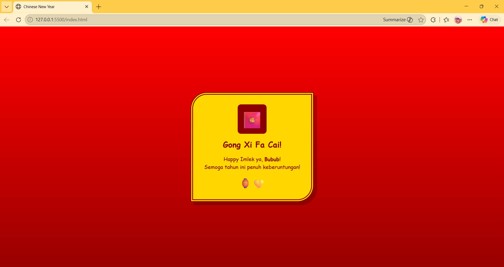

<div align="center">

# LAPORAN PRAKTIKUM
# APLIKASI BERBASIS PLATFORM


## MODUL 3
## CSS – Cascading Style Sheet


**Disusun Oleh :**

**Sherine Naura Early Gunawan**

**2311102020**

**S1 IF-11-REG01**

**Dosen Pengampu :**

Dimas Fanny Hebrasianto Permadi, S.ST., M.Kom

**PROGRAM STUDI S1 INFORMATIKA**

**FAKULTAS INFORMATIKA**

**UNIVERSITAS TELKOM PURWOKERTO**

**2025/2026**

</div>

---

## 1. Dasar Teori

CSS atau Cascading Style Sheet merupakan bahasa pemformatan yang digunakan untuk mengatur tampilan visual
sebuah halaman web yang dibuat dengan HTML. Jika HTML berfungsi sebagai kerangka atau struktur, maka CSS berperan
sebagai "desainer" yang mengatur warna, tata letak, ukuran font, hingga animasi. CSS memungkinkan pemisahan antara
konten (HTML) dan desain, sehingga pengelolaan tampilan menjadi lebih efisien.

---

## 2. Penjelasan kode

```html
<!DOCTYPE html>
<html>

<head>
    <title>Chinese New Year</title>
    <style>
        body {
            background: linear-gradient(to bottom, #ff0000, #990000);
            height: 100vh;
            margin: 0;
            display: flex;
            justify-content: center;
            align-items: center;
            font-family: 'Comic Sans MS', cursive;
        }

        .amplop-cinta {
            background-color: #ffd700;
            padding: 30px;
            border-radius: 50px 0px 50px 0px;
            border: 8px double #8B0000;
            box-shadow: 10px 10px 0px rgba(0, 0, 0, 0.2);
            width: 300px;
            color: #8B0000;
            text-align: center;
        }

        .tulisan-cina {
            font-size: 50px;
            background-color: #8B0000;
            color: #ffd700;
            display: inline-block;
            padding: 10px;
            border-radius: 10px;
            margin-bottom: 15px;
        }

        h2 {
            margin: 0;
            font-size: 24px;
        }

        p {
            font-size: 16px;
            line-height: 1.5;
        }
    </style>
</head>

<body>

    <div class="amplop-cinta">
        <div class="tulisan-cina">🧧</div>
        <h2>Gong Xi Fa Cai!</h2>
        <div style="font-size: 40px; margin: 10px 0;"></div>

        <p>Happy Imlek ya, seng! <br>
            Semoga tahun ini penuh keberuntungan!</p>

        <div style="font-size: 30px;">🏮💛</div>
    </div>

</body>

</html>
```
### Penjelasan kode

Secara keseluruhan, kode ini menggunakan Internal CSS untuk mengubah struktur HTML menjadi kartu ucapan digital yang
menarik. Latar belakang body diatur menggunakan linear-gradient merah serta fitur flexbox (align-items: center dan
justify-content: center) agar kartu tepat berada di tengah layar. Pada bagian utama, class .amplop-cinta menggunakan
border-radius unik dan border: 8px double untuk memberikan kesan bingkai ornamen klasik.

---

## 3. Hasil

<div align="center">
    
</div>