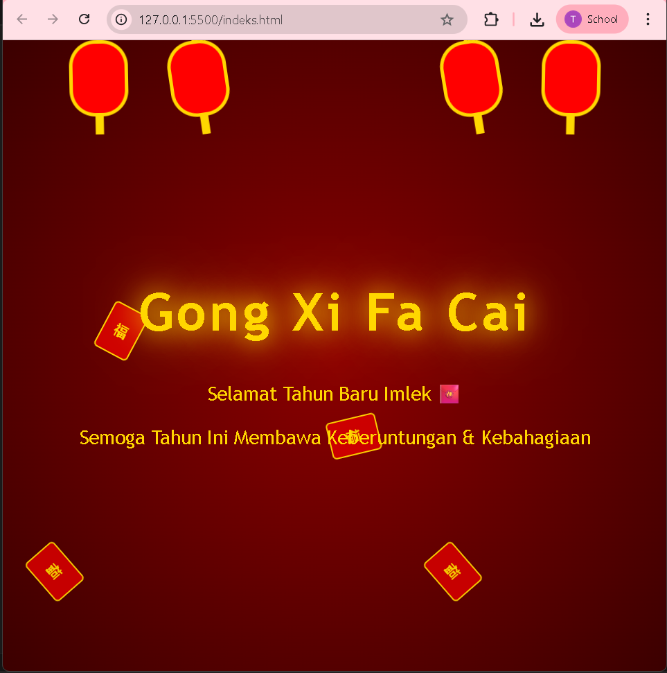

 <div align="center">

# LAPORAN PRAKTIKUM
# APLIKASI BERBASIS PLATFORM

---

## MODUL 3
## HALAMAN PERAYAAN IMLEK

---


---

**Disusun Oleh :**

**TEGAR BANGKIT WIJAYA**

**2311102027**

**S1 IF-11-REG01**

---

**Dosen Pengampu :**

Dimas Fanny Hebrasianto Permadi, S.ST., M.Kom

---

**PROGRAM STUDI S1 INFORMATIKA**

**FAKULTAS INFORMATIKA**

**UNIVERSITAS TELKOM PURWOKERTO**

**2025/2026**

</div>

---

## 1. Dasar Teori

CSS (Cascading Style Sheets) adalah bahasa yang digunakan untuk mendeskripsikan tampilan dan format dari dokumen HTML. CSS memisahkan konten dari presentasi visual sehingga memudahkan pengelolaan tampilan halaman web secara terpisah dari struktur HTML nya.

CSS dapat ditulis dengan tiga cara yaitu Inline CSS yang ditulis langsung pada elemen HTML, Internal CSS yang ditulis di dalam tag `<style>` pada bagian `<head>`, dan External CSS yang ditulis pada file terpisah berekstensi `.css`. Pada praktikum ini digunakan Internal CSS karena seluruh kode berada dalam satu file HTML.

Salah satu fitur CSS yang digunakan adalah **Radial Gradient** pada properti `background`. Radial Gradient menghasilkan transisi warna yang memancar dari titik pusat ke tepi, menciptakan efek kedalaman pada background halaman.

CSS juga mendukung pembuatan animasi melalui fitur **CSS Animation** yang terdiri dari dua komponen utama yaitu `@keyframes` dan properti `animation`. `@keyframes` mendefinisikan tahapan animasi dari kondisi awal hingga akhir, sedangkan properti `animation` menentukan nama animasi, durasi, pengulangan, dan timing function.

Properti `position: absolute` digunakan untuk memposisikan elemen secara bebas relatif terhadap elemen parent nya. Kombinasi dengan properti `top`, `left`, dan `right` memungkinkan penempatan elemen di posisi tertentu pada halaman. Properti `transform: rotate()` dan `translateY()` digunakan untuk memutar dan menggeser elemen secara vertikal dalam animasi.

Pseudo-element `::before` dan `::after` merupakan fitur CSS yang memungkinkan penambahan konten dekoratif sebelum atau sesudah elemen HTML tanpa mengubah struktur HTML. Pada praktikum ini pseudo-element digunakan untuk membuat tali dan rumbai pada lampion.

---

## 2. Penjelasan Kode

Berikut adalah implementasi halaman perayaan Imlek menggunakan CSS murni tanpa library dan tanpa JavaScript.

### Kode HTML (index.html)
```html
<!-- 
    Nama  : Tegar Bangkit Wijaya
    NIM   : 2311102027
    Kelas : S1 IF-11-REG01
-->
<!DOCTYPE html>
<html lang="id">
<head>
<meta charset="UTF-8">
<title>Selamat Imlek</title>
<style>
body{
    margin:0;
    height:100vh;
    display:flex;
    justify-content:center;
    align-items:center;
    background: radial-gradient(circle,#8b0000,#3b0000);
    font-family: "Trebuchet MS", sans-serif;
    overflow:hidden;
    color:#ffd700;
}
.title{
    text-align:center;
    z-index:2;
}
.title h1{
    font-size:60px;
    letter-spacing:4px;
    animation: glow 2s infinite alternate;
}
.title p{
    font-size:22px;
}
@keyframes glow{
    from{ text-shadow:0 0 10px gold; }
    to{ text-shadow:0 0 30px gold,0 0 60px orange; }
}
.lantern{
    position:absolute;
    width:60px;
    height:80px;
    background:red;
    border-radius:30px;
    border:4px solid gold;
    top:0;
    animation:swing 3s infinite ease-in-out;
}
.lantern::before{
    content:"";
    position:absolute;
    width:4px;
    height:40px;
    background:gold;
    top:-40px;
    left:50%;
    transform:translateX(-50%);
}
.lantern::after{
    content:"";
    position:absolute;
    width:10px;
    height:25px;
    background:gold;
    bottom:-25px;
    left:50%;
    transform:translateX(-50%);
}
.l1{ left:10%; animation-delay:0s;}
.l2{ left:25%; animation-delay:1s;}
.l3{ right:25%; animation-delay:0.5s;}
.l4{ right:10%; animation-delay:1.5s;}
@keyframes swing{
    0%{ transform:rotate(-10deg);}
    50%{ transform:rotate(10deg);}
    100%{ transform:rotate(-10deg);}
}
.angpao{
    position:absolute;
    width:40px;
    height:55px;
    background:#d00000;
    border:2px solid gold;
    border-radius:5px;
    animation:fall linear infinite;
}
.angpao::before{
    content:"福";
    position:absolute;
    color:gold;
    font-weight:bold;
    left:50%;
    top:50%;
    transform:translate(-50%,-50%);
}
@keyframes fall{
    from{ transform:translateY(-100px) rotate(0deg); opacity:1; }
    to{ transform:translateY(110vh) rotate(360deg); opacity:0.8; }
}
.a1{left:5%; animation-duration:7s;}
.a2{left:15%; animation-duration:9s;}
.a3{left:30%; animation-duration:6s;}
.a4{left:50%; animation-duration:8s;}
.a5{left:65%; animation-duration:7s;}
.a6{left:80%; animation-duration:10s;}
.a7{left:90%; animation-duration:6s;}
</style>
</head>
<body>
<div class="title">
    <h1>Gong Xi Fa Cai</h1>
    <p>Selamat Tahun Baru Imlek 🧧</p>
    <p>Semoga Tahun Ini Membawa Keberuntungan & Kebahagiaan</p>
</div>
<div class="lantern l1"></div>
<div class="lantern l2"></div>
<div class="lantern l3"></div>
<div class="lantern l4"></div>
<div class="angpao a1"></div>
<div class="angpao a2"></div>
<div class="angpao a3"></div>
<div class="angpao a4"></div>
<div class="angpao a5"></div>
<div class="angpao a6"></div>
<div class="angpao a7"></div>
</body>
</html>
```

### Penjelasan Kode

Background menggunakan `radial-gradient(circle, #8b0000, #3b0000)` yang menghasilkan gradasi warna merah tua dari tengah ke tepi layar, menciptakan suasana khas perayaan Imlek.

Elemen `.title` menggunakan Flexbox pada body untuk memposisikannya tepat di tengah layar. Animasi `glow` pada judul menggunakan `text-shadow` yang berubah dari `0 0 10px gold` menjadi `0 0 30px gold` secara bergantian menghasilkan efek cahaya berkilau.

Elemen `.lantern` menggunakan `position: absolute` agar bisa ditempatkan bebas di bagian atas halaman. Pseudo-element `::before` membuat tali lampion dan `::after` membuat rumbai di bawah lampion. Animasi `swing` memutar lampion bolak-balik antara `-10deg` dan `10deg`. Setiap lampion memiliki `animation-delay` berbeda agar tidak bergerak bersamaan.

Elemen `.angpao` jatuh dari atas ke bawah layar menggunakan animasi `fall` dengan `translateY` dari `-100px` hingga `110vh`. Pseudo-element `::before` menampilkan karakter 福 (keberuntungan) di tengah angpao. Setiap angpao memiliki durasi animasi berbeda agar terlihat natural.

---

## 3. Hasil



---

<div align="center">

*2311102027 - Tegar Bangkit Wijaya - S1 IF-11-REG01*

</div>
