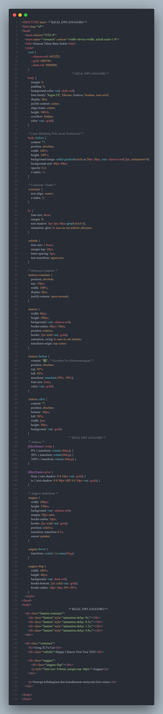



   
  <h1>LAPORAN PRAKTIKUM  APLIKASI BERBASIS PLATFORM</h1>
   
  <h3>MODUL 3   CSS</h3>
   
   
   
   
   
  <h3>Disusun Oleh :</h3>
  

    <strong>Rizal Dwi Anggoro</strong> 
    <strong>2311102034</strong> 
    <strong>IF-11-REG01</strong>
  

   
  <h3>Dosen Pengampu :</h3>
  

    <strong>Dimas Fanny Hebrasianto Permadi, S.ST., M.Kom</strong>
  

   
   
    <h4>Asisten Praktikum :</h4>
    <strong> Apri Pandu Wicaksono </strong>  
    <strong>Rangga Pradarrell Fathi</strong>
   
  <h3>LABORATORIUM HIGH PERFORMANCE
  FAKULTAS INFORMATIKA  UNIVERSITAS TELKOM PURWOKERTO  2026</h3>

---

### DASAR TEORI :

### UNGUIDED : 

**Code :**

**Penjelasan :**

Halaman web ini dibuat untuk menampilkan ucapan Selamat Tahun Baru Imlek dengan tampilan yang menarik menggunakan HTML dan CSS. Pada bagian CSS ditentukan beberapa warna utama seperti merah dan emas yang identik dengan perayaan Imlek. Selain itu CSS juga digunakan untuk mengatur tata letak halaman agar seluruh konten berada di tengah layar serta menambahkan latar belakang dengan pola dekoratif sehingga tampilan halaman terlihat lebih menarik. Teks utama “Gong Xi Fa Cai” diberikan efek animasi glow sehingga terlihat bercahaya dan lebih menonjol sebagai judul utama halaman.

Selanjutnya pada bagian isi halaman ditampilkan beberapa elemen dekorasi seperti lampion dan angpao. Lampion dibuat menggunakan elemen HTML yang diberi styling CSS sehingga memiliki bentuk menyerupai lampion tradisional berwarna merah dengan karakter Cina yang melambangkan keberuntungan. Lampion tersebut juga diberikan animasi swing sehingga terlihat seperti bergoyang. Selain itu terdapat elemen angpao yang akan sedikit membesar dan berputar ketika kursor diarahkan ke atasnya. Dengan kombinasi HTML dan CSS tersebut, halaman web dapat menampilkan ucapan Tahun Baru Imlek yang dekoratif serta memiliki animasi sederhana yang membuat tampilan lebih menarik.