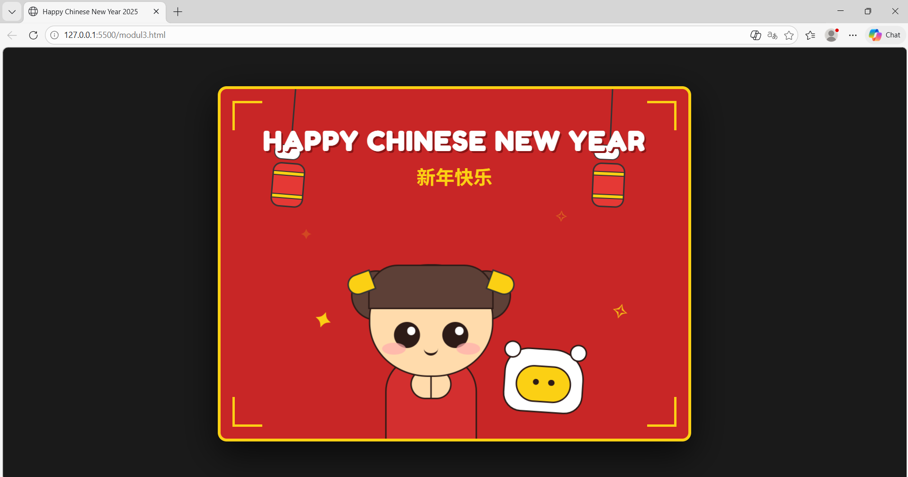

<div align="center">
  <br />
  <h1>LAPORAN PRAKTIKUM <br>APLIKASI BERBASIS PLATFORM</h1>
  <br />
  <h3>MODUL 3 <br> CSS - CASCADING STYLE SHEET</h3>
  <br />
  <br />
   
  <br />
  <br />
  <br />
  <br />
  <h3>Disusun Oleh :</h3>
  <p>
    <strong>Shiva Indah Kurnia</strong><br>
    <strong>2311102035</strong><br>
    <strong>S1 IF-11-REG01</strong>
  </p>
  <br />
  <h3>Dosen Pengampu :</h3>
  <p>
    <strong>Dimas Fanny Hebrasianto Permadi, S.ST., M.Kom</strong>
  </p>
  <br />
  <br />
    <h4>Asisten Praktikum :</h4>
    <strong> Apri Pandu Wicaksono </strong> <br>
    <strong>Rangga Pradarrell Fathi</strong>
  <br />
  <h3>LABORATORIUM HIGH PERFORMANCE
 <br>FAKULTAS INFORMATIKA <br>UNIVERSITAS TELKOM PURWOKERTO <br>2026</h3>
</div>

---

## 1. Dasar Teori

**CSS (Cascading Style Sheets)** adalah bahasa yang digunakan bersama HTML untuk mengatur tampilan visual pada halaman web. Jika HTML berfungsi sebagai struktur atau kerangka dasar sebuah halaman, maka CSS berperan dalam mempercantik tampilannya, seperti mengatur warna, tata letak, ukuran elemen, hingga berbagai dekorasi visual lainnya.

Cara kerja CSS adalah dengan memilih elemen HTML menggunakan selector, seperti tag, class, atau id, kemudian menerapkan aturan gaya melalui berbagai properti, misalnya warna, ukuran teks, jarak antar elemen, dan sebagainya. Dengan penggunaan CSS, struktur konten (HTML) dapat dipisahkan dari pengaturan tampilannya (CSS), sehingga kode menjadi lebih rapi, mudah dipelihara, dan lebih mudah diperbarui.

Secara umum terdapat tiga metode untuk menambahkan CSS ke dalam dokumen HTML, yaitu:

1. **Inline CSS**  
  Gaya CSS dituliskan langsung pada elemen HTML melalui atribut style.

2. **Internal CSS**  
  Aturan CSS ditulis di dalam tag <style> yang ditempatkan pada bagian <head> dalam dokumen HTML.

3. **External CSS**  
   Aturan CSS disimpan dalam file terpisah dengan ekstensi .css, lalu dihubungkan ke file HTML menggunakan tag <link>. Metode ini paling direkomendasikan dalam pengembangan web karena membuat pengelolaan kode lebih terstruktur, terutama untuk proyek yang lebih besar.
   
## 2. Penjelasan Kode HTML dan CSS

Berikut ini adalah implementasi desain kartu ucapan yang digabungkan antara struktur kerangka dasar HTML murni dan desain modern visual yang diambil dari *External CSS*, beserta hasil tampilannya.

### Kode HTML (`modul3.html`)

```html
<!DOCTYPE html>
<html lang="id">
<head>
    <meta charset="UTF-8">
    <meta name="viewport" content="width=device-width, initial-scale=1.0">
    <title>Happy Chinese New Year 2025</title>
    <link href="https://fonts.googleapis.com/css2?family=Fredoka+One&family=Noto+Sans+SC:wght@700&display=swap" rel="stylesheet">
    <style>
        /* RESET & BASE */
        *, *::before, *::after {
            box-sizing: border-box;
            margin: 0;
            padding: 0;
        }

        body {
            background-color: #1a1a1a;
            display: flex;
            justify-content: center;
            align-items: center;
            min-height: 100vh;
            font-family: 'Fredoka One', cursive, sans-serif;
            overflow: hidden;
        }

        /* KARTU UTAMA */
        .card {
            position: relative;
            width: 800px;
            height: 600px;
            background-color: #c82626;
            border: 5px solid #fbd014;
            border-radius: 15px;
            box-shadow: 0 20px 60px rgba(0,0,0,0.7);
            overflow: hidden;
        }

        /* BINGKAI SUDUT */
        .corner {
            position: absolute;
            width: 50px;
            height: 50px;
            border: 4px solid #fbd014;
            z-index: 20;
        }
        .corner-tl { top: 20px; left: 20px; border-right: none; border-bottom: none; }
        .corner-tr { top: 20px; right: 20px; border-left: none; border-bottom: none; }
        .corner-bl { bottom: 20px; left: 20px; border-right: none; border-top: none; }
        .corner-br { bottom: 20px; right: 20px; border-left: none; border-top: none; }

        /* TEKS & ANIMASI MUNCUL */
        .text-container {
            position: absolute;
            top: 60px;
            width: 100%;
            text-align: center;
            color: #fff;
            z-index: 10;
            animation: slideDown 1.2s ease-out;
        }
        @keyframes slideDown {
            from { opacity: 0; transform: translateY(-50px); }
            to { opacity: 1; transform: translateY(0); }
        }
        .text-container h1 { font-size: 2.8rem; letter-spacing: 2px; text-shadow: 3px 3px 0px #8a1515; }
        .text-container h2 { font-family: 'Noto Sans SC', sans-serif; color: #fbd014; font-size: 2rem; margin-top: 10px; }

        /* LAMPION BERAYUN */
        .lantern-container {
            position: absolute;
            top: -10px;
            transform-origin: top center;
            animation: swing 3.5s ease-in-out infinite alternate;
        }
        .lantern-left { left: 100px; }
        .lantern-right { right: 100px; animation-delay: -1.7s; }

        @keyframes swing {
            from { transform: rotate(-5deg); }
            to { transform: rotate(5deg); }
        }
        
        .string { width: 2px; height: 110px; background-color: #333; margin: 0 auto; }
        .cloud-dec { width: 45px; height: 25px; background: #fff; border-radius: 20px; border: 2px solid #333; position: relative; z-index: 2; margin-top: -5px;}
        .lantern {
            width: 55px; height: 75px; background-color: #e53935; border: 3px solid #333; border-radius: 15px; position: relative; margin-top: 5px;
        }
        .lantern::before, .lantern::after {
            content: ''; position: absolute; left: 0; width: 100%; height: 8px; background: #fbd014; border-top: 2px solid #333; border-bottom: 2px solid #333;
        }
        .lantern::before { top: 12px; } .lantern::after { bottom: 12px; }

        /* KEMBANG API BERKEDIP */
        .stars { position: absolute; color: #fbd014; font-size: 35px; z-index: 1; animation: blink 2s infinite; }
        @keyframes blink {
            0%, 100% { opacity: 0.2; transform: scale(0.7) rotate(0deg); }
            50% { opacity: 1; transform: scale(1.1) rotate(20deg); }
        }
        .star1 { top: 220px; left: 130px; animation-delay: 0s; }
        .star2 { top: 190px; right: 200px; animation-delay: 0.5s; }
        .star3 { bottom: 180px; left: 160px; animation-delay: 1s; }
        .star4 { top: 350px; right: 100px; animation-delay: 1.5s; }

        /* KARAKTER GADIS (ANIMASI GOYANG) */
        .girl {
            position: absolute;
            bottom: -15px;
            left: 45%;
            transform: translateX(-50%);
            width: 300px;
            height: 350px;
            z-index: 5;
            animation: girlBob 3s ease-in-out infinite;
        }
        @keyframes girlBob {
            0%, 100% { transform: translateX(-50%) translateY(0); }
            50% { transform: translateX(-50%) translateY(-12px); }
        }

        .bun { position: absolute; top: 60px; width: 85px; height: 85px; background: #5d4037; border: 3px solid #2d1b17; border-radius: 50%; }
        .bun-left { left: 15px; } .bun-right { right: 15px; }
        .ribbon { position: absolute; width: 45px; height: 35px; background: #fbd014; border: 3px solid #333; top: 65px; z-index: 6;}
        .ribbon-left { left: 8px; border-radius: 20px 0 0 20px; transform: rotate(-20deg);}
        .ribbon-right { right: 8px; border-radius: 0 20px 20px 0; transform: rotate(20deg);}

        .head {
            position: absolute; top: 50px; left: 50%; transform: translateX(-50%);
            width: 210px; height: 190px; background: #ffdbac; border: 3px solid #2d1b17; border-radius: 48%; z-index: 3;
        }
        .bangs { position: absolute; top: -2px; left: 50%; transform: translateX(-50%); width: 212px; height: 75px; background: #5d4037; border-radius: 50px 50px 0 0; border: 3px solid #2d1b17; }
        .eye { position: absolute; top: 95px; width: 44px; height: 44px; background: #2d1b17; border-radius: 50%; }
        .eye::after { content: ''; position: absolute; top: 8px; right: 8px; width: 14px; height: 14px; background: white; border-radius: 50%; }
        .eye-left { left: 40px; } .eye-right { right: 40px; }
        .blush { position: absolute; top: 130px; width: 40px; height: 20px; background: #ffadad; border-radius: 50%; opacity: 0.7; }
        .blush-left { left: 20px; } .blush-right { right: 20px; }
        .mouth { position: absolute; top: 140px; left: 50%; transform: translateX(-50%); width: 24px; height: 12px; border-bottom: 4px solid #2d1b17; border-radius: 0 0 20px 20px; }

        .body-girl { position: absolute; bottom: 0; left: 50%; transform: translateX(-50%); width: 155px; height: 145px; background: #d32f2f; border: 3px solid #2d1b17; border-radius: 60px 60px 0 0; }
        .hands { position: absolute; bottom: 70px; left: 50%; transform: translateX(-50%); width: 70px; height: 50px; background: #ffdbac; border: 3px solid #2d1b17; border-radius: 30px; z-index: 7; }
        .hands::after { content: ''; position: absolute; left: 50%; height: 100%; width: 3px; background: #2d1b17; transform: translateX(-50%); }

        /* SAPI (ANIMASI LOMPAT) */
        .cow {
            position: absolute; bottom: 30px; right: 180px; width: 130px; height: 105px; background: #fff; border: 3px solid #2d1b17; border-radius: 40px 50px 30px 30px; z-index: 6;
            animation: cowHop 3s infinite ease-in-out;
        }
        @keyframes cowHop {
            0%, 100% { transform: translateY(0) scale(1); }
            50% { transform: translateY(-20px) scale(1.05) rotate(5deg); }
        }
        .cow-ear { position: absolute; top: -12px; width: 28px; height: 28px; background: #fff; border: 3px solid #2d1b17; border-radius: 50%; z-index: -1;}
        .cow-ear-left { left: -5px; transform: rotate(-20deg); } .cow-ear-right { right: -5px; transform: rotate(20deg); }
        .snout { position: absolute; bottom: 15px; left: 50%; transform: translateX(-50%); width: 90px; height: 60px; background: #fbd014; border: 3px solid #2d1b17; border-radius: 30px; }
        .snout::before, .snout::after { content: ''; position: absolute; top: 20px; width: 10px; height: 10px; background: #2d1b17; border-radius: 50%; }
        .snout::before { left: 25px; } .snout::after { right: 25px; }

    </style>
</head>
<body>

    <div class="card">
        <div class="corner corner-tl"></div>
        <div class="corner corner-tr"></div>
        <div class="corner corner-bl"></div>
        <div class="corner corner-br"></div>

        <div class="text-container">
            <h1>HAPPY CHINESE NEW YEAR</h1>
            <h2>新年快乐</h2>
        </div>

        <div class="lantern-container lantern-left">
            <div class="string"></div>
            <div class="cloud-dec"></div>
            <div class="lantern"></div>
        </div>

        <div class="lantern-container lantern-right">
            <div class="string"></div>
            <div class="cloud-dec"></div>
            <div class="lantern"></div>
        </div>

        <div class="stars star1">✦</div>
        <div class="stars star2">✧</div>
        <div class="stars star3">✦</div>
        <div class="stars star4">✧</div>

        <div class="girl">
            <div class="bun bun-left"></div>
            <div class="bun bun-right"></div>
            <div class="ribbon ribbon-left"></div>
            <div class="ribbon ribbon-right"></div>
            
            <div class="head">
                <div class="bangs"></div>
                <div class="eye eye-left"></div>
                <div class="eye eye-right"></div>
                <div class="blush blush-left"></div>
                <div class="blush blush-right"></div>
                <div class="mouth"></div>
            </div>
            
            <div class="body-girl">
                <div class="hands"></div>
            </div>
        </div>

        <div class="cow">
            <div class="cow-ear cow-ear-left"></div>
            <div class="cow-ear cow-ear-right"></div>
            <div class="snout"></div>
        </div>
    </div>

</body>
</html>
```

### Hasil Tampilan (Screenshot)


### Penjelasan Code

###  1. Struktur HTML 
Struktur HTML diatur secara hierarkis menggunakan elemen <div> untuk membagi komponen visual tanpa perlu aset gambar eksternal (semuanya dibuat dengan kode).
- Container Utama (.card): Berfungsi sebagai bingkai kartu dengan elemen .corner di setiap sudutnya.
- Elemen Teks: Menggunakan tag (h1) untuk ucapan bahasa Inggris dan (h2) untuk aksara Mandarin (Xīnnián kuàilè).
- Elemen Dekoratif: Terdiri dari .lantern-container (lampion) dan .stars (bintang/kembang api).
- Karakter Digital: Membagi tubuh karakter menjadi bagian-bagian kecil seperti .head, .bun (sanggul), .body-girl, hingga bagian .cow (sapi) agar setiap bagian bisa dihias secara spesifik.

---

###  2. CSS Styling
CSS dalam kode ini menggunakan teknik pure CSS art untuk membentuk gambar melalui properti styling.
- Warna Tradisional: Penggunaan dominan warna merah (#c82626) yang melambangkan keberuntungan dan kuning emas (#fbd014) untuk kemakmuran.
- Pembentukan Objek: Menggunakan border-radius: 50% atau nilai tertentu untuk membuat bentuk bulat pada mata, sanggul, dan kepala, serta properti border untuk memberikan garis tepi (outline) yang tegas.
- Layouting: Menggunakan position: absolute untuk menempatkan elemen secara presisi di dalam kartu, dan display: flex pada bagian body untuk memastikan kartu selalu berada tepat di tengah layar pengguna.
---

###  3. Animasi
Kode ini menggunakan @keyframes untuk menciptakan gerakan yang berbeda-beda:
- swing: Memberikan efek ayunan pada lampion agar terlihat seperti tertiup angin.
- girlBob & cowHop: Memberikan gerakan vertikal (naik-turun) yang halus pada karakter agar tidak terlihat kaku.
- blink: Animasi pada bintang yang mengubah skala (scale) dan opasitas untuk memberikan efek kerlap-kerlip kembang api
- slideDown: Efek transisi saat halaman pertama kali dimuat, dimana teks muncul dari atas ke bawah dengan lembut.

---

## Refrensi
- [Materi Modul 3](https://drive.google.com/file/d/1kd7ogQkR_rsNCnKDcJDmavY8FiOyTLzs/view?usp=sharing)
