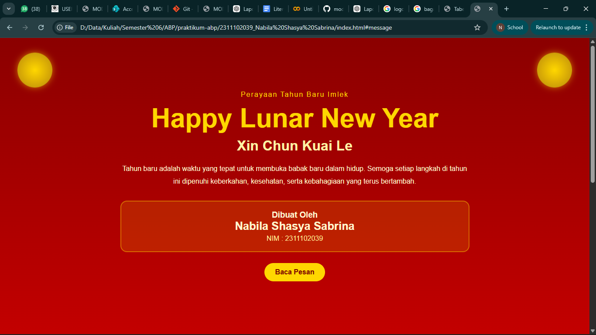

<div align="center">
  <br />
  <h1>LAPORAN PRAKTIKUM <br>APLIKASI BERBASIS PLATFORM</h1>
  <br />
  <h3>MODUL 3 <br> CSS - CASCADING STYLE SHEET</h3>
  <br />
  <br />
   
  <br />
  <br />
  <br />
  <br />
  <h3>Disusun Oleh :</h3>
  <p>
    <strong>Nabila Shasya Sabrina</strong><br>
    <strong>2311102039</strong><br>
    <strong>S1 IF-11-REG01</strong>
  </p>
  <br />
  <h3>Dosen Pengampu :</h3>
  <p>
    <strong>Dimas Fanny Hebrasianto Permadi, S.ST., M.Kom</strong>
  </p>
  <br />
  <br />
    <h4>Asisten Praktikum :</h4>
    <strong> Apri Pandu Wicaksono </strong> <br>
    <strong>Rangga Pradarrell Fathi</strong>
  <br />
  <h3>LABORATORIUM HIGH PERFORMANCE
 <br>FAKULTAS INFORMATIKA <br>UNIVERSITAS TELKOM PURWOKERTO <br>2026</h3>
</div>

---

## 1. Dasar Teori

**CSS (Cascading Style Sheets)** 
 merupakan bahasa yang digunakan bersamaan dengan HTML untuk mengatur tampilan visual pada sebuah halaman web. HTML berfungsi sebagai struktur dasar yang membangun elemen-elemen halaman seperti teks, gambar, dan bagian-bagian konten. Sementara itu, CSS bertugas mengatur bagaimana elemen-elemen tersebut ditampilkan, seperti pengaturan warna, ukuran teks, posisi elemen, jarak antar komponen, hingga efek dekoratif lainnya.

CSS bekerja dengan cara memilih elemen HTML menggunakan selector seperti nama tag, class, atau id, kemudian menerapkan aturan gaya yang disebut properti. Contoh properti yang sering digunakan antara lain pengaturan warna teks, ukuran huruf, latar belakang, jarak antar elemen, serta tata letak halaman. Dengan memisahkan struktur halaman (HTML) dan tampilan visualnya (CSS), proses pengembangan website menjadi lebih rapi, mudah dibaca, dan lebih mudah diperbarui di kemudian hari.

Terdapat beberapa metode untuk menambahkan CSS pada halaman HTML, yaitu:

**Inline CSS**
Penulisan aturan gaya langsung pada elemen HTML menggunakan atribut style.

***Internal CSS**
Penulisan aturan CSS di dalam tag <style> yang ditempatkan pada bagian <head> dokumen HTML.

***External CSS**
Aturan CSS disimpan pada file terpisah dengan ekstensi .css kemudian dihubungkan ke file HTML menggunakan tag <link>. Metode ini merupakan cara yang paling umum digunakan karena membuat kode lebih terstruktur dan mudah dikelola.


## 2. Penjelasan Kode HTML dan CSS

Berikut ini adalah implementasi desain kartu ucapan yang digabungkan antara struktur kerangka dasar HTML murni dan desain modern visual yang diambil dari *External CSS*, beserta hasil tampilannya.

### Kode HTML (`index.html`)

```html
<!DOCTYPE html>
<html lang="id">
<head>
<meta charset="UTF-8">
<meta name="viewport" content="width=device-width, initial-scale=1.0">
<title>Imlek Greeting | Nabila Shasya Sabrina</title>
<link rel="stylesheet" href="style.css">
</head>

<body>

<div class="coin coin-left"></div>
<div class="coin coin-right"></div>

<header class="banner">
<div class="wrapper">

<p class="subtitle">Perayaan Tahun Baru Imlek</p>

<h1 class="title">Happy Lunar New Year</h1>

<h2 class="chinese">Xin Chun Kuai Le</h2>

<p class="intro">
Tahun baru adalah waktu yang tepat untuk membuka babak baru dalam hidup.
Semoga setiap langkah di tahun ini dipenuhi keberkahan,
kesehatan, serta kebahagiaan yang terus bertambah.
</p>

<div class="identity">
<h3>Dibuat Oleh</h3>
<p class="name">Nabila Shasya Sabrina</p>
<p class="nim">NIM : 2311102039</p>
</div>

<a href="#message" class="button">Baca Pesan</a>

</div>
</header>


<section class="section" id="message">

<h2>Makna Tahun Baru Imlek</h2>

<p>
Tahun Baru Imlek melambangkan awal yang baru,
penuh harapan, semangat, dan doa terbaik.
Momen ini menjadi kesempatan untuk mempererat
hubungan keluarga, berbagi kebahagiaan,
dan menyambut masa depan dengan optimisme.
</p>

</section>


<section class="features">

<div class="box">
<span>🎊</span>
<h3>Harapan Baru</h3>
<p>Semoga tahun ini membawa peluang baru dan semangat baru dalam setiap langkah kehidupan.</p>
</div>

<div class="box">
<span>💰</span>
<h3>Kemakmuran</h3>
<p>Semoga keberuntungan dan rezeki selalu menyertai setiap usaha yang dilakukan.</p>
</div>

<div class="box">
<span>❤️</span>
<h3>Keharmonisan</h3>
<p>Semoga hubungan dengan keluarga dan sahabat semakin erat dan penuh kebahagiaan.</p>
</div>

</section>


<footer>

<p>© 2026 Lunar New Year Greeting</p>
<p>Nabila Shasya Sabrina | 2311102039</p>

</footer>

</body>
</html>
```

### Kode CSS (`style.css`)

```css
*{
margin:0;
padding:0;
box-sizing:border-box;
font-family:Arial, Helvetica, sans-serif;
}

body{
background:linear-gradient(180deg,#8b0000,#c40000,#5a0000);
color:#fff5d0;
min-height:100vh;
}

/* koin dekorasi */

.coin{
width:80px;
height:80px;
background:radial-gradient(circle,#ffd700,#b8860b);
border-radius:50%;
position:fixed;
top:40px;
z-index:10;
box-shadow:0 0 15px rgba(255,215,0,0.6);
animation:float 3s infinite ease-in-out;
}

.coin-left{
left:40px;
}

.coin-right{
right:40px;
}

@keyframes float{
0%{transform:translateY(0)}
50%{transform:translateY(-10px)}
100%{transform:translateY(0)}
}


/* banner */

.banner{
display:flex;
align-items:center;
justify-content:center;
text-align:center;
min-height:100vh;
padding:40px 20px;
}

.wrapper{
max-width:800px;
}

.subtitle{
letter-spacing:2px;
color:#ffd700;
margin-bottom:10px;
}

.title{
font-size:3.8rem;
color:#ffd700;
margin-bottom:10px;
}

.chinese{
font-size:2rem;
margin-bottom:20px;
color:#fff2a6;
}

.intro{
line-height:1.8;
margin-bottom:30px;
}

/* card identitas */

.identity{
background:rgba(255,215,0,0.15);
border:2px solid rgba(255,215,0,0.4);
border-radius:15px;
padding:20px;
margin-bottom:25px;
}

.name{
font-size:1.6rem;
font-weight:bold;
}

.nim{
margin-top:5px;
color:#ffe89c;
}

/* tombol */

.button{
display:inline-block;
padding:12px 25px;
background:#ffd700;
color:#7a0000;
text-decoration:none;
border-radius:25px;
font-weight:bold;
transition:0.3s;
}

.button:hover{
background:#fff3b0;
transform:translateY(-3px);
}

/* section */

.section{
padding:80px 20px;
text-align:center;
max-width:900px;
margin:auto;
}

.section h2{
color:#ffd700;
margin-bottom:20px;
}

/* feature box */

.features{
display:grid;
grid-template-columns:repeat(3,1fr);
gap:25px;
padding:60px 40px;
max-width:1100px;
margin:auto;
}

.box{
background:rgba(255,255,255,0.08);
border:2px solid rgba(255,215,0,0.3);
padding:25px;
border-radius:15px;
text-align:center;
transition:0.3s;
}

.box:hover{
transform:translateY(-5px);
}

.box span{
font-size:2.5rem;
display:block;
margin-bottom:10px;
}

.box h3{
color:#ffd700;
margin-bottom:10px;
}

/* footer */

footer{
text-align:center;
padding:25px;
background:rgba(0,0,0,0.2);
margin-top:40px;
}

/* responsive */

@media(max-width:900px){

.features{
grid-template-columns:1fr;
}

.title{
font-size:2.6rem;
}

.chinese{
font-size:1.5rem;
}

}
```

### Hasil Tampilan (Screenshot)


(assets/2.png)
### Penjelasan Code

#### 1. HTML

. HTML

Pada bagian <head>, tag <meta charset="UTF-8"> digunakan agar halaman dapat menampilkan berbagai karakter dengan benar. Tag <meta name="viewport"> berfungsi supaya tampilan website dapat menyesuaikan ukuran layar perangkat, terutama saat dibuka melalui smartphone atau tablet. Tag <title> digunakan untuk memberikan judul halaman yang akan muncul pada tab browser. Selain itu, tag <link rel="stylesheet" href="style.css"> berfungsi untuk menghubungkan file HTML dengan file CSS eksternal yang berisi aturan tampilan halaman.

Pada bagian awal <body>, terdapat dua elemen <div> dengan class coin coin-left dan coin coin-right. Kedua elemen ini digunakan sebagai ornamen dekoratif berbentuk koin keberuntungan yang ditempatkan di sisi kiri dan kanan halaman. Tampilan visual koin tersebut tidak dibuat secara langsung di HTML, melainkan diatur melalui CSS.

Pada bagian <header class="banner">, elemen ini berfungsi sebagai tampilan pembuka halaman website. Di dalamnya terdapat <div class="wrapper"> yang digunakan sebagai wadah utama untuk menampung seluruh konten pada bagian header.

Di dalam wrapper terdapat beberapa elemen teks seperti <p class="subtitle">, <h1 class="title">, <h2 class="chinese">, dan <p class="intro">. Elemen-elemen tersebut digunakan untuk menampilkan ucapan Tahun Baru Imlek, judul utama halaman, teks ucapan dalam bahasa Mandarin, serta deskripsi singkat mengenai harapan di tahun baru.

Selanjutnya terdapat <div class="identity"> yang berfungsi untuk menampilkan identitas pembuat halaman. Di dalamnya terdapat nama Nabila Shasya Sabrina serta NIM 2311102039 yang ditampilkan dalam bentuk kartu sederhana.

Tag <a href="#message" class="button"> digunakan sebagai tombol navigasi. Ketika tombol ini diklik, halaman akan secara otomatis berpindah ke bagian yang memiliki id message.

Pada bagian <section class="section" id="message">, ditampilkan teks yang menjelaskan makna dan harapan pada perayaan Tahun Baru Imlek. Bagian ini berisi judul serta paragraf penjelasan mengenai arti penting momen tersebut.

Selanjutnya terdapat <section class="features"> yang berisi tiga kotak informasi. Setiap kotak dibuat menggunakan <div class="box"> dan menampilkan ikon emoji, judul, serta deskripsi singkat mengenai harapan seperti harapan baru, kemakmuran, dan keharmonisan.

Pada bagian terakhir terdapat <footer> yang berisi informasi penutup halaman, yaitu keterangan copyright serta identitas pembuat website.

#### 2. Styling CSS (`style.css`)

Pada selector universal *, properti margin: 0, padding: 0, dan box-sizing: border-box digunakan untuk menghilangkan pengaturan jarak bawaan dari browser sehingga tampilan semua elemen menjadi lebih konsisten. Properti font-family digunakan untuk menentukan jenis huruf yang digunakan pada seluruh halaman.

Pada elemen body, properti background: linear-gradient(...) digunakan untuk membuat latar belakang berwarna merah dengan efek gradasi yang sesuai dengan tema perayaan Imlek. Properti color mengatur warna teks utama agar kontras dengan latar belakang, sedangkan min-height: 100vh memastikan tinggi halaman minimal memenuhi layar perangkat.

Pada class .coin, CSS digunakan untuk membuat dekorasi berbentuk koin emas. Properti seperti width, height, border-radius, dan background digunakan untuk membentuk lingkaran dengan efek warna emas. Efek bayangan ditambahkan menggunakan box-shadow. Selain itu, animasi @keyframes float digunakan untuk memberikan efek gerakan naik turun pada koin sehingga tampilan terlihat lebih hidup.

Pada class .banner, properti seperti display: flex, align-items: center, dan justify-content: center digunakan untuk menempatkan konten utama di tengah halaman secara horizontal maupun vertikal. Properti text-align: center membuat seluruh teks pada bagian ini ditampilkan dengan posisi rata tengah.

Pada class .wrapper, properti max-width digunakan untuk membatasi lebar konten sehingga tampilan tetap rapi ketika ditampilkan pada layar yang besar.

Pada class .subtitle, .title, .chinese, dan .intro, CSS digunakan untuk mengatur ukuran teks, warna huruf, jarak antar elemen, serta penekanan visual pada judul utama agar terlihat lebih menarik.

Pada class .identity, properti seperti background, border, border-radius, padding, dan margin digunakan untuk membuat tampilan kartu identitas dengan latar belakang transparan serta garis tepi berwarna emas.

Pada class .button, CSS digunakan untuk membuat tombol navigasi yang memiliki bentuk bulat dengan warna emas. Properti seperti padding, border-radius, dan text-decoration digunakan untuk memperindah tampilannya. Efek :hover memberikan perubahan warna serta sedikit pergerakan saat kursor diarahkan ke tombol.

Pada class .section, CSS digunakan untuk memberikan jarak antar bagian halaman agar tampilan tidak terlalu rapat. Judul pada bagian ini juga diatur dengan warna emas agar selaras dengan tema halaman.

Pada class .features, digunakan properti display: grid dengan grid-template-columns: repeat(3, 1fr) untuk menampilkan tiga kotak informasi secara sejajar pada layar besar.

Pada class .box, CSS digunakan untuk membuat tampilan kartu informasi dengan latar belakang transparan, sudut membulat, serta garis tepi berwarna emas. Efek :hover dengan transform memberikan animasi ringan ketika pengguna mengarahkan kursor ke kotak tersebut.

Pada bagian footer, CSS digunakan untuk menampilkan teks penutup secara rata tengah serta memberikan latar belakang gelap transparan agar tetap serasi dengan keseluruhan tema halaman.

Pada bagian @media, CSS digunakan untuk membuat tampilan website menjadi responsif. Ketika ukuran layar lebih kecil, tata letak kartu akan berubah dari tiga kolom menjadi satu kolom, serta ukuran teks dan elemen lain akan menyesuaikan agar tetap nyaman dilihat pada perangkat mobile.

## Refrensi
- [Materi Modul 3](https://drive.google.com/file/d/1kd7ogQkR_rsNCnKDcJDmavY8FiOyTLzs/view?usp=sharing)