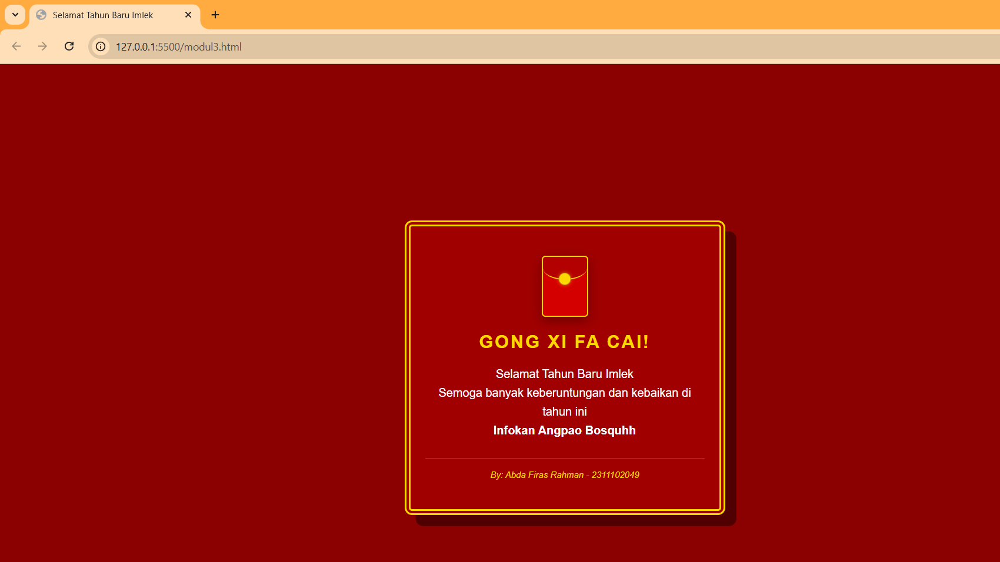

<div align="center">
  <br />

  <h1>LAPORAN PRAKTIKUM <br>
  APLIKASI BERBASIS PLATFORM
  </h1>

  <br />

  <h3>MODUL 3  <br>
  CSS
  </h3>

  <br />

  <p align="center">

</p>

  <br />
  <br />
  <br />

  <h3>Disusun Oleh :</h3>

  <p>
    <strong>Abda Firas Rahman</strong><br>
    <strong>2311102049</strong><br>
    <strong>S1 IF-11-01</strong>
  </p>

  <br />

  <h3>Dosen Pengampu :</h3>

  <p>
    <strong>Dimas Fanny Hebrasianto Permadi, S.ST., M.Kom</strong>
  </p>
  
  <br />
  <br />
    <h4>Asisten Praktikum :</h4>
    <strong>Apri Pandu Wicaksono </strong> <br>
    <strong>Rangga Pradarrell Fathi</strong>
  <br />

  <h3>LABORATORIUM HIGH PERFORMANCE
 <br>FAKULTAS INFORMATIKA <br>UNIVERSITAS TELKOM PURWOKERTO <br>2026</h3>
</div>

<hr>

## Dasar Teori

CSS (Cascading Style Sheets) merupakan bahasa desain yang berfungsi untuk mengatur presentasi visual dari sebuah dokumen web yang disusun menggunakan HTML. Secara filosofis CSS memisahkan antara struktur konten (apa yang ditampilkan) dengan gaya tampilan (bagaimana cara menampilkannya) sehingga pengelolaan estetika seperti tata letak, warna, tipografi, hingga animasi dapat dilakukan secara terpusat. Dengan menggunakan sistem selektor CSS mampu memberikan instruksi spesifik pada elemen tertentu agar tampil sesuai dengan desain yang diinginkan.

Dalam penerapannya CSS bekerja berdasarkan konsep Box Model, di mana setiap elemen dianggap sebagai sebuah kotak yang memiliki properti margin, border, padding, dan content. Selain aspek statis CSS modern juga memungkinkan pembuatan antarmuka yang dinamis melalui fitur Flexbox dan Grid untuk pengaturan tata letak yang responsif serta Keyframes untuk keperluan animasi. Hal ini memungkinkan pengembang web menciptakan pengalaman pengguna yang interaktif dan visual yang menarik tanpa harus bergantung pada skrip tambahan atau pustaka eksternal.

## Kode program HTML
Berikut adalah kode nya:

```html
<!DOCTYPE html> 
<html lang="id">
<head>
    <meta charset="UTF-8">
    <meta name="viewport" content="width=device-width, initial-scale=1.0">
    <title>Selamat Tahun Baru Imlek</title>
    <style>
        body {
            background: #8b0000; 
            color: #ffd700;      
            font-family: Arial, sans-serif;
            display: flex;
            justify-content: center;
            align-items: center;
            height: 100vh;
            margin: 0;
        }
        
        /* Abda Firas Rahman-2311102049-IF-11-REG01 */

        .kartu {
            border: 8px double #ffd700;
            padding: 40px 20px;
            text-align: center;
            width: 380px;
            background: #a00000;
            box-shadow: 15px 15px 0px #500000; 
            border-radius: 10px;
        }

        /* Angpao CSS */
        .angpao {
            width: 60px;
            height: 80px;
            background: #d40000;
            margin: 0 auto 20px;
            position: relative;
            border-radius: 5px;
            border: 2px solid #ffd700;
            overflow: hidden; /* biar lipatannya gak keluar */
            box-shadow: 0 5px 15px rgba(0,0,0,0.3);
        }

        /* Lipatan Atas Angpao */
        .angpao::before {
            content: "";
            position: absolute;
            top: 0;
            left: 0;
            width: 100%;
            height: 30px;
            background: #b30000;
            border-bottom: 2px solid #ffd700;
            border-radius: 5px 5px 50% 50%; /* Bikin efek melengkung */
            z-index: 2;
        }

        .kancing {
            width: 15px;
            height: 15px;
            background: #ffd700;
            border-radius: 50%;
            position: absolute;
            top: 22px;
            left: 50%;
            transform: translateX(-50%);
            z-index: 3;
            border: 1px solid #b8860b;
            box-shadow: 0 0 5px rgba(255, 215, 0, 0.5);
        }

        h1 {
            font-size: 25px;
            margin-bottom: 10px;
            text-transform: uppercase;
            letter-spacing: 2px;
        }

        p {
            color: white;
            line-height: 1.6;
            margin-bottom: 25px;
        }

        .nama-nim {
            font-size: 12px;
            border-top: 1px solid rgba(255, 215, 0, 0.3);
            padding-top: 15px;
            font-style: italic;
        }

    </style>
</head>
<body>

    <div class="kartu">
        <div class="angpao">
            <div class="kancing"></div>
        </div>

        <h1>Gong Xi Fa Cai!</h1>
        <p>
            Selamat Tahun Baru Imlek <br>
            Semoga banyak keberuntungan dan kebaikan di tahun ini <br>
            <strong>Infokan Angpao Bosquhh</strong> 
        </p>

        <div class="nama-nim">
            By: Abda Firas Rahman - 2311102049
        </div>
    </div>

</body>
</html>
```

## Tampilan Kode (SS)


## Penjelasan Kode

Objek angpao pada halaman ini dirancang sepenuhnya menggunakan teknik CSS Box Model tanpa menggunakan aset gambar eksternal sama sekali. Secara struktur, angpao tersebut dibangun menggunakan elemen div utama yang berfungsi sebagai badan amplop, yang kemudian diberikan dimensi proporsional dan warna latar merah khas perayaan Imlek. Untuk menciptakan detail visual yang realistis, digunakan properti border-radius dengan nilai persentase tertentu pada bagian penutup untuk menghasilkan efek lengkungan yang halus.

Penyempurnaan tampilan dilakukan dengan memanfaatkan konsep Layering atau penumpukan elemen menggunakan properti z-index. Di sini, bagian penutup amplop dibuat menggunakan pseudo-element (::before) agar tetap menyatu secara struktural, sementara detail "kancing emas" ditambahkan sebagai elemen terpisah di bagian tengah. Penggunaan bayangan halus (box-shadow) dan garis tepi emas (border) bertujuan untuk memberikan kesan kedalaman (3D) dan mempertegas batas antar bagian amplop. Hasilnya, objek ini tidak hanya menjadi dekorasi statis, tetapi juga memperkuat tema visual kartu ucapan secara keseluruhan dengan teknik kode yang tetap efisien dan ringan.