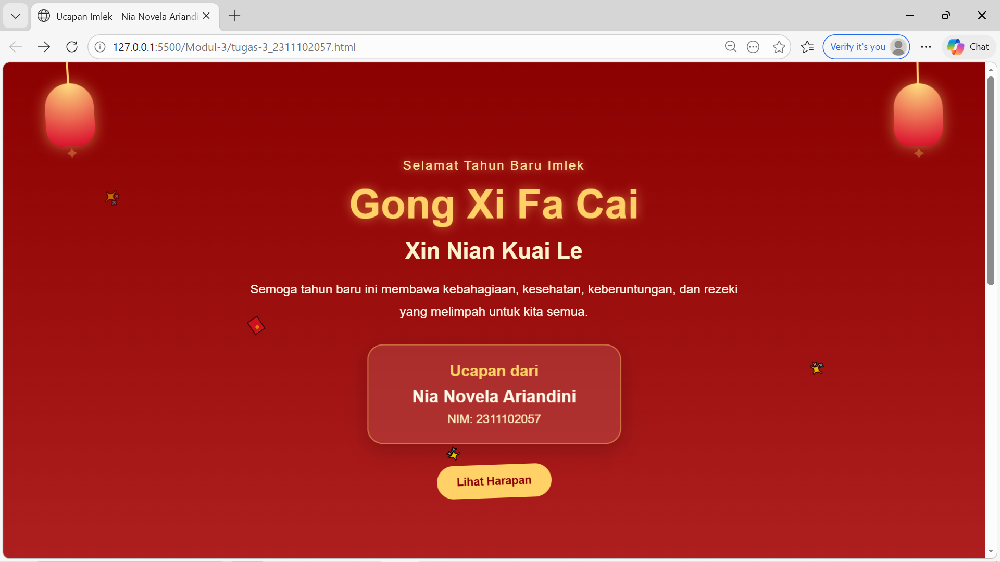

<div align="center">
  <br />
  <h1>LAPORAN PRAKTIKUM <br>APLIKASI BERBASIS PLATFORM</h1>
  <br />
  <h3>MODUL 3 <br> CSS - CASCADING STYLE SHEET</h3>
  <br />
   
  <br />
  <br />
  <br />
  <h3>Disusun Oleh :</h3>
  <p>
    <strong>Nia Novela Ariandini</strong><br>
    <strong>2311102057</strong><br>
    <strong>S1 IF-11-01</strong>
  </p>
  <br />
  <h3>Dosen Pengampu :</h3>
  <p>
    <strong>Dimas Fanny Hebrasianto Permadi, S.ST., M.Kom</strong>
  </p>
  <br />
  <br />
    <h4>Asisten Praktikum :</h4>
    <strong> Apri Pandu Wicaksono </strong> <br>
    <strong>Rangga Pradarrell Fathi</strong>
  <br />
  <br />
  <br />
  <br />
  <h3>LABORATORIUM HIGH PERFORMANCE
 <br>FAKULTAS INFORMATIKA <br>UNIVERSITAS TELKOM PURWOKERTO <br>2026</h3>
</div>

---

## 1. Dasar Teori

**CSS (Cascading Style Sheets)** adalah bahasa yang dipakai bersama HTML untuk mengatur tampilan halaman web. Kalau HTML berfungsi sebagai kerangka atau susunan isi halaman, maka CSS dipakai untuk mempercantik tampilannya, misalnya mengatur warna, ukuran teks, jarak antar elemen, posisi, sampai animasi.

CSS bekerja dengan cara memilih elemen HTML melalui **selector**, seperti nama tag, `class`, atau `id`. Setelah itu, CSS memberikan aturan tampilan melalui properti tertentu, contohnya `color`, `font-size`, `margin`, `padding`, dan lain-lain. Dengan adanya CSS, struktur halaman dan tampilan visual bisa dipisahkan, sehingga kode jadi lebih rapi dan lebih mudah dikembangkan.

Secara umum, ada tiga cara untuk menambahkan CSS ke dalam halaman HTML, yaitu :

1. **Inline CSS**  
   CSS ditulis langsung pada elemen HTML menggunakan atribut `style`.

2. **Internal CSS**  
   CSS ditulis di dalam tag `<style>` yang diletakkan pada bagian `<head>`.

3. **External CSS**  
   CSS ditulis pada file terpisah berekstensi `.css`, lalu dihubungkan ke file HTML menggunakan tag `<link>`.Cara ini biasanya lebih disarankan karena membuat kode lebih rapi, apalagi kalau project yang dikerjakan cukup besar.

Pada modul ini, tampilan website dibuat dengan menggabungkan HTML dan CSS dalam satu file. HTML digunakan untuk menyusun isi halaman, sedangkan CSS dipakai untuk mempercantik tampilan supaya lebih menarik, interaktif, dan nyaman dilihat.

---

## 2. Penjelasan Kode HTML dan CSS

Berikut ini merupakan implementasi halaman ucapan Imlek yang dibuat menggunakan HTML dan CSS dalam satu file. Tampilan halaman dibuat lebih menarik dengan tambahan warna gradasi, ornamen, kartu informasi, serta animasi sederhana tanpa menggunakan JavaScript maupun library tambahan.

### Kode HTML (`tugas-3_2311102057.html`)

```html
<!DOCTYPE html>
<html lang="id">

<head>
    <meta charset="UTF-8" />
    <meta name="viewport" content="width=device-width, initial-scale=1.0" />
    <title>Ucapan Imlek - Nia Novela Ariandini</title>
    <style>
        * {
            margin: 0;
            padding: 0;
            box-sizing: border-box;
            font-family: Arial, Helvetica, sans-serif;
        }

        body {
            min-height: 100vh;
            background: linear-gradient(180deg, #8b0000, #b22222, #d62828);
            color: #fff8e7;
            overflow-x: hidden;
            position: relative;
        }

        .sparkle {
            position: fixed;
            font-size: 20px;
            opacity: 0.8;
            animation: floatUp 7s linear infinite;
            pointer-events: none;
        }

        .sparkle.one {
            left: 10%;
            top: 100%;
            animation-delay: 0s;
        }

        .sparkle.two {
            left: 25%;
            top: 100%;
            animation-delay: 1.5s;
        }

        .sparkle.three {
            left: 45%;
            top: 100%;
            animation-delay: 3s;
        }

        .sparkle.four {
            left: 65%;
            top: 100%;
            animation-delay: 4.5s;
        }

        .sparkle.five {
            left: 82%;
            top: 100%;
            animation-delay: 2s;
        }

        @keyframes floatUp {
            0% {
                transform: translateY(0) scale(0.8) rotate(0deg);
                opacity: 0;
            }

            20% {
                opacity: 0.9;
            }

            100% {
                transform: translateY(-120vh) scale(1.2) rotate(360deg);
                opacity: 0;
            }
        }

        .lantern {
            width: 70px;
            height: 90px;
            background: radial-gradient(circle at top, #ffdf80, #d90429);
            border-radius: 35px 35px 25px 25px;
            position: fixed;
            top: 30px;
            z-index: 2;
            box-shadow: 0 0 20px rgba(255, 223, 128, 0.5);
            animation: sway 3s ease-in-out infinite;
        }

        .lantern::before {
            content: "";
            width: 3px;
            height: 40px;
            background: #ffd166;
            position: absolute;
            top: -40px;
            left: 50%;
            transform: translateX(-50%);
        }

        .lantern::after {
            content: "✦";
            position: absolute;
            bottom: -22px;
            left: 50%;
            transform: translateX(-50%);
            color: #ffd166;
            font-size: 20px;
            animation: blink 1.8s infinite;
        }

        .lantern-left {
            left: 60px;
        }

        .lantern-right {
            right: 60px;
            animation-delay: 1s;
        }

        @keyframes sway {

            0%,
            100% {
                transform: rotate(-4deg);
            }

            50% {
                transform: rotate(4deg);
            }
        }

        @keyframes blink {

            0%,
            100% {
                opacity: 1;
            }

            50% {
                opacity: 0.3;
            }
        }

        .hero {
            min-height: 100vh;
            display: flex;
            align-items: center;
            justify-content: center;
            padding: 120px 20px 70px;
            position: relative;
            text-align: center;
        }

        .container {
            max-width: 900px;
            z-index: 1;
        }

        .mini-text {
            font-size: 18px;
            letter-spacing: 2px;
            margin-bottom: 14px;
            color: #ffe8a3;
            animation: glow 2s infinite alternate;
        }

        h1 {
            font-size: 58px;
            margin-bottom: 12px;
            color: #ffd166;
            text-shadow: 0 0 15px rgba(255, 209, 102, 0.5);
            animation: bounceText 2.5s infinite;
        }

        h2 {
            font-size: 32px;
            margin-bottom: 20px;
            color: #fff3cd;
        }

        .description {
            max-width: 700px;
            margin: 0 auto 30px;
            font-size: 18px;
            line-height: 1.8;
            color: #fff8e7;
        }

        .profile-card {
            width: 100%;
            max-width: 360px;
            margin: 0 auto 30px;
            padding: 24px 20px;
            background: rgba(255, 248, 231, 0.12);
            border: 2px solid rgba(255, 209, 102, 0.45);
            border-radius: 22px;
            backdrop-filter: blur(6px);
            box-shadow: 0 8px 30px rgba(0, 0, 0, 0.2);
            animation: cardPulse 2.8s infinite;
        }

        .profile-card h3 {
            margin-bottom: 10px;
            font-size: 22px;
            color: #ffd166;
        }

        .name {
            font-size: 24px;
            font-weight: bold;
            margin-bottom: 8px;
        }

        .nim {
            font-size: 17px;
            color: #fff0c2;
        }

        .btn {
            display: inline-block;
            text-decoration: none;
            background: #ffd166;
            color: #8b0000;
            padding: 14px 28px;
            border-radius: 30px;
            font-weight: bold;
            transition: 0.3s;
            animation: wiggle 2s infinite;
        }

        .btn:hover {
            transform: scale(1.08);
            background: #ffe29a;
        }

        .section {
            padding: 70px 20px;
        }

        .content-box {
            max-width: 850px;
            margin: 0 auto;
            background: rgba(255, 248, 231, 0.1);
            border: 2px solid rgba(255, 209, 102, 0.35);
            border-radius: 24px;
            padding: 35px 28px;
            text-align: center;
            box-shadow: 0 8px 25px rgba(0, 0, 0, 0.18);
        }

        .content-box h2 {
            margin-bottom: 18px;
            color: #ffd166;
        }

        .content-box p {
            line-height: 1.9;
            font-size: 17px;
        }

        .alt-section {
            padding-top: 20px;
            padding-bottom: 80px;
        }

        .cards {
            max-width: 1100px;
            margin: 0 auto;
            display: flex;
            flex-wrap: wrap;
            justify-content: center;
            gap: 24px;
        }

        .card {
            width: 300px;
            background: rgba(255, 248, 231, 0.12);
            border-radius: 22px;
            padding: 28px 22px;
            text-align: center;
            border: 2px solid rgba(255, 209, 102, 0.35);
            box-shadow: 0 10px 22px rgba(0, 0, 0, 0.18);
            transition: 0.3s;
        }

        .card:hover {
            transform: translateY(-10px) scale(1.03);
        }

        .icon {
            font-size: 42px;
            margin-bottom: 12px;
            animation: iconJump 2s infinite;
        }

        .card h3 {
            margin-bottom: 12px;
            color: #ffd166;
            font-size: 24px;
        }

        .card p {
            line-height: 1.7;
            font-size: 16px;
        }

        .cute-note {
            text-align: center;
            margin-top: 18px;
            font-size: 18px;
            color: #fff0c2;
            animation: glow 2s infinite alternate;
        }

        footer {
            text-align: center;
            padding: 28px 20px 40px;
            background: rgba(0, 0, 0, 0.15);
            line-height: 1.8;
            font-size: 15px;
            color: #fff0c2;
        }

        @keyframes glow {
            from {
                opacity: 0.75;
            }

            to {
                opacity: 1;
                text-shadow: 0 0 12px rgba(255, 223, 128, 0.7);
            }
        }

        @keyframes bounceText {

            0%,
            100% {
                transform: translateY(0);
            }

            50% {
                transform: translateY(-8px);
            }
        }

        @keyframes cardPulse {

            0%,
            100% {
                transform: scale(1);
            }

            50% {
                transform: scale(1.03);
            }
        }

        @keyframes wiggle {

            0%,
            100% {
                transform: rotate(0deg);
            }

            25% {
                transform: rotate(2deg);
            }

            75% {
                transform: rotate(-2deg);
            }
        }

        @keyframes iconJump {

            0%,
            100% {
                transform: translateY(0);
            }

            50% {
                transform: translateY(-6px);
            }
        }

        @media (max-width: 768px) {
            h1 {
                font-size: 40px;
            }

            h2 {
                font-size: 24px;
            }

            .description {
                font-size: 16px;
            }

            .lantern {
                width: 55px;
                height: 75px;
            }

            .lantern-left {
                left: 20px;
            }

            .lantern-right {
                right: 20px;
            }
        }
    </style>
</head>

<body>
    <div class="sparkle one">✨</div>
    <div class="sparkle two">🧧</div>
    <div class="sparkle three">✨</div>
    <div class="sparkle four">🏮</div>
    <div class="sparkle five">✨</div>

    <div class="lantern lantern-left"></div>
    <div class="lantern lantern-right"></div>

    <header class="hero">
        <div class="container">
            <p class="mini-text">Selamat Tahun Baru Imlek</p>
            <h1>Gong Xi Fa Cai</h1>
            <h2>Xin Nian Kuai Le</h2>
            <p class="description">
                Semoga tahun baru ini membawa kebahagiaan, kesehatan,
                keberuntungan, dan rezeki yang melimpah untuk kita semua.
            </p>

            <div class="profile-card">
                <h3>Ucapan dari</h3>
                <p class="name">Nia Novela Ariandini</p>
                <p class="nim">NIM: 2311102057</p>
            </div>

            <a href="#wish" class="btn">Lihat Harapan</a>
        </div>
    </header>

    <main>
        <section class="section" id="wish">
            <div class="content-box">
                <h2>Harapan di Tahun Baru Imlek</h2>
                <p>
                    Tahun Baru Imlek jadi momen yang pas buat mulai lembaran baru
                    dengan semangat, doa, dan harapan yang baik. Semoga setiap
                    langkah yang dijalani selalu diberi kelancaran, suasana hati
                    yang tenang, dan kebersamaan yang hangat bareng keluarga serta
                    orang-orang tersayang.
                </p>
            </div>
        </section>

        <section class="section alt-section">
            <div class="cards">
                <div class="card">
                    <div class="icon">🧧</div>
                    <h3>Keberuntungan</h3>
                    <p>
                        Semoga di tahun ini makin banyak hal baik, peluang baru,
                        dan kejutan manis yang datang.
                    </p>
                </div>

                <div class="card">
                    <div class="icon">🏮</div>
                    <h3>Kebahagiaan</h3>
                    <p>
                        Semoga hari-hari yang dijalani terasa lebih ringan,
                        hangat, dan penuh senyum lucu.
                    </p>
                </div>

                <div class="card">
                    <div class="icon">🐉</div>
                    <h3>Kesuksesan</h3>
                    <p>
                        Semoga semua usaha, tugas, dan mimpi baik bisa berjalan
                        lancar dan membuahkan hasil terbaik.
                    </p>
                </div>
            </div>

            <p class="cute-note">Semoga tahun ini seberuntung angpao penuh isi ✨</p>
        </section>
    </main>

    <footer>
        <p>© 2026 | Website Ucapan Imlek</p>
        <p>Nia Novela Ariandini - 2311102057</p>
    </footer>
</body>

</html>
```
### Hasil Tampilan (Screenshot)



## Penjelasan Code

### 1. HTML

Pada bagian awal terdapat deklarasi `<!DOCTYPE html>` yang menunjukkan bahwa dokumen ini menggunakan standar HTML5. Tag `<html lang="id">` dipakai untuk menandai bahwa bahasa utama halaman adalah bahasa Indonesia.

Di dalam bagian `<head>`, terdapat tag `<meta charset="UTF-8">` yang berfungsi supaya karakter pada halaman bisa tampil dengan baik. Lalu tag `<meta name="viewport" content="width=device-width, initial-scale=1.0">` digunakan agar tampilan website tetap menyesuaikan ukuran layar, terutama saat dibuka lewat perangkat mobile. Tag `<title>` dipakai untuk memberi judul halaman pada tab browser.

Karena CSS ditulis langsung di file yang sama, maka pada bagian `<head>` juga terdapat tag `<style>` yang berisi seluruh aturan tampilan halaman.

Pada bagian `<body>`, terdapat lima elemen `<div>` dengan class `.sparkle` yang berisi emoji. Elemen ini dibuat sebagai hiasan tambahan agar halaman terlihat lebih hidup karena nantinya diberi animasi bergerak ke atas.

Setelah itu ada dua elemen `<div>` dengan class `lantern lantern-left` dan `lantern lantern-right`. Kedua elemen ini berfungsi sebagai ornamen lampion di sisi kiri dan kanan halaman.

Bagian utama halaman ada pada tag `<header class="hero">`. Di dalamnya terdapat `<div class="container">` yang menjadi wadah semua isi utama seperti teks ucapan, judul, deskripsi, identitas pembuat, dan tombol navigasi.

Tag `<p class="mini-text">` digunakan untuk menampilkan teks pembuka. Kemudian tag `<h1>` dan `<h2>` dipakai sebagai judul utama dan subjudul ucapan Imlek. Setelah itu, tag `<p class="description">` berisi pesan singkat mengenai doa dan harapan di tahun baru.

Di bawahnya terdapat `<div class="profile-card">` yang dipakai untuk menampilkan identitas pembuat, yaitu nama **Nia Novela Ariandini** dan **NIM 2311102057**.

Tag `<a href="#wish" class="btn">` berfungsi sebagai tombol navigasi. Saat tombol ditekan, halaman akan langsung berpindah ke bagian dengan id `wish`.

Pada bagian `<main>`, terdapat dua section utama. Section pertama dengan id `wish` berisi teks harapan Tahun Baru Imlek di dalam `<div class="content-box">`. Section kedua berisi beberapa kartu ucapan yang dibungkus dalam `<div class="cards">`.

Di dalam bagian kartu tersebut, setiap `<div class="card">` menampilkan satu tema harapan, yaitu keberuntungan, kebahagiaan, dan kesuksesan. Masing-masing kartu juga diberi ikon emoji agar tampil lebih menarik.

Bagian paling bawah menggunakan tag `<footer>` yang berisi informasi penutup berupa copyright dan identitas pembuat halaman.

### 2. CSS

Pada selector universal `*`, properti `margin: 0`, `padding: 0`, dan `box-sizing: border-box` dipakai untuk mereset tampilan bawaan browser supaya semua elemen punya jarak awal yang lebih konsisten. Properti `font-family` digunakan untuk mengatur jenis huruf utama.

Pada bagian `body`, properti `min-height: 100vh` membuat halaman minimal setinggi layar. Lalu `background:linear-gradient(...)` digunakan untuk memberi latar belakang merah gradasi yang sesuai dengan nuansa Imlek. Properti `color` mengatur warna teks utama, sedangkan `overflow-x: hidden` mencegah halaman bergeser ke samping.

Class `.sparkle` digunakan untuk membuat ornamen emoji mengambang. Posisi tiap ornamen dibedakan melalui class tambahan seperti `.one`, `.two`, `.three`, `.four`, dan `.five`. Animasi geraknya diatur menggunakan `@keyframes floatUp` sehingga elemen terlihat naik ke atas sambil memudar.

Class `.lantern` digunakan untuk membentuk ornamen lampion. Ukuran, warna, bentuk, dan bayangannya diatur dengan CSS. Pseudo-element `::before` dipakai untuk membuat tali lampion, sedangkan `::after` dipakai untuk menambahkan ornamen kecil di bagian bawah. Efek gerakan lampion dibuat melalui animasi `sway`, sedangkan efek kedip dibuat dengan `blink`.

Class `.hero` memakai `display: flex`, `align-items: center`, dan `justify-content: center` agar isi utama tampil di tengah halaman. Properti `text-align: center` dipakai supaya seluruh teks di bagian hero rata tengah.

Class `.container` membatasi lebar isi halaman agar tampil lebih rapi dan tidak terlalu melebar pada layar besar.

Class `.mini-text`, `h1`, `h2`, dan `.description` digunakan untuk mengatur ukuran teks, warna, jarak antar elemen, dan animasi sederhana agar judul terlihat lebih menarik. Misalnya, `h1` diberi animasi `bounceText` supaya judul utama terlihat bergerak naik turun secara halus.

Class `.profile-card` digunakan untuk membuat kartu identitas. CSS pada bagian ini mengatur lebar kartu, jarak, warna latar semi transparan, border, sudut melengkung, bayangan, dan animasi `cardPulse` agar kartu terlihat hidup.

Class `.btn` dipakai untuk mengatur tampilan tombol. Properti seperti `padding`, `border-radius`, `background`, dan `text-decoration` membuat tombol terlihat lebih menarik. Selain itu, tombol juga diberi animasi `wiggle` dan efek `:hover` agar saat disentuh kursor tampil lebih interaktif.

Class `.section` mengatur jarak antar bagian halaman. Class `.content-box` dipakai untuk menampilkan kotak isi harapan dengan latar semi transparan, border, bayangan, dan sudut melengkung.

Class `.cards` memakai `display: flex`, `flex-wrap: wrap`, dan `justify-content: center` agar kumpulan kartu bisa tersusun rapi dan tetap menyesuaikan ukuran layar. Setiap `.card` diberi latar transparan, `padding`, border, dan efek bayangan. Pada bagian `.card:hover`, digunakan `transform` agar kartu sedikit terangkat saat diarahkan kursor.

Class `.icon` dipakai untuk memperbesar emoji di dalam kartu dan memberinya animasi `iconJump` agar terlihat lebih lucu dan tidak monoton.

Class `.cute-note` digunakan untuk menampilkan catatan kecil di bawah kartu. Teks ini diberi efek animasi cahaya supaya terlihat menonjol.

Bagian `footer` diatur agar teks berada di tengah, memiliki jarak yang cukup, dan tetap selaras dengan tema halaman.

Di bagian akhir, terdapat `@media (max-width: 768px)` yang digunakan untuk membuat tampilan lebih responsif. Saat ukuran layar mengecil, ukuran judul, deskripsi, dan ornamen lampion akan disesuaikan agar halaman tetap nyaman dilihat di HP maupun tablet.

## Refrensi
- [Materi Modul 3](https://drive.google.com/file/d/1kd7ogQkR_rsNCnKDcJDmavY8FiOyTLzs/view?usp=sharing)