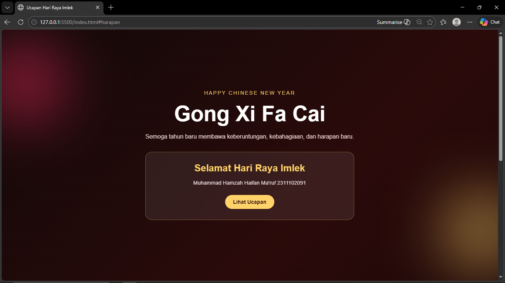
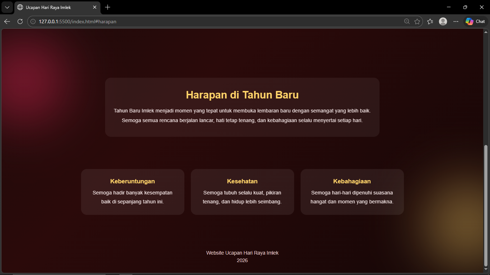

<div align="center">
  <br />
  <h1>LAPORAN PRAKTIKUM <br>APLIKASI BERBASIS PLATFORM</h1>
  <br />
  <h3>MODUL 3 <br> CSS - CASCADING STYLE SHEET</h3>
  <br />
  <br />
   
  <br />
  <br />
  <br />
  <br />
  <h3>Disusun Oleh :</h3>
  <p>
    <strong>Muhammad Hamzah Haifan Ma'ruf</strong><br>
    <strong>2311102091</strong><br>
    <strong>S1 IF-11-REG01</strong>
  </p>
  <br />
  <h3>Dosen Pengampu :</h3>
  <p>
    <strong>Dimas Fanny Hebrasianto Permadi, S.ST., M.Kom</strong>
  </p>
  <br />
  <br />
    <h4>Asisten Praktikum :</h4>
    <strong> Apri Pandu Wicaksono </strong> <br>
    <strong>Rangga Pradarrell Fathi</strong>
  <br />
  <h3>LABORATORIUM HIGH PERFORMANCE
 <br>FAKULTAS INFORMATIKA <br>UNIVERSITAS TELKOM PURWOKERTO <br>2026</h3>
</div>

---

## 1. Dasar Teori

CSS (*Cascading Style Sheets*) adalah bahasa yang digunakan bersamaan dengan HTML untuk mengatur tampilan visual sebuah halaman web. Jika HTML berfungsi sebagai kerangka dasar yang menyusun isi halaman, maka CSS berperan dalam mempercantik tampilannya, seperti mengatur warna, ukuran teks, jarak antar elemen, posisi, hingga dekorasi visual lainnya.

CSS bekerja dengan memanfaatkan **selector** untuk memilih elemen HTML yang akan diberikan gaya. Selector dapat berupa nama tag, class, maupun id. Setelah elemen dipilih, CSS akan menerapkan aturan berupa properti tertentu, misalnya `color`, `background`, `margin`, `padding`, `text-align`, dan lain sebagainya. Dengan adanya CSS, struktur halaman dan tampilan visual dapat dipisahkan, sehingga kode menjadi lebih rapi, mudah dipahami, dan lebih mudah dikembangkan.

Secara umum, terdapat tiga cara untuk menerapkan CSS pada halaman web, yaitu:

1. **Inline CSS**  
   CSS dituliskan langsung pada elemen HTML melalui atribut `style`.

2. **Internal CSS**  
   CSS ditulis di dalam tag `<style>` yang diletakkan pada bagian `<head>`.

3. **External CSS**  
   CSS ditulis pada file terpisah berekstensi `.css`, lalu dihubungkan ke file HTML menggunakan tag `<link>`. Cara ini paling sering digunakan karena membuat kode lebih terstruktur dan mudah dikelola.

Pada praktikum ini, digunakan **External CSS** agar tampilan halaman lebih terorganisir. Website yang dibuat berupa ucapan Hari Raya Imlek dengan nuansa modern, futuristik, sederhana, dan tetap menarik secara visual.

---

## 2. Penjelasan Kode HTML dan CSS

Berikut ini adalah implementasi halaman website ucapan Hari Raya Imlek yang dibuat menggunakan HTML sebagai struktur utama dan CSS eksternal sebagai pengatur tampilannya.

### Kode HTML (`imlek.html`)

```html
<!DOCTYPE html>
<html lang="id">
<head>
  <meta charset="UTF-8">
  <meta name="viewport" content="width=device-width, initial-scale=1.0">
  <title>Ucapan Hari Raya Imlek</title>
  <link rel="stylesheet" href="style.css">
</head>
<body>
  <div class="glow glow-1"></div>
  <div class="glow glow-2"></div>

  <header class="hero">
    <div class="container">
      <p class="tagline">Happy Chinese New Year</p>
      <h1>Gong Xi Fa Cai</h1>
      <p class="subtitle">Semoga tahun baru membawa keberuntungan, kebahagiaan, dan harapan baru.</p>

      <div class="card">
        <h2>Selamat Hari Raya Imlek</h2>
        <p>
          Semoga setiap langkah di tahun ini dipenuhi kedamaian, kesehatan,
          rezeki yang baik, dan momen indah bersama orang-orang tersayang.
        </p>
        <a href="#harapan" class="btn">Lihat Ucapan</a>
      </div>
    </div>
  </header>

  <main>
    <section class="section" id="harapan">
      <div class="content">
        <h2>Harapan di Tahun Baru</h2>
        <p>
          Tahun Baru Imlek menjadi momen yang tepat untuk membuka lembaran baru
          dengan semangat yang lebih baik. Semoga semua rencana berjalan lancar,
          hati tetap tenang, dan kebahagiaan selalu menyertai setiap hari.
        </p>
      </div>
    </section>

    <section class="section cards-section">
      <div class="cards">
        <div class="item">
          <h3>Keberuntungan</h3>
          <p>Semoga hadir banyak kesempatan baik di sepanjang tahun ini.</p>
        </div>
        <div class="item">
          <h3>Kesehatan</h3>
          <p>Semoga tubuh selalu kuat, pikiran tenang, dan hidup lebih seimbang.</p>
        </div>
        <div class="item">
          <h3>Kebahagiaan</h3>
          <p>Semoga hari-hari dipenuhi suasana hangat dan momen yang bermakna.</p>
        </div>
      </div>
    </section>
  </main>

  <footer>
    <p>Website Ucapan Hari Raya Imlek</p>
    <p>2026</p>
  </footer>
</body>
</html>
```

### Kode CSS (`style.css`)

```css
* {
  margin: 0;
  padding: 0;
  box-sizing: border-box;
  font-family: Arial, sans-serif;
}

html {
  scroll-behavior: smooth;
}

body {
  background: linear-gradient(135deg, #120909, #2b0a0a, #140606);
  color: #f5f5f5;
  min-height: 100vh;
  overflow-x: hidden;
}

.glow {
  position: fixed;
  width: 260px;
  height: 260px;
  border-radius: 50%;
  filter: blur(80px);
  z-index: 0;
  opacity: 0.45;
}

.glow-1 {
  background: #ff2e63;
  top: 30px;
  left: -60px;
}

.glow-2 {
  background: #ffd369;
  bottom: 20px;
  right: -80px;
}

.hero {
  min-height: 100vh;
  display: flex;
  align-items: center;
  justify-content: center;
  padding: 40px 20px;
  position: relative;
  text-align: center;
}

.container {
  position: relative;
  z-index: 2;
  max-width: 900px;
}

.tagline {
  color: #ffd369;
  letter-spacing: 3px;
  font-size: 0.95rem;
  margin-bottom: 18px;
  text-transform: uppercase;
}

.hero h1 {
  font-size: 4rem;
  margin-bottom: 16px;
  color: #ffffff;
}

.subtitle {
  max-width: 680px;
  margin: 0 auto 30px;
  font-size: 1.1rem;
  line-height: 1.8;
  color: #f3d9d9;
}

.card {
  max-width: 650px;
  margin: 0 auto;
  background: rgba(255, 255, 255, 0.08);
  border: 1px solid rgba(255, 211, 105, 0.35);
  border-radius: 20px;
  padding: 32px 24px;
  backdrop-filter: blur(10px);
}

.card h2 {
  color: #ffd369;
  margin-bottom: 14px;
  font-size: 1.8rem;
}

.card p {
  line-height: 1.8;
  color: #f8eaea;
  margin-bottom: 22px;
}

.btn {
  display: inline-block;
  text-decoration: none;
  background: #ffd369;
  color: #2b0a0a;
  padding: 12px 24px;
  border-radius: 30px;
  font-weight: bold;
}

.section {
  padding: 80px 20px;
  position: relative;
  z-index: 2;
}

.content {
  max-width: 850px;
  margin: 0 auto;
  text-align: center;
  background: rgba(255, 255, 255, 0.06);
  border-radius: 18px;
  padding: 35px 25px;
}

.content h2 {
  font-size: 2rem;
  margin-bottom: 16px;
  color: #ffd369;
}

.content p {
  line-height: 1.9;
  color: #f5e7e7;
}

.cards-section {
  padding-top: 20px;
}

.cards {
  max-width: 1000px;
  margin: 0 auto;
  display: grid;
  grid-template-columns: repeat(3, 1fr);
  gap: 20px;
}

.item {
  background: rgba(255, 255, 255, 0.07);
  border-radius: 18px;
  padding: 28px 20px;
  text-align: center;
}

.item h3 {
  color: #ffd369;
  margin-bottom: 10px;
}

.item p {
  color: #f8eaea;
  line-height: 1.7;
}

footer {
  text-align: center;
  padding: 30px 20px;
  color: #e8cfcf;
  font-size: 0.95rem;
}

footer p:first-child {
  margin-bottom: 6px;
}

@media (max-width: 900px) {
  .hero h1 {
    font-size: 3rem;
  }

  .cards {
    grid-template-columns: 1fr;
  }
}

@media (max-width: 600px) {
  .hero h1 {
    font-size: 2.3rem;
  }

  .subtitle,
  .content p,
  .item p,
  .card p {
    font-size: 1rem;
  }

  .card,
  .content,
  .item {
    padding: 24px 18px;
  }
}
```

### Hasil Tampilan (Screenshot)



### Penjelasan Code

#### 1. HTML

- Pada bagian `<head>`, digunakan tag `<meta charset="UTF-8">` agar karakter dapat ditampilkan dengan baik pada browser. Tag `<meta name="viewport">` digunakan supaya halaman dapat menyesuaikan ukuran layar perangkat, terutama saat dibuka melalui ponsel. Tag `<title>` berfungsi menampilkan judul halaman pada tab browser, sedangkan tag `<link rel="stylesheet" href="style.css">` dipakai untuk menghubungkan file HTML dengan file CSS eksternal.

- Pada awal bagian `<body>`, terdapat dua elemen `<div>` dengan class `glow glow-1` dan `glow glow-2`. Kedua elemen ini berfungsi sebagai dekorasi visual berupa efek cahaya berwarna yang memberi kesan futuristik dan modern pada halaman.

- Bagian `<header class="hero">` digunakan sebagai tampilan pembuka halaman. Di dalamnya terdapat `<div class="container">` yang menjadi pembungkus semua konten utama seperti teks ucapan, judul utama, deskripsi, dan kartu ucapan.

- Elemen `<p class="tagline">` digunakan untuk menampilkan teks kecil pembuka. Tag `<h1>` menampilkan judul utama ucapan Imlek, sedangkan `<p class="subtitle">` berisi kalimat singkat yang menjelaskan pesan utama halaman.

- Pada bagian `<div class="card">`, dibuat sebuah kotak konten yang berisi ucapan utama Imlek. Di dalamnya terdapat `<h2>`, `<p>`, dan tombol `<a>` yang mengarahkan pengguna ke bagian harapan pada halaman.

- Elemen `<main>` membungkus isi utama website. Pada section pertama dengan id `harapan`, ditampilkan satu bagian ucapan dan harapan tahun baru. Pada section berikutnya, terdapat tiga kotak informasi yang menjelaskan tema harapan seperti keberuntungan, kesehatan, dan kebahagiaan.

- Pada bagian `<footer>`, digunakan dua tag `<p>` untuk menampilkan informasi penutup halaman.

#### 2. Styling CSS (`style.css`)

- Selector universal `*` digunakan untuk mengatur ulang margin, padding, dan `box-sizing` pada seluruh elemen agar tampilan halaman lebih konsisten di berbagai browser. Pada bagian ini juga ditentukan jenis font utama halaman.

- Pada elemen `body`, properti `background: linear-gradient(...)` dipakai untuk membuat latar belakang gradasi gelap bernuansa merah yang sesuai dengan tema Imlek namun tetap terlihat modern. Properti `color` mengatur warna teks utama, sedangkan `min-height: 100vh` memastikan tinggi halaman memenuhi layar.

- Class `.glow`, `.glow-1`, dan `.glow-2` digunakan untuk membuat efek cahaya blur di sudut halaman. Properti seperti `position`, `border-radius`, `filter: blur(...)`, dan `opacity` dipakai untuk menghasilkan elemen dekoratif yang sederhana tetapi tetap estetik.

- Pada class `.hero`, digunakan properti `display: flex`, `align-items: center`, dan `justify-content: center` agar isi header tampil di tengah layar. Properti `text-align: center` digunakan supaya seluruh teks rata tengah.

- Pada class `.container`, properti `position: relative` dan `z-index` membuat isi utama tetap berada di atas elemen dekorasi latar belakang. Properti `max-width` dipakai agar lebar konten tidak terlalu besar saat ditampilkan pada layar lebar.

- Pada class `.tagline`, `.hero h1`, dan `.subtitle`, CSS digunakan untuk mengatur ukuran huruf, warna teks, jarak antar elemen, serta tampilan judul agar terlihat lebih menarik dan sesuai tema.

- Pada class `.card`, digunakan properti `background`, `border`, `border-radius`, `padding`, dan `backdrop-filter` untuk membuat kotak ucapan dengan efek transparan modern. Efek ini memberikan kesan sederhana, bersih, dan futuristik.

- Pada class `.btn`, properti seperti `display`, `background`, `padding`, `border-radius`, dan `text-decoration` digunakan untuk membentuk tombol navigasi yang mudah dikenali dan selaras dengan desain halaman.

- Pada class `.section` dan `.content`, CSS mengatur jarak antar bagian, posisi elemen, serta latar belakang kotak isi agar tampilan tetap rapi dan nyaman dibaca.

- Pada class `.cards`, digunakan `display: grid` dan `grid-template-columns: repeat(3, 1fr)` agar tiga kotak informasi tampil sejajar pada layar besar. Setiap kotak memiliki class `.item` yang diberi latar semi transparan, sudut melengkung, dan teks rata tengah.

- Pada bagian `footer`, CSS digunakan untuk mengatur letak teks agar berada di tengah dan tetap serasi dengan tampilan keseluruhan halaman.

- Pada bagian `@media`, CSS digunakan untuk membuat tampilan website lebih responsif. Saat ukuran layar mengecil, ukuran judul akan menyesuaikan dan susunan tiga kotak akan berubah menjadi satu kolom agar tetap nyaman dilihat pada perangkat mobile.

## Refrensi

- [Materi Modul 3](https://drive.google.com/file/d/1kd7ogQkR_rsNCnKDcJDmavY8FiOyTLzs/view?usp=sharing)