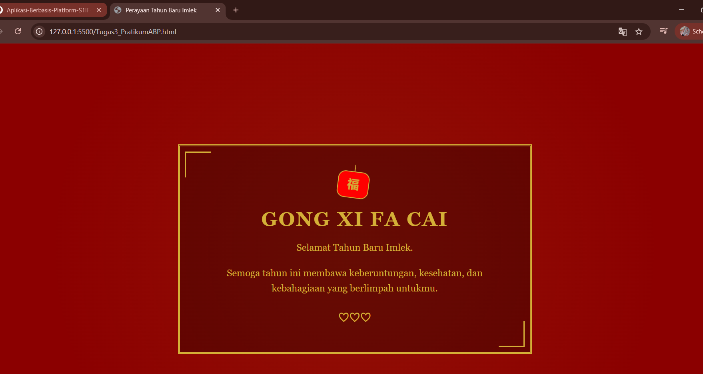

<div align="center">
  <br />

  <h1>LAPORAN PRAKTIKUM <br>
  APLIKASI BERBASIS PLATFORM
  </h1>

  <br />

  <h3>MODUL 3  <br>
  CSS
  </h3>

  <br />

  <p align="center">

</p>

  <br />
  <br />
  <br />

  <h3>Disusun Oleh :</h3>

  <p>
    <strong>Aisyah Anis Mazaya</strong><br>
    <strong>2311102095</strong><br>
    <strong>S1 IF-11-REG01</strong>
  </p>

  <br />

  <h3>Dosen Pengampu :</h3>

  <p>
    <strong>Dimas Fanny Hebrasianto Permadi, S.ST., M.Kom</strong>
  </p>
  
  <br />
  <br />
    <h4>Asisten Praktikum :</h4>
    <strong>Apri Pandu Wicaksono </strong> <br>
    <strong>Rangga Pradarrell Fathi</strong>
  <br />

  <h3>LABORATORIUM HIGH PERFORMANCE
 <br>FAKULTAS INFORMATIKA <br>UNIVERSITAS TELKOM PURWOKERTO <br>2026</h3>
</div>

<hr>

## Dasar Teori

CSS (Cascading Style Sheets) merupakan instrumen penting dalam pengembangan web yang berfungsi untuk memisahkan antara struktur konten (HTML) dengan estetika visualnya. Pemisahan ini memungkinkan pengembang untuk mengelola elemen desain seperti tipografi, skema warna, dan tata letak secara terpusat sehingga pemeliharaan kode menjadi lebih efisien. Melalui mekanisme selektor CSS memberikan instruksi yang presisi terhadap elemen tertentu untuk menghasilkan representasi visual yang sesuai dengan kebutuhan desain.

Dalam operasionalnya CSS menerapkan konsep Box Model yang memandang setiap elemen sebagai sebuah unit kotak yang terdiri dari komponen content, padding, border, dan margin.

Seiring perkembangannya CSS modern kini telah mendukung pembuatan antarmuka yang adaptif dan dinamis melalui fitur Flexbox serta Grid. Selain itu penggunaan Keyframes memungkinkan pengembang untuk menciptakan animasi langsung di dalam stylesheet. Integrasi fitur-fitur ini memastikan bahwa pengalaman pengguna yang interaktif dan responsif dapat tercapai secara optimal tanpa harus bergantung pada pustaka eksternal.

## Kode program HTML
Berikut adalah kode nya:

```html
<!-- 2311102095 - Aisyah Anis Mazaya - Modul_3 -->

<!DOCTYPE html>
<html lang="id">
<head>
    <meta charset="UTF-8">
    <meta name="viewport" content="width=device-width, initial-scale=1.0">
    <title>Perayaan Tahun Baru Imlek</title>
    <style>
        /* Dasar Halaman */
        body {
            margin: 0;
            padding: 0;
            background-color: #8B0000; /* Dark Red */
            color: #D4AF37; /* Metallic Gold */
            font-family: "Georgia", serif;
            display: flex;
            justify-content: center;
            align-items: center;
            min-height: 100vh;
            overflow: hidden;
        }

        /* Container Utama */
        .container {
            text-align: center;
            border: 4px double #D4AF37;
            padding: 50px;
            background-color: rgba(0, 0, 0, 0.3);
            position: relative;
            max-width: 600px;
            z-index: 1;
        }

        /* Ornamen Lampion Modern dengan CSS */
        .lantern {
            width: 60px;
            height: 50px;
            background-color: #FF0000;
            border: 2px solid #D4AF37;
            border-radius: 15px;
            margin: 0 auto 20px;
            position: relative;
            animation: swing 3s ease-in-out infinite;
            transform-origin: top center;
        }

        .lantern::before {
            content: "";
            position: absolute;
            top: -15px;
            left: 50%;
            transform: translateX(-50%);
            width: 2px;
            height: 15px;
            background-color: #D4AF37;
        }

        .lantern::after {
            content: "福";
            font-size: 24px;
            line-height: 50px;
            color: #D4AF37;
            font-weight: bold;
        }

        /* Animasi Ayunan */
        @keyframes swing {
            0% { transform: rotate(-8deg); }
            50% { transform: rotate(8deg); }
            100% { transform: rotate(-8deg); }
        }

        h1 {
            font-size: 2.5rem;
            margin: 0 0 10px 0;
            letter-spacing: 2px;
            text-transform: uppercase;
        }

        p {
            font-size: 1.2rem;
            line-height: 1.6;
            margin-bottom: 20px;
        }

        .footer-icon {
            font-size: 2rem;
            display: block;
            margin-top: 20px;
        }

        /* Dekorasi Sudut */
        .corner {
            position: absolute;
            width: 50px;
            height: 50px;
            border: 3px solid #D4AF37;
        }

        .top-left { top: 10px; left: 10px; border-right: none; border-bottom: none; }
        .bottom-right { bottom: 10px; right: 10px; border-left: none; border-top: none; }

        /* Efek Cahaya Latar Belakang */
        .glow {
            position: absolute;
            width: 100%;
            height: 100%;
            background: radial-gradient(circle, rgba(212, 175, 55, 0.1) 0%, rgba(139, 0, 0, 0) 70%);
            pointer-events: none;
        }
    </style>
</head>
<body>

    <div class="glow"></div>

    <div class="container">
        <div class="corner top-left"></div>
        <div class="corner bottom-right"></div>
        
        <div class="lantern"></div>

        <h1>Gong Xi Fa Cai</h1>
        <p>Selamat Tahun Baru Imlek.</p>
        <p>Semoga tahun ini membawa keberuntungan, kesehatan, dan kebahagiaan yang berlimpah untukmu.</p>
        
        <span class="footer-icon">♡♡♡</span>
    </div>

</body>
</html>
```

## Tampilan Kode (SS)


### Penjelasan Kode Program


Kode ini mengimplementasikan halaman web statis bertema "Tahun Baru Imlek" dengan memadukan struktur HTML5 dan desain visual melalui CSS. Secara estetika, dokumen ini menggunakan palet warna merah tua (`#8B0000`) dan emas (`#D4AF37`) untuk menghadirkan nuansa tradisional yang mewah. Tata letak utama diatur menggunakan **CSS Flexbox** pada elemen `body` untuk memastikan seluruh konten berada tepat di tengah layar secara responsif.

Dari sisi teknis, penerapan **Box Model** terlihat pada `.container` yang menggunakan *padding* luas dan *double border* untuk memberikan ruang visual yang proporsional. Salah satu fitur utama adalah pembuatan ornamen lampion yang dikonstruksi sepenuhnya menggunakan CSS tanpa aset gambar. Objek ini memanfaatkan **Pseudo-elements** (`::before` dan `::after`) untuk detail tali serta teks, serta dilengkapi dengan **CSS Animation** (`@keyframes swing`) untuk memberikan efek ayunan dinamis yang interaktif.

mendemonstrasikan efisiensi CSS modern dalam mengelola tata letak (*layouting*), dekorasi sudut dengan *absolute positioning*, hingga pembuatan elemen grafis bergerak yang ringan dan optimal untuk performa web.