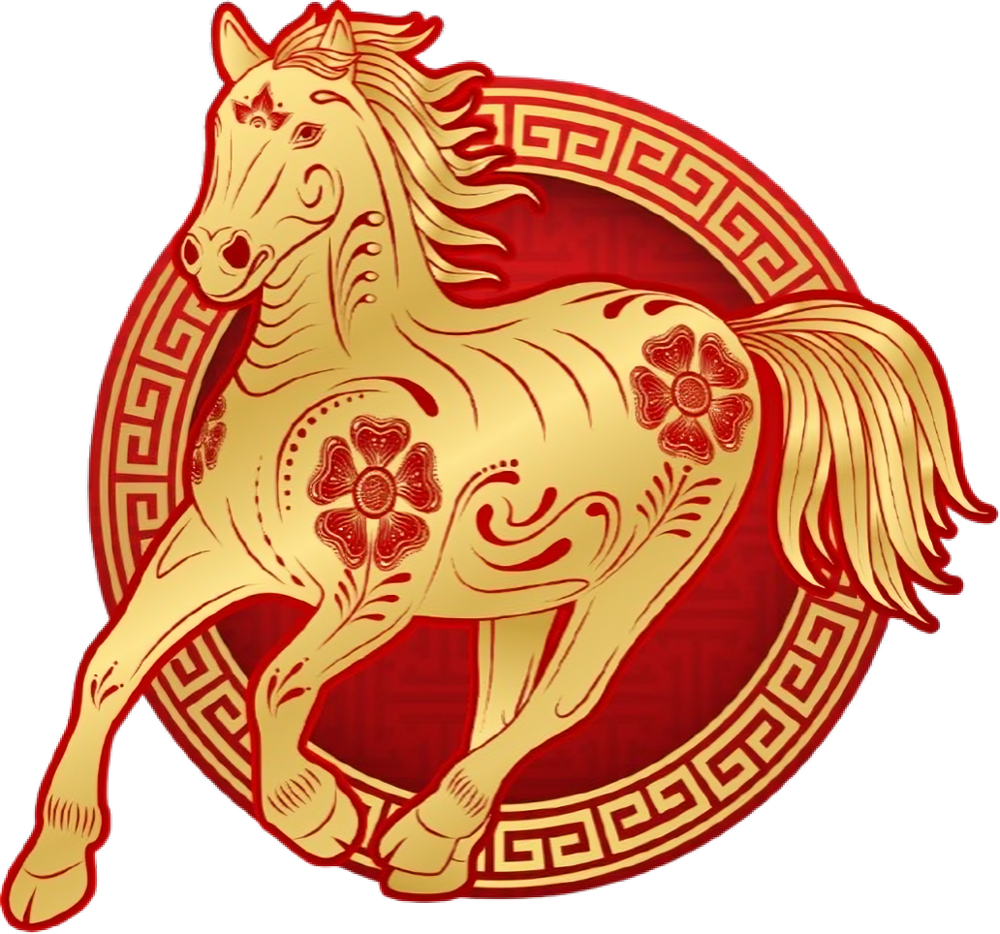
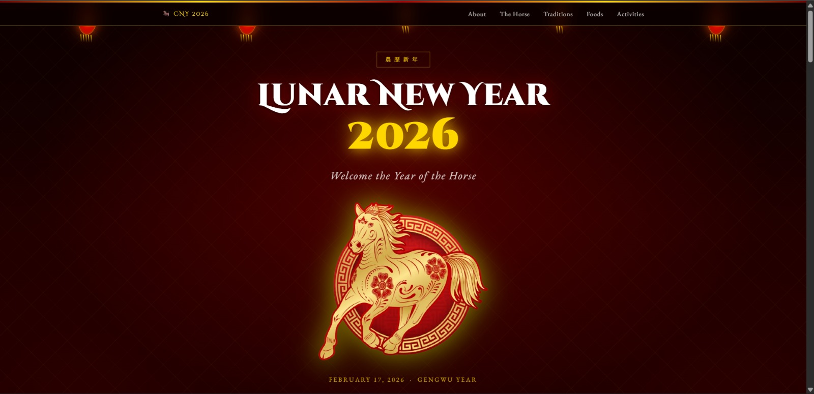
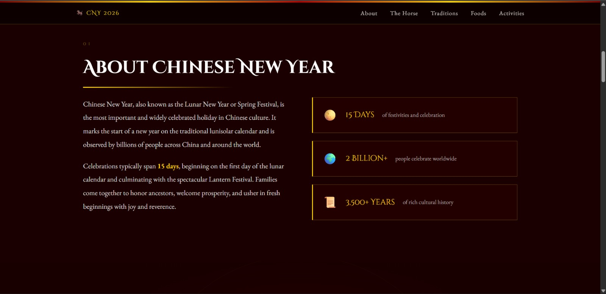
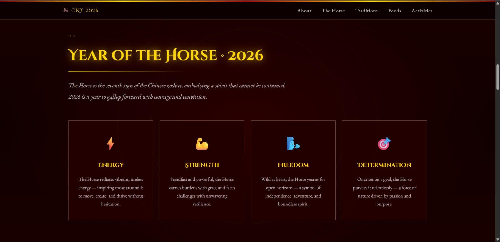
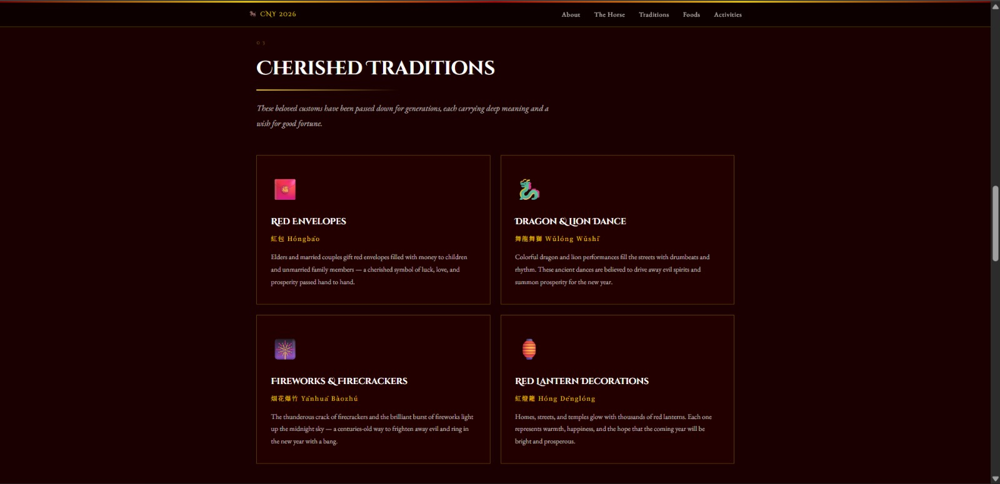
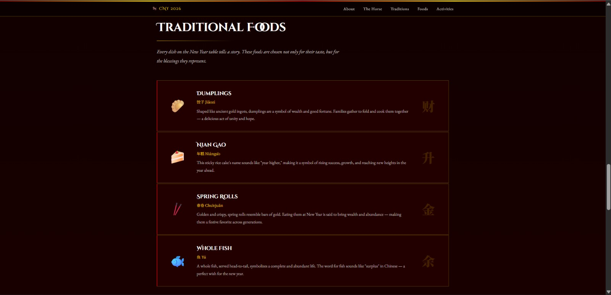
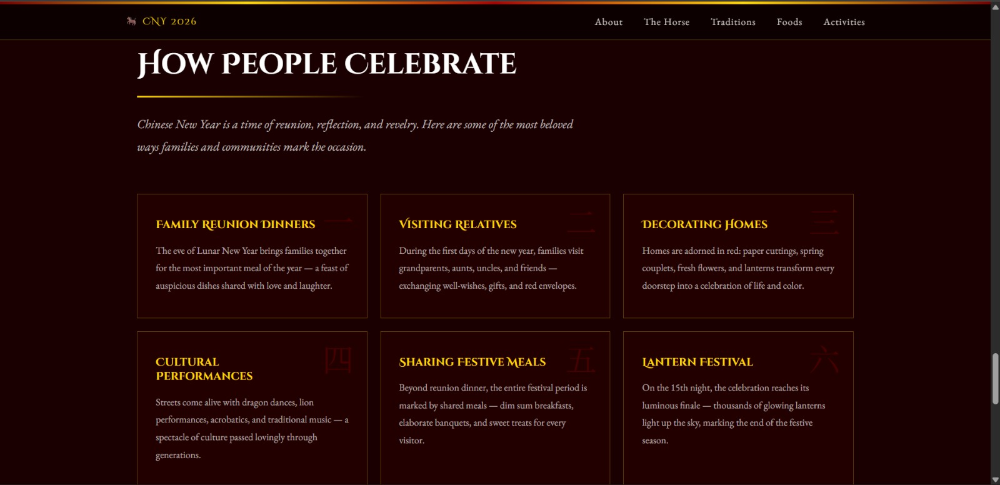
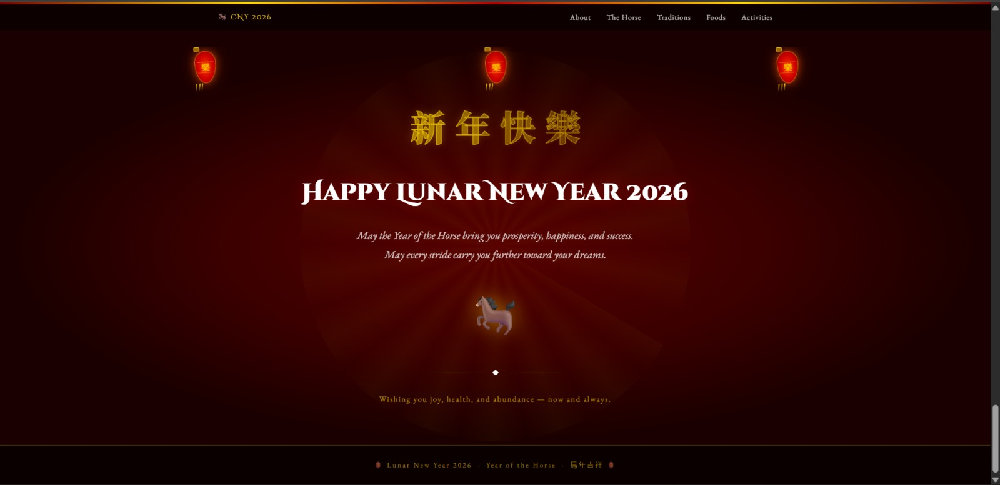

<div align="center">
  <br />
  <h1>LAPORAN PRAKTIKUM <br>APLIKASI BERBASIS PLATFORM</h1>
  <br />
  <h2>MODUL 3 <br> CSS - CASCADING STYLE SHEET </h2>
  <br />
  <br />
   
  <br />
  <br />
  <br />
  <h3>Disusun Oleh :</h3>
  <p>
    <strong>Rafaldo Al Maqdis</strong><br>
    <strong>2311102099</strong><br>
    <strong>S1 IF-11-REG 01</strong>
  </p>
  <br />
  <h3>Dosen Pengampu :</h3>
  <p>
    <strong>Dimas Fanny Hebrasianto Permadi, S.ST., M.Kom</strong>
  </p>
  <br />
  <br />
    <h4>Asisten Praktikum :</h4>
    <strong> Apri Pandu Wicaksono </strong> <br>
    <strong>Rangga Pradarrell Fathi</strong>
  <br />
  <h2>LABORATORIUM HIGH PERFORMANCE
 <br>FAKULTAS INFORMATIKA <br>UNIVERSITAS TELKOM PURWOKERTO <br>2026</h2>
</div>

---

# 1. Dasar Teori

## Mengenal CSS: Pengatur Tampilan Visual pada Halaman Web

**CSS (Cascading Style Sheets)** adalah bahasa yang digunakan bersama HTML untuk mengatur tampilan visual suatu halaman web. Jika HTML berfungsi sebagai kerangka yang menyusun struktur konten, maka CSS berperan dalam mempercantik tampilannya, seperti pengaturan warna, tata letak halaman, ukuran teks, hingga gaya huruf.

Dengan bantuan CSS, halaman web dapat ditampilkan secara lebih menarik, rapi, serta nyaman untuk dibaca oleh pengguna.

## Cara Kerja CSS

CSS bekerja dengan cara menargetkan elemen-elemen HTML tertentu melalui **selector**, misalnya menggunakan nama tag, class, ataupun ID. Setelah elemen tersebut dipilih, aturan gaya yang telah didefinisikan akan diterapkan pada elemen tersebut.

Pemisahan antara struktur konten (HTML) dan pengaturan tampilan (CSS) membuat kode program menjadi lebih terorganisir, mudah dikelola, serta mempermudah proses perubahan desain tanpa harus mengubah struktur HTML secara langsung.

## Tiga Metode Penerapan CSS pada HTML

Secara umum, terdapat tiga cara untuk menerapkan CSS ke dalam dokumen HTML, yaitu sebagai berikut:

1. **Inline CSS**  
   Gaya CSS dituliskan langsung pada elemen HTML menggunakan atribut `style`. Metode ini biasanya digunakan untuk perubahan sederhana pada elemen tertentu saja.

2. **Internal CSS**  
   Aturan CSS diletakkan di dalam tag `<style>` yang berada pada bagian `<head>` dari dokumen HTML.

3. **External CSS**  
   Seluruh aturan CSS ditempatkan pada file terpisah dengan ekstensi `.css`, kemudian file tersebut dihubungkan ke dokumen HTML menggunakan tag `<link>`.  
   **Catatan:** Metode **External CSS** merupakan pendekatan yang paling direkomendasikan dalam pengembangan web modern karena memudahkan pengelolaan kode, terutama pada proyek yang lebih besar dan kompleks.

# 2.Kode HTML dan CSS

```html
### Kode HTML (`Tugas-3.html`)
<!DOCTYPE html>
<html lang="en">
<head>
  <meta charset="UTF-8" />
  <meta name="viewport" content="width=device-width, initial-scale=1.0" />
  <title>Lunar New Year 2026 – Year of the Horse</title>
  <link rel="stylesheet" href="style.css" />
  <link rel="preconnect" href="https://fonts.googleapis.com" />
  <link rel="preconnect" href="https://fonts.gstatic.com" crossorigin />
  <link href="https://fonts.googleapis.com/css2?family=Noto+Serif+SC:wght@400;700;900&family=Cinzel+Decorative:wght@400;700;900&family=EB+Garamond:ital,wght@0,400;0,600;1,400&display=swap" rel="stylesheet" />
</head>
<body>

  <!-- ======= FIREWORKS BG ======= -->
  <div class="fireworks-bg" aria-hidden="true">
    <div class="spark s1"></div>
    <div class="spark s2"></div>
    <div class="spark s3"></div>
    <div class="spark s4"></div>
    <div class="spark s5"></div>
    <div class="spark s6"></div>
  </div>

  <!-- ======= HEADER NAV ======= -->
  <header class="site-header">
    <div class="header-inner">
      <span class="header-logo">🐎 CNY 2026</span>
      <nav>
        <a href="#about">About</a>
        <a href="#horse">The Horse</a>
        <a href="#traditions">Traditions</a>
        <a href="#food">Foods</a>
        <a href="#activities">Activities</a>
      </nav>
    </div>
  </header>

  <!-- ======= HERO ======= -->
  <section class="hero" id="top">

    <!-- Hanging lanterns -->
    <div class="lantern-row" aria-hidden="true">
      <div class="lantern l1">
        <div class="lantern-top"></div>
        <div class="lantern-body">
          <div class="lantern-stripe"></div>
          <div class="lantern-stripe"></div>
          <div class="lantern-stripe"></div>
        </div>
        <div class="lantern-fringe"><span></span><span></span><span></span><span></span><span></span></div>
      </div>
      <div class="lantern l2">
        <div class="lantern-top"></div>
        <div class="lantern-body">
          <div class="lantern-stripe"></div>
          <div class="lantern-stripe"></div>
          <div class="lantern-stripe"></div>
        </div>
        <div class="lantern-fringe"><span></span><span></span><span></span><span></span><span></span></div>
      </div>
      <div class="lantern l3 small">
        <div class="lantern-top"></div>
        <div class="lantern-body">
          <div class="lantern-stripe"></div>
          <div class="lantern-stripe"></div>
        </div>
        <div class="lantern-fringe"><span></span><span></span><span></span></div>
      </div>
      <div class="lantern l4 small">
        <div class="lantern-top"></div>
        <div class="lantern-body">
          <div class="lantern-stripe"></div>
          <div class="lantern-stripe"></div>
        </div>
        <div class="lantern-fringe"><span></span><span></span><span></span></div>
      </div>
      <div class="lantern l5">
        <div class="lantern-top"></div>
        <div class="lantern-body">
          <div class="lantern-stripe"></div>
          <div class="lantern-stripe"></div>
          <div class="lantern-stripe"></div>
        </div>
        <div class="lantern-fringe"><span></span><span></span><span></span><span></span><span></span></div>
      </div>
    </div>

    <!-- Rope connecting lanterns -->
    <div class="lantern-rope" aria-hidden="true"></div>

    <div class="hero-content">
      <div class="hero-badge">農歷新年</div>
      <h1 class="hero-title">Lunar New Year<br /><span class="year-num">2026</span></h1>
      <p class="hero-sub">Welcome the Year of the Horse</p>

      <!-- ================================================
           🖼️  GANTI GAMBAR KUDA DI SINI
           Langkah:
           1. Simpan gambar kuda dari Canva (PNG/JPG/WEBP)
              di folder yang sama dengan index.html
           2. Ganti nilai src="YOUR_HORSE_IMAGE.png"
              dengan nama file gambar kamu
              Contoh: src="kuda-cny.png"
           ================================================ -->
      <div class="horse-container" aria-label="Chinese Zodiac Horse illustration">
        
        <!-- Placeholder tampil kalau gambar belum diganti -->
        <div class="horse-placeholder">
          <div class="placeholder-ring"></div>
          <span class="placeholder-icon">🐎</span>
          <p>Ganti <code>src="YOUR_HORSE_IMAGE.png"</code><br/>dengan nama file gambar kamu</p>
        </div>
      </div>

      <div class="hero-date">February 17, 2026 &nbsp;·&nbsp; Gengwu Year</div>
      <div class="hero-divider">
        <span></span><span class="diamond">◆</span><span></span>
      </div>
    </div>
  </section>

  <!-- ======= SECTION: ABOUT ======= -->
  <section class="section about-section" id="about">
    <div class="section-inner">
      <div class="section-label">01</div>
      <h2 class="section-title">About Chinese New Year</h2>
      <div class="about-grid">
        <div class="about-text">
          <p>Chinese New Year, also known as the Lunar New Year or Spring Festival, is the most important and widely celebrated holiday in Chinese culture. It marks the start of a new year on the traditional lunisolar calendar and is observed by billions of people across China and around the world.</p>
          <p>Celebrations typically span <strong>15 days</strong>, beginning on the first day of the lunar calendar and culminating with the spectacular Lantern Festival. Families come together to honor ancestors, welcome prosperity, and usher in fresh beginnings with joy and reverence.</p>
        </div>
        <div class="about-facts">
          <div class="fact-card">
            <div class="fact-icon">🌕</div>
            <div class="fact-label">15 Days</div>
            <div class="fact-desc">of festivities and celebration</div>
          </div>
          <div class="fact-card">
            <div class="fact-icon">🌍</div>
            <div class="fact-label">2 Billion+</div>
            <div class="fact-desc">people celebrate worldwide</div>
          </div>
          <div class="fact-card">
            <div class="fact-icon">📜</div>
            <div class="fact-label">3,500+ Years</div>
            <div class="fact-desc">of rich cultural history</div>
          </div>
        </div>
      </div>
    </div>
  </section>

  <!-- ======= SECTION: HORSE ======= -->
  <section class="section horse-section" id="horse">
    <div class="section-inner">
      <div class="section-label">02</div>
      <h2 class="section-title gold-glow">Year of the Horse · 2026</h2>
      <p class="section-intro">The Horse is the seventh sign of the Chinese zodiac, embodying a spirit that cannot be contained. 2026 is a year to gallop forward with courage and conviction.</p>
      <div class="traits-grid">
        <div class="trait-card">
          <div class="trait-icon">⚡</div>
          <h3>Energy</h3>
          <p>The Horse radiates vibrant, tireless energy — inspiring those around it to move, create, and thrive without hesitation.</p>
        </div>
        <div class="trait-card">
          <div class="trait-icon">💪</div>
          <h3>Strength</h3>
          <p>Steadfast and powerful, the Horse carries burdens with grace and faces challenges with unwavering resilience.</p>
        </div>
        <div class="trait-card">
          <div class="trait-icon">🌬️</div>
          <h3>Freedom</h3>
          <p>Wild at heart, the Horse yearns for open horizons — a symbol of independence, adventure, and boundless spirit.</p>
        </div>
        <div class="trait-card">
          <div class="trait-icon">🎯</div>
          <h3>Determination</h3>
          <p>Once set on a goal, the Horse pursues it relentlessly — a force of nature driven by passion and purpose.</p>
        </div>
      </div>
    </div>
  </section>

  <!-- ======= SECTION: TRADITIONS ======= -->
  <section class="section traditions-section" id="traditions">
    <div class="section-inner">
      <div class="section-label">03</div>
      <h2 class="section-title">Cherished Traditions</h2>
      <p class="section-intro">These beloved customs have been passed down for generations, each carrying deep meaning and a wish for good fortune.</p>
      <div class="traditions-grid">

        <div class="trad-card">
          <div class="trad-icon">🧧</div>
          <h3>Red Envelopes</h3>
          <p class="trad-chinese">紅包 Hóngbāo</p>
          <p>Elders and married couples gift red envelopes filled with money to children and unmarried family members — a cherished symbol of luck, love, and prosperity passed hand to hand.</p>
        </div>

        <div class="trad-card">
          <div class="trad-icon">🐉</div>
          <h3>Dragon &amp; Lion Dance</h3>
          <p class="trad-chinese">舞龍舞獅 Wǔlóng Wǔshī</p>
          <p>Colorful dragon and lion performances fill the streets with drumbeats and rhythm. These ancient dances are believed to drive away evil spirits and summon prosperity for the new year.</p>
        </div>

        <div class="trad-card">
          <div class="trad-icon">🎆</div>
          <h3>Fireworks &amp; Firecrackers</h3>
          <p class="trad-chinese">烟花爆竹 Yānhuā Bàozhú</p>
          <p>The thunderous crack of firecrackers and the brilliant burst of fireworks light up the midnight sky — a centuries-old way to frighten away evil and ring in the new year with a bang.</p>
        </div>

        <div class="trad-card">
          <div class="trad-icon">🏮</div>
          <h3>Red Lantern Decorations</h3>
          <p class="trad-chinese">紅燈籠 Hóng Dēnglóng</p>
          <p>Homes, streets, and temples glow with thousands of red lanterns. Each one represents warmth, happiness, and the hope that the coming year will be bright and prosperous.</p>
        </div>

      </div>
    </div>
  </section>

  <!-- ======= SECTION: FOOD ======= -->
  <section class="section food-section" id="food">
    <div class="section-inner">
      <div class="section-label">04</div>
      <h2 class="section-title">Traditional Foods</h2>
      <p class="section-intro">Every dish on the New Year table tells a story. These foods are chosen not only for their taste, but for the blessings they represent.</p>
      <div class="food-list">

        <div class="food-item">
          <div class="food-emoji">🥟</div>
          <div class="food-info">
            <h3>Dumplings <span class="food-cn">饺子 Jiǎozi</span></h3>
            <p>Shaped like ancient gold ingots, dumplings are a symbol of wealth and good fortune. Families gather to fold and cook them together — a delicious act of unity and hope.</p>
          </div>
          <div class="food-symbol">财</div>
        </div>

        <div class="food-item">
          <div class="food-emoji">🍰</div>
          <div class="food-info">
            <h3>Nian Gao <span class="food-cn">年糕 Niángāo</span></h3>
            <p>This sticky rice cake's name sounds like "year higher," making it a symbol of rising success, growth, and reaching new heights in the year ahead.</p>
          </div>
          <div class="food-symbol">升</div>
        </div>

        <div class="food-item">
          <div class="food-emoji">🥢</div>
          <div class="food-info">
            <h3>Spring Rolls <span class="food-cn">春卷 Chūnjuǎn</span></h3>
            <p>Golden and crispy, spring rolls resemble bars of gold. Eating them at New Year is said to bring wealth and abundance — making them a festive favorite across generations.</p>
          </div>
          <div class="food-symbol">金</div>
        </div>

        <div class="food-item">
          <div class="food-emoji">🐟</div>
          <div class="food-info">
            <h3>Whole Fish <span class="food-cn">鱼 Yú</span></h3>
            <p>A whole fish, served head-to-tail, symbolizes a complete and abundant life. The word for fish sounds like "surplus" in Chinese — a perfect wish for the new year.</p>
          </div>
          <div class="food-symbol">余</div>
        </div>

      </div>
    </div>
  </section>

  <!-- ======= SECTION: ACTIVITIES ======= -->
  <section class="section activities-section" id="activities">
    <div class="section-inner">
      <div class="section-label">05</div>
      <h2 class="section-title">How People Celebrate</h2>
      <p class="section-intro">Chinese New Year is a time of reunion, reflection, and revelry. Here are some of the most beloved ways families and communities mark the occasion.</p>
      <div class="activities-grid">
        <div class="act-card">
          <div class="act-num">一</div>
          <h3>Family Reunion Dinners</h3>
          <p>The eve of Lunar New Year brings families together for the most important meal of the year — a feast of auspicious dishes shared with love and laughter.</p>
        </div>
        <div class="act-card">
          <div class="act-num">二</div>
          <h3>Visiting Relatives</h3>
          <p>During the first days of the new year, families visit grandparents, aunts, uncles, and friends — exchanging well-wishes, gifts, and red envelopes.</p>
        </div>
        <div class="act-card">
          <div class="act-num">三</div>
          <h3>Decorating Homes</h3>
          <p>Homes are adorned in red: paper cuttings, spring couplets, fresh flowers, and lanterns transform every doorstep into a celebration of life and color.</p>
        </div>
        <div class="act-card">
          <div class="act-num">四</div>
          <h3>Cultural Performances</h3>
          <p>Streets come alive with dragon dances, lion performances, acrobatics, and traditional music — a spectacle of culture passed lovingly through generations.</p>
        </div>
        <div class="act-card">
          <div class="act-num">五</div>
          <h3>Sharing Festive Meals</h3>
          <p>Beyond reunion dinner, the entire festival period is marked by shared meals — dim sum breakfasts, elaborate banquets, and sweet treats for every visitor.</p>
        </div>
        <div class="act-card">
          <div class="act-num">六</div>
          <h3>Lantern Festival</h3>
          <p>On the 15th night, the celebration reaches its luminous finale — thousands of glowing lanterns light up the sky, marking the end of the festive season.</p>
        </div>
      </div>
    </div>
  </section>

  <!-- ======= SECTION: CELEBRATION MESSAGE ======= -->
  <section class="section closing-section">
    <div class="closing-lanterns" aria-hidden="true">
      <div class="cl l1"><div class="lantern-top"></div><div class="lantern-body"><div class="lantern-stripe"></div><div class="lantern-stripe"></div></div><div class="lantern-fringe"><span></span><span></span><span></span></div></div>
      <div class="cl l2"><div class="lantern-top"></div><div class="lantern-body"><div class="lantern-stripe"></div><div class="lantern-stripe"></div></div><div class="lantern-fringe"><span></span><span></span><span></span></div></div>
      <div class="cl l3"><div class="lantern-top"></div><div class="lantern-body"><div class="lantern-stripe"></div><div class="lantern-stripe"></div></div><div class="lantern-fringe"><span></span><span></span><span></span></div></div>
    </div>
    <div class="closing-inner">
      <div class="closing-chars" aria-hidden="true">
        <span>新</span><span>年</span><span>快</span><span>樂</span>
      </div>
      <h2 class="closing-title">Happy Lunar New Year 2026</h2>
      <p class="closing-msg">May the Year of the Horse bring you prosperity, happiness, and success.<br/>May every stride carry you further toward your dreams.</p>
      <div class="closing-horse-char">🐎</div>
      <div class="closing-divider"><span></span><span class="diamond">◆</span><span></span></div>
      <p class="closing-footer">Wishing you joy, health, and abundance — now and always.</p>
    </div>
  </section>

  <!-- ======= FOOTER ======= -->
  <footer class="site-footer">
    <div class="footer-inner">
      <p>🏮 Lunar New Year 2026 &nbsp;·&nbsp; Year of the Horse &nbsp;·&nbsp; 馬年吉祥 🏮</p>
    </div>
  </footer>

</body>
</html>
```

### Kode css (`style.css`)
```css

:root {
  --red:       #b30000;
  --red-dark:  #7a0000;
  --gold:      #ffd700;
  --gold-dim:  #c8a000;
  --gold-dark: #8b6914;
  --black:     #111111;
  --white:     #ffffff;
  --cream:     #fff9e6;
  --section-bg:#1a0000;
  --card-bg:   #220000;
  --border:    rgba(255,215,0,0.3);
  --font-display: 'Cinzel Decorative', serif;
  --font-body:    'EB Garamond', Georgia, serif;
  --font-cjk:     'Noto Serif SC', serif;
}

/* ============================================================
   RESET & BASE
   ============================================================ */
*, *::before, *::after { box-sizing: border-box; margin: 0; padding: 0; }

html { scroll-behavior: smooth; }

body {
  background-color: var(--black);
  color: var(--white);
  font-family: var(--font-body);
  font-size: 18px;
  line-height: 1.75;
  overflow-x: hidden;
}

/* ============================================================
   FIREWORKS BACKGROUND
   ============================================================ */
.fireworks-bg {
  position: fixed;
  inset: 0;
  pointer-events: none;
  z-index: 0;
  overflow: hidden;
}

.spark {
  position: absolute;
  border-radius: 50%;
  opacity: 0;
  animation: sparkle 6s ease-in-out infinite;
}

.s1 { width: 8px; height: 8px; background: var(--gold); top: 10%; left: 5%;  animation-delay: 0s;   animation-duration: 7s; }
.s2 { width: 6px; height: 6px; background: #ff6622;      top: 20%; left: 90%; animation-delay: 1.2s; animation-duration: 5.5s; }
.s3 { width: 10px;height: 10px;background: var(--gold);  top: 60%; left: 3%;  animation-delay: 2.4s; animation-duration: 8s; }
.s4 { width: 5px; height: 5px; background: #ffaa00;      top: 75%; left: 92%; animation-delay: 0.8s; animation-duration: 6s; }
.s5 { width: 7px; height: 7px; background: var(--gold);  top: 40%; left: 8%;  animation-delay: 3s;   animation-duration: 9s; }
.s6 { width: 9px; height: 9px; background: #ff4400;      top: 85%; left: 85%; animation-delay: 1.8s; animation-duration: 7s; }

@keyframes sparkle {
  0%,100% { opacity: 0; transform: scale(0.5) rotate(0deg); }
  30%      { opacity: 0.9; transform: scale(1.4) rotate(180deg); }
  60%      { opacity: 0.4; transform: scale(0.8) rotate(300deg); }
}

/* Decorative top border strip */
body::before {
  content: '';
  display: block;
  position: fixed;
  top: 0; left: 0; right: 0;
  height: 4px;
  background: linear-gradient(90deg, var(--red-dark), var(--gold), var(--red), var(--gold), var(--red-dark));
  z-index: 1000;
}

/* ============================================================
   HEADER
   ============================================================ */
.site-header {
  position: fixed;
  top: 4px; left: 0; right: 0;
  z-index: 999;
  background: rgba(10,0,0,0.88);
  backdrop-filter: blur(12px);
  border-bottom: 1px solid var(--border);
}

.header-inner {
  max-width: 1200px;
  margin: 0 auto;
  padding: 14px 32px;
  display: flex;
  align-items: center;
  justify-content: space-between;
}

.header-logo {
  font-family: var(--font-display);
  font-size: 14px;
  color: var(--gold);
  letter-spacing: 2px;
}

.site-header nav {
  display: flex;
  gap: 32px;
}

.site-header nav a {
  font-family: var(--font-body);
  font-size: 15px;
  color: rgba(255,255,255,0.75);
  text-decoration: none;
  letter-spacing: 1px;
  transition: color 0.25s;
  position: relative;
}
.site-header nav a::after {
  content: '';
  position: absolute;
  bottom: -3px; left: 0; right: 100%;
  height: 1px;
  background: var(--gold);
  transition: right 0.3s ease;
}
.site-header nav a:hover { color: var(--gold); }
.site-header nav a:hover::after { right: 0; }

/* ============================================================
   LANTERNS (CSS-ONLY)
   ============================================================ */
.lantern-row {
  position: absolute;
  top: 0; left: 0; right: 0;
  display: flex;
  justify-content: space-around;
  align-items: flex-start;
  padding: 0 20px;
  z-index: 5;
}

.lantern-rope {
  position: absolute;
  top: 0; left: 0; right: 0;
  height: 30px;
  background: linear-gradient(to bottom, #5c1a00 0%, transparent 100%);
  clip-path: polygon(0 0, 100% 0, 100% 8px, 0 8px);
  z-index: 4;
  border-bottom: 2px solid #8b3a00;
}

.lantern {
  display: flex;
  flex-direction: column;
  align-items: center;
  animation: swing 4s ease-in-out infinite;
  transform-origin: top center;
}
.lantern.l1 { animation-delay: 0s; }
.lantern.l2 { animation-delay: 0.6s; }
.lantern.l3 { animation-delay: 1.2s; }
.lantern.l4 { animation-delay: 0.9s; }
.lantern.l5 { animation-delay: 0.3s; }

@keyframes swing {
  0%,100% { transform: rotate(-4deg); }
  50%      { transform: rotate(4deg); }
}

.lantern-top {
  width: 14px; height: 10px;
  background: var(--gold-dark);
  border-radius: 2px 2px 0 0;
  border: 1px solid var(--gold);
}
.lantern-body {
  width: 48px; height: 70px;
  background: radial-gradient(ellipse at center, #ff3300 0%, #cc0000 50%, #7a0000 100%);
  border-radius: 50% 50% 50% 50% / 35% 35% 65% 65%;
  display: flex;
  flex-direction: column;
  justify-content: space-around;
  align-items: center;
  padding: 12px 0;
  box-shadow: 0 0 20px rgba(255,80,0,0.6), 0 0 40px rgba(255,80,0,0.3), inset 0 0 15px rgba(255,200,0,0.2);
  border: 1px solid rgba(255,215,0,0.5);
  position: relative;
}
.lantern-body::before {
  content: '福';
  position: absolute;
  font-family: var(--font-cjk);
  font-size: 20px;
  color: var(--gold);
  text-shadow: 0 0 6px rgba(255,215,0,0.8);
}
.lantern-stripe {
  width: 80%; height: 1px;
  background: rgba(255,215,0,0.4);
}
.lantern-fringe {
  display: flex;
  gap: 4px;
}
.lantern-fringe span {
  display: block;
  width: 2px;
  height: 18px;
  background: linear-gradient(to bottom, var(--gold), transparent);
  animation: fringe-sway 2s ease-in-out infinite alternate;
}
.lantern-fringe span:nth-child(2) { animation-delay: 0.1s; }
.lantern-fringe span:nth-child(3) { animation-delay: 0.2s; }
.lantern-fringe span:nth-child(4) { animation-delay: 0.3s; }
.lantern-fringe span:nth-child(5) { animation-delay: 0.4s; }

@keyframes fringe-sway {
  from { transform: skewX(-8deg); }
  to   { transform: skewX(8deg); }
}

.lantern.small .lantern-body {
  width: 36px; height: 52px;
}
.lantern.small .lantern-body::before { font-size: 15px; }
.lantern.small .lantern-top { width: 10px; height: 8px; }

/* ============================================================
   HERO
   ============================================================ */
.hero {
  position: relative;
  min-height: 100vh;
  display: flex;
  align-items: center;
  justify-content: center;
  padding: 120px 24px 80px;
  background: 
    radial-gradient(ellipse at 50% 40%, rgba(120,0,0,0.55) 0%, transparent 65%),
    radial-gradient(ellipse at 10% 90%, rgba(80,0,0,0.4) 0%, transparent 50%),
    radial-gradient(ellipse at 90% 90%, rgba(80,0,0,0.4) 0%, transparent 50%),
    linear-gradient(180deg, #0d0000 0%, #1a0000 50%, #0d0000 100%);
  overflow: hidden;
  z-index: 1;
}

/* Radial Chinese pattern background */
.hero::before {
  content: '';
  position: absolute;
  inset: 0;
  background-image: 
    repeating-linear-gradient(45deg, rgba(255,215,0,0.03) 0px, rgba(255,215,0,0.03) 1px, transparent 1px, transparent 40px),
    repeating-linear-gradient(-45deg, rgba(255,215,0,0.03) 0px, rgba(255,215,0,0.03) 1px, transparent 1px, transparent 40px);
  z-index: 0;
}

.hero::after {
  content: '';
  position: absolute;
  bottom: 0; left: 0; right: 0;
  height: 120px;
  background: linear-gradient(to bottom, transparent, var(--section-bg));
  z-index: 2;
  pointer-events: none;
}

.hero-content {
  position: relative;
  z-index: 3;
  text-align: center;
  max-width: 760px;
  width: 100%;
}

.hero-badge {
  display: inline-block;
  font-family: var(--font-cjk);
  font-size: 13px;
  letter-spacing: 8px;
  color: var(--gold);
  border: 1px solid rgba(255,215,0,0.4);
  padding: 6px 20px;
  margin-bottom: 28px;
  text-transform: uppercase;
  animation: fadeInDown 1s ease both;
}

.hero-title {
  font-family: var(--font-display);
  font-size: clamp(36px, 7vw, 72px);
  font-weight: 900;
  line-height: 1.1;
  color: var(--white);
  text-shadow: 0 0 40px rgba(179,0,0,0.6), 0 2px 8px rgba(0,0,0,0.8);
  margin-bottom: 16px;
  animation: fadeInDown 1s 0.15s ease both;
}

.year-num {
  color: var(--gold);
  text-shadow: 0 0 30px rgba(255,215,0,0.8), 0 0 60px rgba(255,215,0,0.4);
  display: block;
  font-size: clamp(52px, 10vw, 100px);
}

.hero-sub {
  font-family: var(--font-body);
  font-style: italic;
  font-size: clamp(18px, 3vw, 26px);
  color: rgba(255,255,255,0.8);
  letter-spacing: 2px;
  margin-bottom: 40px;
  animation: fadeInDown 1s 0.3s ease both;
}

/* Horse SVG container */
.horse-container {
  margin: 0 auto 32px;
  width: clamp(260px, 50vw, 400px);
  position: relative;
  animation: floatHorse 5s ease-in-out infinite, fadeInUp 1.2s 0.4s ease both;
  filter: drop-shadow(0 0 30px rgba(255,215,0,0.35)) drop-shadow(0 8px 24px rgba(0,0,0,0.6));
}

@keyframes floatHorse {
  0%,100% { transform: translateY(0px); }
  50%      { transform: translateY(-12px); }
}

/* --- Gambar kuda dari Canva --- */
.horse-img {
  width: 100%;
  height: auto;
  display: block;
  object-fit: contain;
  /* Opsional: hapus baris filter kalau tidak mau efek glow */
  filter: drop-shadow(0 0 24px rgba(255,215,0,0.4)) drop-shadow(0 8px 20px rgba(0,0,0,0.5));
}

/* Placeholder — tampil otomatis kalau gambar belum diganti */
.horse-placeholder {
  display: none;
  flex-direction: column;
  align-items: center;
  justify-content: center;
  gap: 14px;
  width: 100%;
  aspect-ratio: 1 / 1;
  border: 2px dashed rgba(255,215,0,0.35);
  border-radius: 50%;
  padding: 32px;
  position: relative;
}
.placeholder-ring {
  position: absolute;
  inset: 0;
  border-radius: 50%;
  border: 1px solid rgba(255,215,0,0.12);
  animation: pulsering 2.5s ease-in-out infinite;
}
@keyframes pulsering {
  0%,100% { transform: scale(1); opacity: 0.5; }
  50%      { transform: scale(1.05); opacity: 1; }
}
.placeholder-icon {
  font-size: 72px;
  filter: grayscale(0.3);
  animation: floatHorse 5s ease-in-out infinite;
}
.horse-placeholder p {
  font-family: var(--font-body);
  font-size: 14px;
  color: rgba(255,215,0,0.6);
  text-align: center;
  line-height: 1.7;
}
.horse-placeholder code {
  background: rgba(255,215,0,0.1);
  border: 1px solid rgba(255,215,0,0.3);
  padding: 2px 8px;
  border-radius: 4px;
  font-size: 12px;
  color: var(--gold);
}

.hero-date {
  font-family: var(--font-body);
  font-size: 15px;
  color: rgba(255,215,0,0.7);
  letter-spacing: 3px;
  text-transform: uppercase;
  margin-bottom: 28px;
  animation: fadeInUp 1s 0.5s ease both;
}

.hero-divider {
  display: flex;
  align-items: center;
  gap: 16px;
  justify-content: center;
  animation: fadeInUp 1s 0.6s ease both;
}
.hero-divider span:first-child,
.hero-divider span:last-child {
  display: block;
  width: 80px; height: 1px;
  background: linear-gradient(to right, transparent, var(--gold), transparent);
}
.hero-divider .diamond {
  color: var(--gold);
  font-size: 14px;
  width: auto;
  height: auto;
  background: none;
}

/* ============================================================
   SECTIONS SHARED
   ============================================================ */
.section {
  position: relative;
  z-index: 1;
  padding: 100px 24px;
}

.section-inner {
  max-width: 1100px;
  margin: 0 auto;
}

.section-label {
  font-family: var(--font-display);
  font-size: 11px;
  letter-spacing: 6px;
  color: rgba(255,215,0,0.4);
  text-transform: uppercase;
  margin-bottom: 12px;
}

.section-title {
  font-family: var(--font-display);
  font-size: clamp(26px, 5vw, 44px);
  font-weight: 700;
  color: var(--white);
  margin-bottom: 24px;
  position: relative;
  display: inline-block;
}
.section-title::after {
  content: '';
  display: block;
  width: 60%;
  height: 2px;
  background: linear-gradient(to right, var(--gold), transparent);
  margin-top: 10px;
}

.gold-glow {
  color: var(--gold);
  text-shadow: 0 0 20px rgba(255,215,0,0.5), 0 0 40px rgba(255,215,0,0.25);
}

.section-intro {
  font-size: 19px;
  color: rgba(255,255,255,0.7);
  font-style: italic;
  max-width: 700px;
  margin-bottom: 56px;
  line-height: 1.8;
}

/* ============================================================
   SECTION 01 – ABOUT
   ============================================================ */
.about-section {
  background: var(--section-bg);
}

.about-grid {
  display: grid;
  grid-template-columns: 1fr 1fr;
  gap: 60px;
  align-items: start;
}

.about-text p {
  color: rgba(255,255,255,0.82);
  font-size: 18px;
  line-height: 1.9;
  margin-bottom: 20px;
}
.about-text strong {
  color: var(--gold);
}

.about-facts {
  display: flex;
  flex-direction: column;
  gap: 20px;
}

.fact-card {
  background: var(--card-bg);
  border: 1px solid var(--border);
  border-left: 3px solid var(--gold);
  padding: 20px 24px;
  display: flex;
  align-items: center;
  gap: 20px;
  transition: transform 0.3s ease, box-shadow 0.3s ease;
}
.fact-card:hover {
  transform: translateX(6px);
  box-shadow: -4px 0 20px rgba(255,215,0,0.15);
}
.fact-icon { font-size: 28px; flex-shrink: 0; }
.fact-label {
  font-family: var(--font-display);
  font-size: 20px;
  color: var(--gold);
  display: block;
  line-height: 1.2;
}
.fact-desc {
  font-size: 15px;
  color: rgba(255,255,255,0.6);
}

/* ============================================================
   SECTION 02 – HORSE TRAITS
   ============================================================ */
.horse-section {
  background: 
    radial-gradient(ellipse at center, rgba(120,0,0,0.25) 0%, transparent 70%),
    linear-gradient(180deg, var(--section-bg) 0%, #110000 50%, var(--section-bg) 100%);
  position: relative;
  overflow: hidden;
}

.horse-section::before {
  content: '';
  position: absolute;
  top: 50%; left: 50%;
  transform: translate(-50%, -50%);
  width: 600px; height: 600px;
  border-radius: 50%;
  border: 1px solid rgba(255,215,0,0.06);
  pointer-events: none;
}
.horse-section::after {
  content: '';
  position: absolute;
  top: 50%; left: 50%;
  transform: translate(-50%, -50%);
  width: 800px; height: 800px;
  border-radius: 50%;
  border: 1px solid rgba(255,215,0,0.04);
  pointer-events: none;
}

.traits-grid {
  display: grid;
  grid-template-columns: repeat(4, 1fr);
  gap: 20px;
}

.trait-card {
  background: var(--card-bg);
  border: 1px solid var(--border);
  padding: 36px 24px;
  text-align: center;
  position: relative;
  overflow: hidden;
  transition: transform 0.35s ease, box-shadow 0.35s ease, border-color 0.35s ease;
}
.trait-card::before {
  content: '';
  position: absolute;
  top: 0; left: 0; right: 0;
  height: 2px;
  background: linear-gradient(to right, transparent, var(--gold), transparent);
  transform: scaleX(0);
  transition: transform 0.4s ease;
}
.trait-card:hover::before { transform: scaleX(1); }
.trait-card:hover {
  transform: translateY(-8px);
  box-shadow: 0 20px 40px rgba(0,0,0,0.5), 0 0 20px rgba(255,215,0,0.08);
  border-color: rgba(255,215,0,0.5);
}

.trait-icon { font-size: 40px; display: block; margin-bottom: 16px; }
.trait-card h3 {
  font-family: var(--font-display);
  font-size: 18px;
  color: var(--gold);
  margin-bottom: 14px;
}
.trait-card p {
  font-size: 15px;
  color: rgba(255,255,255,0.65);
  line-height: 1.7;
}

/* ============================================================
   SECTION 03 – TRADITIONS
   ============================================================ */
.traditions-section {
  background: var(--section-bg);
}

.traditions-grid {
  display: grid;
  grid-template-columns: repeat(2, 1fr);
  gap: 24px;
}

.trad-card {
  background: var(--card-bg);
  border: 1px solid var(--border);
  padding: 36px 32px;
  position: relative;
  overflow: hidden;
  transition: transform 0.3s ease, box-shadow 0.3s ease;
}
.trad-card::after {
  content: '';
  position: absolute;
  bottom: 0; left: 0; right: 0;
  height: 2px;
  background: linear-gradient(to right, transparent, var(--gold), transparent);
  transform: scaleX(0);
  transition: transform 0.4s ease;
}
.trad-card:hover::after { transform: scaleX(1); }
.trad-card:hover {
  transform: translateY(-5px);
  box-shadow: 0 16px 40px rgba(0,0,0,0.5), 0 0 20px rgba(255,0,0,0.05);
}

.trad-icon {
  font-size: 48px;
  display: block;
  margin-bottom: 16px;
}
.trad-card h3 {
  font-family: var(--font-display);
  font-size: 20px;
  color: var(--white);
  margin-bottom: 8px;
}
.trad-chinese {
  font-family: var(--font-cjk);
  font-size: 14px;
  color: var(--gold);
  letter-spacing: 2px;
  margin-bottom: 16px;
}
.trad-card p:last-child {
  font-size: 16px;
  color: rgba(255,255,255,0.68);
  line-height: 1.8;
}

/* ============================================================
   SECTION 04 – FOOD
   ============================================================ */
.food-section {
  background: linear-gradient(180deg, #110000 0%, var(--section-bg) 100%);
  position: relative;
}

.food-list {
  display: flex;
  flex-direction: column;
  gap: 2px;
}

.food-item {
  display: grid;
  grid-template-columns: 80px 1fr 80px;
  align-items: center;
  gap: 32px;
  padding: 32px 36px;
  background: var(--card-bg);
  border: 1px solid var(--border);
  border-left: 3px solid var(--red);
  transition: border-left-color 0.3s ease, background 0.3s ease, transform 0.3s ease;
  position: relative;
  overflow: hidden;
}
.food-item::before {
  content: '';
  position: absolute;
  inset: 0;
  background: linear-gradient(90deg, rgba(255,215,0,0.03), transparent);
  opacity: 0;
  transition: opacity 0.3s;
}
.food-item:hover::before { opacity: 1; }
.food-item:hover {
  border-left-color: var(--gold);
  transform: translateX(6px);
}

.food-emoji { font-size: 48px; text-align: center; }

.food-info h3 {
  font-family: var(--font-display);
  font-size: 20px;
  color: var(--white);
  margin-bottom: 8px;
}
.food-cn {
  font-family: var(--font-cjk);
  font-weight: 400;
  font-size: 14px;
  color: var(--gold);
  display: block;
  margin-top: 2px;
}
.food-info p {
  font-size: 16px;
  color: rgba(255,255,255,0.65);
  line-height: 1.8;
  margin-top: 4px;
}

.food-symbol {
  font-family: var(--font-cjk);
  font-size: 48px;
  color: rgba(255,215,0,0.15);
  text-align: center;
  font-weight: 900;
  transition: color 0.3s;
}
.food-item:hover .food-symbol {
  color: rgba(255,215,0,0.35);
}

/* ============================================================
   SECTION 05 – ACTIVITIES
   ============================================================ */
.activities-section {
  background: var(--section-bg);
}

.activities-grid {
  display: grid;
  grid-template-columns: repeat(3, 1fr);
  gap: 20px;
}

.act-card {
  background: var(--card-bg);
  border: 1px solid var(--border);
  padding: 36px 28px;
  position: relative;
  overflow: hidden;
  transition: transform 0.35s ease, box-shadow 0.35s ease;
}
.act-card:hover {
  transform: translateY(-6px);
  box-shadow: 0 20px 40px rgba(0,0,0,0.5), 0 0 15px rgba(179,0,0,0.1);
}

.act-num {
  font-family: var(--font-cjk);
  font-size: 48px;
  color: rgba(179,0,0,0.25);
  position: absolute;
  top: 16px; right: 20px;
  line-height: 1;
  transition: color 0.3s;
}
.act-card:hover .act-num { color: rgba(179,0,0,0.5); }

.act-card h3 {
  font-family: var(--font-display);
  font-size: 17px;
  color: var(--gold);
  margin-bottom: 14px;
  padding-right: 48px;
  line-height: 1.3;
}
.act-card p {
  font-size: 15px;
  color: rgba(255,255,255,0.65);
  line-height: 1.8;
}

/* ============================================================
   CLOSING SECTION
   ============================================================ */
.closing-section {
  position: relative;
  background: 
    radial-gradient(ellipse at 50% 50%, rgba(179,0,0,0.4) 0%, rgba(80,0,0,0.6) 40%, transparent 70%),
    linear-gradient(180deg, var(--section-bg) 0%, #1a0000 100%);
  padding: 100px 24px 80px;
  text-align: center;
  overflow: hidden;
  z-index: 1;
}

.closing-section::before {
  content: '';
  position: absolute;
  top: 50%; left: 50%;
  transform: translate(-50%, -50%);
  width: 800px; height: 800px;
  background: conic-gradient(
    from 0deg,
    rgba(255,215,0,0.03) 0deg, transparent 10deg,
    rgba(255,215,0,0.03) 20deg, transparent 30deg,
    rgba(255,215,0,0.03) 40deg, transparent 50deg,
    rgba(255,215,0,0.03) 60deg, transparent 70deg,
    rgba(255,215,0,0.03) 80deg, transparent 90deg,
    rgba(255,215,0,0.03) 100deg, transparent 110deg,
    rgba(255,215,0,0.03) 120deg, transparent 130deg,
    rgba(255,215,0,0.03) 140deg, transparent 150deg,
    rgba(255,215,0,0.03) 160deg, transparent 170deg,
    rgba(255,215,0,0.03) 180deg, transparent 190deg,
    rgba(255,215,0,0.03) 200deg, transparent 210deg,
    rgba(255,215,0,0.03) 220deg, transparent 230deg,
    rgba(255,215,0,0.03) 240deg, transparent 250deg,
    rgba(255,215,0,0.03) 260deg, transparent 270deg,
    rgba(255,215,0,0.03) 280deg, transparent 290deg,
    rgba(255,215,0,0.03) 300deg, transparent 310deg,
    rgba(255,215,0,0.03) 320deg, transparent 330deg,
    rgba(255,215,0,0.03) 340deg, transparent 350deg
  );
  border-radius: 50%;
  pointer-events: none;
  animation: rotateSun 60s linear infinite;
}
@keyframes rotateSun { to { transform: translate(-50%, -50%) rotate(360deg); } }

.closing-lanterns {
  position: absolute;
  top: 0; left: 0; right: 0;
  display: flex;
  justify-content: space-around;
  padding: 0 120px;
  pointer-events: none;
}
.cl { animation: swing 4s ease-in-out infinite; transform-origin: top center; }
.cl.l1 { animation-delay: 0.2s; }
.cl.l2 { animation-delay: 0.8s; }
.cl.l3 { animation-delay: 0.5s; }
.cl .lantern-top { width: 12px; height: 9px; background: var(--gold-dark); border-radius: 2px 2px 0 0; border: 1px solid var(--gold); }
.cl .lantern-body {
  width: 44px; height: 66px;
  background: radial-gradient(ellipse at center, #ff3300 0%, #cc0000 55%, #7a0000 100%);
  border-radius: 50% 50% 50% 50% / 35% 35% 65% 65%;
  display: flex; flex-direction: column; justify-content: space-around; align-items: center; padding: 10px 0;
  box-shadow: 0 0 16px rgba(255,80,0,0.6), 0 0 32px rgba(255,80,0,0.3);
  border: 1px solid rgba(255,215,0,0.5);
  position: relative;
}
.cl .lantern-body::before { content: '樂'; position: absolute; font-family: var(--font-cjk); font-size: 18px; color: var(--gold); }
.cl .lantern-stripe { width: 80%; height: 1px; background: rgba(255,215,0,0.4); }
.cl .lantern-fringe { display: flex; gap: 4px; }
.cl .lantern-fringe span { display: block; width: 2px; height: 16px; background: linear-gradient(to bottom, var(--gold), transparent); }

.closing-inner { position: relative; z-index: 2; max-width: 800px; margin: 0 auto; }

.closing-chars {
  display: flex;
  justify-content: center;
  gap: 20px;
  margin-bottom: 32px;
}
.closing-chars span {
  font-family: var(--font-cjk);
  font-size: clamp(36px, 8vw, 72px);
  font-weight: 900;
  color: transparent;
  -webkit-text-stroke: 1px rgba(255,215,0,0.5);
  animation: glowChar 3s ease-in-out infinite alternate;
}
.closing-chars span:nth-child(1) { animation-delay: 0s; }
.closing-chars span:nth-child(2) { animation-delay: 0.3s; }
.closing-chars span:nth-child(3) { animation-delay: 0.6s; }
.closing-chars span:nth-child(4) { animation-delay: 0.9s; }

@keyframes glowChar {
  from {
    color: transparent;
    -webkit-text-stroke: 1px rgba(255,215,0,0.3);
  }
  to {
    color: rgba(255,215,0,0.6);
    -webkit-text-stroke: 1px rgba(255,215,0,0.8);
    text-shadow: 0 0 20px rgba(255,215,0,0.4);
  }
}

.closing-title {
  font-family: var(--font-display);
  font-size: clamp(24px, 5vw, 48px);
  font-weight: 900;
  color: var(--white);
  margin-bottom: 24px;
  text-shadow: 0 0 30px rgba(179,0,0,0.5);
}

.closing-msg {
  font-size: clamp(17px, 2.5vw, 22px);
  font-style: italic;
  color: rgba(255,255,255,0.8);
  line-height: 1.8;
  margin-bottom: 36px;
}

.closing-horse-char {
  font-size: 80px;
  display: block;
  margin-bottom: 32px;
  animation: floatHorse 4s ease-in-out infinite;
  filter: drop-shadow(0 0 20px rgba(255,215,0,0.5));
}

.closing-divider {
  display: flex; align-items: center; gap: 16px; justify-content: center; margin-bottom: 24px;
}
.closing-divider span:first-child,
.closing-divider span:last-child {
  display: block; width: 120px; height: 1px;
  background: linear-gradient(to right, transparent, var(--gold), transparent);
}

.closing-footer {
  font-size: 16px;
  color: rgba(255,215,0,0.6);
  letter-spacing: 2px;
}

/* ============================================================
   FOOTER
   ============================================================ */
.site-footer {
  background: #0a0000;
  border-top: 1px solid var(--border);
  padding: 28px 24px;
  position: relative;
  z-index: 1;
}
.footer-inner {
  max-width: 1100px; margin: 0 auto; text-align: center;
}
.footer-inner p {
  font-family: var(--font-body);
  font-size: 14px;
  color: rgba(255,215,0,0.5);
  letter-spacing: 3px;
}

/* ============================================================
   ANIMATIONS
   ============================================================ */
@keyframes fadeInDown {
  from { opacity: 0; transform: translateY(-24px); }
  to   { opacity: 1; transform: translateY(0); }
}
@keyframes fadeInUp {
  from { opacity: 0; transform: translateY(24px); }
  to   { opacity: 1; transform: translateY(0); }
}

/* ============================================================
   RESPONSIVE
   ============================================================ */
@media (max-width: 900px) {
  .traits-grid { grid-template-columns: repeat(2, 1fr); }
  .activities-grid { grid-template-columns: repeat(2, 1fr); }
  .about-grid { grid-template-columns: 1fr; gap: 40px; }
  .traditions-grid { grid-template-columns: 1fr; }
  .food-item { grid-template-columns: 60px 1fr 60px; gap: 20px; padding: 24px; }
  .food-symbol { font-size: 36px; }
}

@media (max-width: 640px) {
  .site-header nav { display: none; }
  .traits-grid { grid-template-columns: 1fr; }
  .activities-grid { grid-template-columns: 1fr; }
  .food-item { grid-template-columns: 50px 1fr; }
  .food-symbol { display: none; }
  .closing-chars { gap: 10px; }
  .lantern-row .lantern.small { display: none; }
  .traditions-grid { grid-template-columns: 1fr; }
}

```
### Hasil Tampilan (Screenshot)

 <br>
 <br>
 <br>
 <br>
 <br>
 <br>
 <br>


# penjelasan html dan css

  # html
## Deklarasi HTML

`<!DOCTYPE html>`

Baris ini merupakan deklarasi dokumen yang memberi tahu browser bahwa file yang digunakan mengikuti standar **HTML5**. Dengan deklarasi ini, browser dapat menampilkan halaman dengan cara yang sesuai dengan standar HTML modern.

---

## Elemen HTML Utama

`<html lang="en">`

Tag `<html>` merupakan elemen utama yang membungkus seluruh isi dokumen HTML.  
Atribut `lang="en"` menunjukkan bahwa bahasa utama yang digunakan dalam halaman ini adalah **Bahasa Inggris**.

---

# Bagian Head

Bagian `<head>` berisi berbagai informasi metadata yang dibutuhkan oleh browser sebelum menampilkan halaman.

## Pengaturan Karakter

`<meta charset="UTF-8">`

Elemen ini digunakan untuk menentukan jenis **encoding karakter**. Dengan menggunakan UTF-8, halaman dapat menampilkan berbagai karakter khusus, simbol, serta bahasa internasional dengan benar.

---

## Pengaturan Responsif

`<meta name="viewport" content="width=device-width, initial-scale=1.0">`

Tag ini digunakan untuk mengatur tampilan halaman agar dapat menyesuaikan dengan ukuran layar perangkat, seperti smartphone, tablet, maupun desktop.

---

## Judul Halaman

`<title>Lunar New Year 2026 – Year of the Horse</title>`

Elemen `<title>` menentukan judul halaman yang akan ditampilkan pada tab browser.

---

## Menghubungkan File CSS

`<link rel="stylesheet" href="style.css">`

Kode ini digunakan untuk menghubungkan dokumen HTML dengan file **CSS eksternal** bernama `style.css`.  
File tersebut berisi aturan gaya yang mengatur tampilan visual halaman seperti warna, tata letak, animasi, dan tipografi.

---

## Optimasi Koneksi Font

`<link rel="preconnect" href="https://fonts.googleapis.com">`

`<link rel="preconnect" href="https://fonts.gstatic.com">`

Kode ini digunakan untuk melakukan **preconnect** ke server Google Fonts. Tujuannya adalah mempercepat proses pemuatan font yang digunakan oleh halaman web.

---

## Import Google Fonts

`<link href="https://fonts.googleapis.com/css2?...">`

Elemen ini digunakan untuk mengimpor beberapa jenis font dari **Google Fonts**, seperti:

- Noto Serif SC  
- Cinzel Decorative  
- EB Garamond  

Font tersebut dipilih untuk memberikan tampilan tipografi yang lebih elegan serta sesuai dengan tema budaya pada halaman.

---

# Bagian Body

Bagian `<body>` berisi seluruh konten yang akan ditampilkan kepada pengguna ketika halaman dibuka.

---

# Background Fireworks

`<div class="fireworks-bg">`

Elemen ini digunakan untuk membuat **latar belakang animasi kembang api**.  
Di dalamnya terdapat beberapa elemen `<div>` dengan class `spark` yang nantinya dianimasikan menggunakan CSS.

Efek ini dibuat untuk menciptakan suasana perayaan yang identik dengan Tahun Baru Imlek.

---

# Header Navigasi

`<header class="site-header">`

Elemen `<header>` digunakan untuk membuat bagian **kepala halaman** yang berisi identitas website dan menu navigasi.

---

## Logo Halaman

`<span class="header-logo">🐎 CNY 2026</span>`

Elemen ini menampilkan logo sederhana berupa teks dan emoji kuda yang melambangkan **Chinese New Year 2026 – Year of the Horse**.

---

## Menu Navigasi

`<nav>`

Bagian navigasi berisi beberapa tautan yang memungkinkan pengguna berpindah ke bagian tertentu pada halaman.

Menu yang tersedia antara lain:

- About
- The Horse
- Traditions
- Foods
- Activities

Setiap menu menggunakan **anchor link** yang mengarah ke ID section tertentu.

---

# Section Hero

`<section class="hero">`

Section ini merupakan **bagian utama (hero section)** yang pertama kali dilihat oleh pengguna ketika membuka halaman web.

Bagian ini berisi:

- dekorasi lentera
- judul halaman
- ilustrasi kuda
- informasi tanggal perayaan

---

# Dekorasi Lentera

`<div class="lantern-row">`

Bagian ini menampilkan deretan **lentera merah** yang menjadi simbol khas dalam perayaan Tahun Baru Imlek.

Setiap lentera dibangun menggunakan beberapa elemen HTML seperti:

- lantern-top  
- lantern-body  
- lantern-stripe  
- lantern-fringe  

Elemen-elemen tersebut kemudian dibentuk dan dianimasikan menggunakan CSS.

---

# Konten Utama Hero

`<div class="hero-content">`

Bagian ini berisi teks utama yang menjelaskan tema halaman.

---

## Badge Mandarin

`<div class="hero-badge">農歷新年</div>`

Elemen ini menampilkan teks Mandarin yang berarti **Tahun Baru Lunar**.

---

## Judul Utama

`<h1 class="hero-title">`

Judul ini menampilkan teks **Lunar New Year 2026**, yang menjadi fokus utama halaman.

---

## Subjudul

`<p class="hero-sub">Welcome the Year of the Horse</p>`

Subjudul ini memberikan pesan sambutan untuk menyambut **tahun kuda dalam zodiak Cina**.

---

# Gambar Kuda

`<div class="horse-container">`

Elemen ini digunakan untuk menampilkan ilustrasi **kuda**, yang merupakan simbol dari zodiak Cina pada tahun 2026.

---

## Elemen Gambar

``

Tag `` digunakan untuk menampilkan gambar kuda yang tersimpan dalam file `QUDANIL.png`.

Jika gambar gagal dimuat, maka sistem akan menampilkan elemen **placeholder** sebagai pengganti.

---

# Informasi Tanggal

`<div class="hero-date">`

Bagian ini menampilkan tanggal perayaan Lunar New Year yaitu **17 Februari 2026** serta nama tahun dalam kalender tradisional Tiongkok.

---

# Section About

`<section class="about-section">`

Bagian ini menjelaskan informasi umum mengenai **Chinese New Year**, termasuk sejarah dan makna perayaan tersebut.

Selain paragraf penjelasan, bagian ini juga menampilkan beberapa **kartu fakta**.

---

# Fact Cards

`<div class="fact-card">`

Elemen ini digunakan untuk menampilkan informasi singkat mengenai perayaan Tahun Baru Imlek, seperti:

- lamanya perayaan yang berlangsung selama 15 hari  
- jumlah orang yang merayakan di seluruh dunia  
- sejarah tradisi yang telah berlangsung ribuan tahun

---

# Section Year of the Horse

`<section class="horse-section">`

Bagian ini menjelaskan karakteristik dari **zodiak kuda** dalam astrologi Tiongkok.

Beberapa sifat yang dijelaskan antara lain:

- energi yang tinggi  
- kekuatan  
- kebebasan  
- tekad yang kuat

Setiap sifat ditampilkan menggunakan **trait card**.

---

# Section Traditions

`<section class="traditions-section">`

Bagian ini menjelaskan berbagai tradisi penting yang dilakukan saat perayaan Tahun Baru Imlek.

Contohnya antara lain:

- pemberian angpao  
- tarian naga dan singa  
- kembang api  
- dekorasi lentera merah

---

# Section Traditional Foods

`<section class="food-section">`

Bagian ini menampilkan berbagai makanan khas yang biasa disajikan saat perayaan.

Beberapa makanan tersebut antara lain:

- Dumplings  
- Nian Gao  
- Spring Rolls  
- Whole Fish  

Setiap makanan memiliki makna simbolis yang berkaitan dengan keberuntungan, kekayaan, dan kelimpahan.

---

# Section Activities

`<section class="activities-section">`

Bagian ini menjelaskan berbagai kegiatan yang biasanya dilakukan saat perayaan Tahun Baru Imlek, seperti:

- makan malam keluarga  
- mengunjungi kerabat  
- menghias rumah  
- pertunjukan budaya  
- berbagi makanan  
- festival lentera

---

# Section Penutup

`<section class="closing-section">`

Bagian ini berfungsi sebagai **penutup halaman** yang berisi ucapan selamat Tahun Baru Imlek.

Di dalamnya terdapat:

- tulisan Mandarin
- ucapan selamat tahun baru
- simbol kuda
- pesan harapan untuk keberuntungan dan kesuksesan.

---

# Footer

`<footer class="site-footer">`

Footer merupakan bagian paling bawah dari halaman web yang berisi informasi singkat mengenai tema halaman yaitu **Lunar New Year 2026 – Year of the Horse** serta ucapan keberuntungan dalam bahasa Mandarin.

---


# 2. Penjelasan Kode CSS (`style.css`) 
```
Berikut **penjelasan lengkap kode CSS dalam satu format `.md`** (Markdown). Kamu bisa langsung menaruhnya di **README.md / laporan praktikum** tanpa perlu memecahnya lagi.

---

```md
# 4. Penjelasan Kode CSS

File CSS ini digunakan untuk mengatur tampilan visual dari halaman web **Lunar New Year 2026 – Year of the Horse**.  
Seluruh desain dibuat menggunakan **Pure CSS3 tanpa framework dan tanpa JavaScript**, sehingga semua animasi, layout, warna, serta responsivitas halaman diatur sepenuhnya menggunakan CSS.

---

# CSS Variables

Bagian ini mendefinisikan variabel warna dan font yang digunakan secara konsisten di seluruh halaman.

```

:root {
--red: #b30000;
--gold: #ffd700;
--black: #111111;
}

```

Penjelasan:

`:root` merupakan selector global yang digunakan untuk menyimpan **CSS Variables**.

Keuntungan menggunakan CSS Variables:

- memudahkan pengaturan warna
- membuat kode lebih konsisten
- mempermudah perubahan desain

Beberapa variabel penting:

| Variabel | Fungsi |
|--------|--------|
| `--red` | warna merah utama tema Imlek |
| `--gold` | warna emas simbol kemakmuran |
| `--black` | warna latar utama |
| `--section-bg` | warna background section |
| `--card-bg` | warna background card |
| `--font-display` | font dekoratif untuk judul |
| `--font-body` | font teks utama |

---

# Reset dan Base Styling

Bagian ini berfungsi untuk **menghilangkan styling default browser** agar tampilan lebih konsisten.

```

*, *::before, *::after {
box-sizing: border-box;
margin: 0;
padding: 0;
}

```

Penjelasan:

`box-sizing: border-box` membuat perhitungan ukuran elemen lebih mudah karena padding dan border sudah termasuk dalam ukuran elemen.

```

html {
scroll-behavior: smooth;
}

```

Fungsi:

membuat efek **smooth scrolling** ketika pengguna menekan menu navigasi.

---

# Body Styling

```

body {
background-color: var(--black);
color: var(--white);
font-family: var(--font-body);
}

```

Penjelasan:

- mengatur warna latar halaman
- menentukan font utama
- menentukan ukuran teks dasar

`overflow-x: hidden` digunakan untuk mencegah scroll horizontal.

---

# Fireworks Background

Bagian ini membuat **efek animasi kembang api di background**.

```

.fireworks-bg

```

Elemen ini diposisikan menggunakan:

```

position: fixed;

```

Sehingga background tetap berada di tempat meskipun halaman di-scroll.

---

## Spark Animation

```

.spark {
animation: sparkle 6s infinite;
}

```

Setiap elemen `.spark` merupakan **titik cahaya kecil** yang dianimasikan.

Keyframes:

```

@keyframes sparkle

```

Animasi ini membuat efek:

- muncul
- membesar
- memudar

sehingga terlihat seperti **percikan kembang api**.

---

# Decorative Border

```

body::before

```

Pseudo element ini membuat **garis dekoratif di bagian atas halaman**.

Warna menggunakan:

```

linear-gradient

```

Sehingga menghasilkan efek **gradasi merah dan emas**.

---

# Header (Navigation Bar)

```

.site-header

```

Digunakan untuk membuat **navbar tetap di atas halaman**.

Properti penting:

```

position: fixed
backdrop-filter: blur(12px)

```

Fungsi:

- navbar selalu terlihat saat scroll
- memberi efek kaca buram modern

---

# Navigation Menu

```

.site-header nav a

```

Digunakan untuk mengatur tampilan link navigasi.

Efek hover dibuat menggunakan pseudo element:

```

a::after

```

Ketika mouse diarahkan ke menu:

- warna berubah menjadi emas
- garis bawah muncul dengan animasi

---

# Lantern Decoration

Bagian ini membuat **lentera Imlek menggunakan CSS saja**.

```

.lantern-row

```

Berfungsi menampilkan deretan lentera di bagian atas hero section.

Setiap lentera terdiri dari beberapa bagian:

| Class | Fungsi |
|------|------|
| `lantern-top` | bagian atas lentera |
| `lantern-body` | badan lentera |
| `lantern-stripe` | garis dekoratif |
| `lantern-fringe` | rumbai bawah |

---

## Lantern Animation

```

@keyframes swing

```

Animasi ini membuat lentera **bergoyang seperti tertiup angin**.

Efek:

```

transform: rotate()

```

---

# Hero Section

```

.hero

```

Hero merupakan bagian utama halaman yang menampilkan:

- judul
- gambar kuda
- dekorasi

Background menggunakan beberapa **radial gradient** untuk menciptakan efek cahaya merah.

---

# Pattern Background

```

.hero::before

```

Pseudo element ini membuat **pola dekoratif berbentuk garis silang** menggunakan:

```

repeating-linear-gradient

```

Tujuannya untuk menambah kesan ornamen tradisional.

---

# Hero Content

```

.hero-content

```

Berisi seluruh teks utama pada hero section.

Tampilan dibuat **center alignment** agar terlihat simetris.

---

# Hero Title

```

.hero-title

```

Digunakan untuk menampilkan judul utama halaman.

Properti penting:

```

text-shadow

```

Digunakan untuk menciptakan efek glow.

---

# Horse Image

```

.horse-container

```

Digunakan untuk menampilkan ilustrasi kuda.

Animasi:

```

@keyframes floatHorse

```

Efeknya membuat gambar **mengambang naik turun**.

---

# Placeholder Image

Jika gambar kuda tidak ditemukan maka:

```

.horse-placeholder

```

akan ditampilkan.

Fungsi:

memberi pesan bahwa gambar belum diganti.

---

# Section Styling

Semua section menggunakan class dasar:

```

.section

```

Properti utama:

```

padding
position
z-index

```

Digunakan untuk menjaga jarak antar section.

---

# Section Title

```

.section-title

```

Digunakan untuk judul tiap bagian halaman.

Pseudo element:

```

```

membuat garis dekoratif di bawah judul.

---

# About Section

```

.about-section

```

Bagian ini menjelaskan tentang Chinese New Year.

Layout menggunakan:

```

display: grid
grid-template-columns: 1fr 1fr

```

Sehingga konten terbagi menjadi **2 kolom**.

---

# Fact Card

```

.fact-card

```

Digunakan untuk menampilkan informasi singkat.

Efek hover:

```

transform: translateX()

```

Sehingga card bergerak sedikit saat disentuh.

---

# Horse Traits Section

```

.traits-grid

```

Layout menggunakan:

```

grid-template-columns: repeat(4, 1fr)

```

Artinya terdapat **4 kolom card sifat kuda**.

---

# Trait Card

```

.trait-card

```

Digunakan untuk menampilkan sifat zodiak kuda.

Efek hover:

- card naik sedikit
- bayangan bertambah

---

# Traditions Section

```

.traditions-grid

```

Menampilkan tradisi Imlek seperti:

- Angpao
- Tarian naga
- Kembang api
- Lentera

Layout menggunakan **2 kolom grid**.

---

# Food Section

```

.food-list

```

Menampilkan daftar makanan khas Imlek.

Contoh makanan:

- Dumplings
- Nian Gao
- Spring Rolls
- Fish

---

# Food Item

```

.food-item

```

Layout menggunakan:

```

grid-template-columns: 80px 1fr 80px

```

Berarti:

| Kolom | Isi |
|-----|-----|
| 1 | emoji makanan |
| 2 | deskripsi makanan |
| 3 | simbol Cina |

---

# Activities Section

```

.activities-grid

```

Menampilkan aktivitas saat perayaan Imlek.

Layout menggunakan **3 kolom grid**.

---

# Activity Card

```

.act-card

```

Berisi kegiatan seperti:

- family dinner
- visiting relatives
- decorating homes

Efek hover membuat card sedikit terangkat.

---

# Closing Section

```

.closing-section

```

Bagian penutup halaman.

Berisi:

- ucapan selamat Imlek
- animasi karakter Mandarin
- ikon kuda

---

# Character Glow Animation

```

@keyframes glowChar

```

Animasi ini membuat karakter Mandarin:

- menyala
- redup
- menyala kembali

sehingga terlihat hidup.

---

# Footer

```

.site-footer

```

Bagian paling bawah halaman.

Berisi teks penutup mengenai perayaan:

Lunar New Year 2026 – Year of the Horse.

---

# Global Animations

Beberapa animasi umum digunakan di seluruh halaman.

Contoh:

```

fadeInDown
fadeInUp

```
```

# 4. Refrensi

- [Materi Modul 3](https://drive.google.com/file/d/1YZ4-EXXFpIfaoV6P8ZpeixciZLjrFiy5/view?usp=drive_link)
