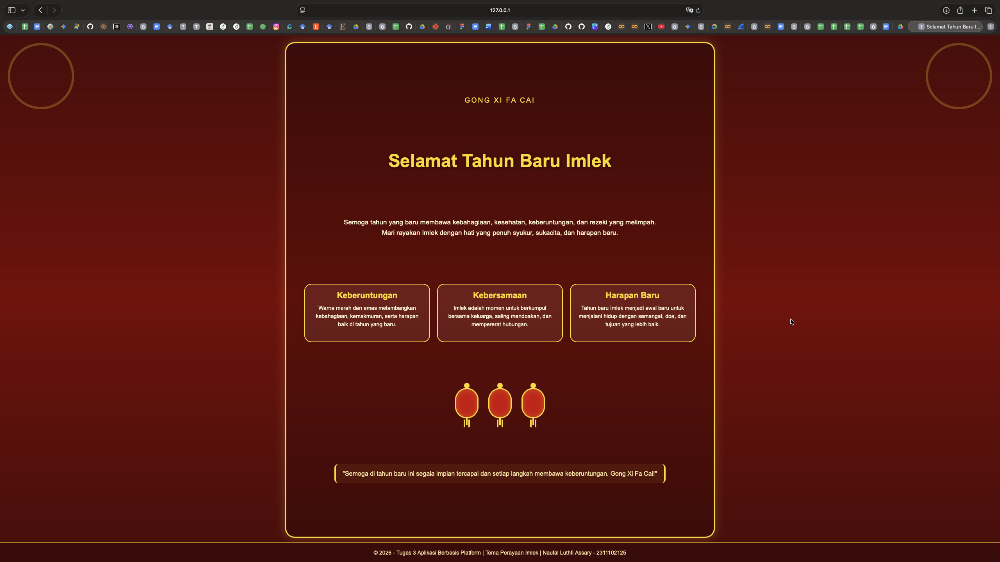

<div align="center">
  <br />
  <h1>LAPORAN PRAKTIKUM <br>APLIKASI BERBASIS PLATFORM</h1>
  <br />
  <h3>MODUL 3 <br> CSS - Cascading Style Sheets</h3>
  <br />
  <br />
   
  <br />
  <br />
  <br />
  <br />
  <h3>Disusun Oleh :</h3>
  <p>
    <strong>NAUFAL LUTHFI ASSARY</strong><br>
    <strong>2311102125</strong><br>
    <strong>S1 IF-11-REG01</strong>
  </p>
  <br />
  <h3>Dosen Pengampu :</h3>
  <p>
    <strong>Dimas Fanny Hebrasianto Permadi, S.ST., M.Kom</strong>
  </p>
  <br />
  <br />
    <h4>Asisten Praktikum :</h4>
    <strong> Apri Pandu Wicaksono </strong> <br>
    <strong>Rangga Pradarrell Fathi</strong>
  <br />
  <h3>LABORATORIUM HIGH PERFORMANCE
 <br>FAKULTAS INFORMATIKA <br>UNIVERSITAS TELKOM PURWOKERTO <br>2026</h3>
</div>

---

## 1. Dasar Teori

# Dasar Teori

**Cascading Style Sheets (CSS)** merupakan bahasa yang digunakan untuk memperindah tampilan halaman web yang dibangun menggunakan HTML. CSS mendeskripsikan bagaimana elemen-elemen HTML seharusnya ditampilkan pada browser, sehingga halaman web tidak hanya berfungsi dengan baik, tetapi juga memiliki tampilan yang lebih rapi, menarik, dan mudah dipahami oleh pengguna. Dalam penulisannya, CSS terdiri atas **selector** dan **declaration block**. Selector berfungsi untuk menentukan elemen HTML yang akan diberi gaya, sedangkan declaration block berisi property dan value yang mengatur perubahan tampilan elemen tersebut.  

CSS dapat disisipkan ke dalam dokumen HTML dengan tiga cara, yaitu **external style sheet**, **internal style sheet**, dan **inline style**. External style sheet dilakukan dengan memanggil file berekstensi `.css` ke dalam file HTML menggunakan tag `<link>` pada bagian `<head>`. Internal style sheet dilakukan dengan menuliskan kode CSS langsung di dalam tag `<style>` pada bagian `<head>`, biasanya digunakan jika satu halaman memiliki kebutuhan tampilan khusus. Sementara itu, inline style diterapkan langsung pada elemen HTML melalui atribut `style`, dan umumnya digunakan hanya untuk satu elemen tertentu. 

Dalam CSS, selector digunakan untuk menentukan elemen HTML mana yang akan diberi gaya. Selector dapat berupa nama elemen HTML, atribut `id`, maupun atribut `class`. Misalnya, selector `p` digunakan untuk semua elemen paragraf, selector `#para1` digunakan untuk elemen dengan id tertentu, dan selector `p.center` digunakan untuk paragraf yang memiliki class tertentu. Dengan adanya selector, pengaturan tampilan halaman web dapat dilakukan secara lebih terstruktur dan efisien.  
Selain itu, CSS juga menyediakan **font properties** untuk mengatur tampilan teks pada halaman web. Beberapa properti yang umum digunakan antara lain `font-family` untuk menentukan jenis huruf, `font-size` untuk mengatur ukuran huruf, `font-style` untuk mengatur gaya huruf seperti *normal*, *italic*, atau *oblique*, serta `font-weight` untuk mengatur ketebalan huruf seperti *normal* atau *bold*. Pengaturan font sangat penting karena teks merupakan bagian utama dalam penyampaian informasi pada halaman web, sehingga tampilannya harus jelas, nyaman dibaca, dan sesuai dengan desain antarmuka.  

HTML juga memiliki elemen list yang dapat diatur tampilannya dengan CSS. Elemen list pada HTML menggunakan tag `<ul>` untuk *unordered list* dan `<ol>` untuk *ordered list*, dengan setiap item list dituliskan menggunakan tag `<li>`. CSS dapat digunakan untuk mengatur tampilan list agar lebih menarik melalui properti seperti `list-style-image`, `list-style-position`, dan `list-style-type`. Selain itu, elemen list juga dapat dipercantik dengan properti umum seperti `background-color`, `padding`, dan `margin`, sehingga daftar yang ditampilkan tidak terlihat monoton. 

Pengaturan perataan teks atau **alignment of text** juga dapat dilakukan menggunakan CSS melalui properti `text-align`. Nilai yang dapat digunakan antara lain `center` untuk membuat teks rata tengah, `left` untuk rata kiri, `right` untuk rata kanan, dan `justify` untuk membuat paragraf rata kiri dan kanan. Penggunaan alignment yang tepat sangat berpengaruh terhadap kerapian tampilan halaman web dan kenyamanan pengguna saat membaca isi konten. 
Dalam desain antarmuka web, warna merupakan salah satu unsur yang sangat penting karena berpengaruh terhadap daya tarik visual dan identitas tampilan halaman. CSS menyediakan pengaturan warna yang lebih lengkap dibandingkan atribut HTML biasa. Properti `background-color` digunakan untuk mengatur warna latar belakang elemen HTML, sedangkan properti `color` digunakan untuk mengatur warna teks. Nilai warna dalam CSS dapat dituliskan dalam beberapa format, seperti **color names**, **RGB**, **Hex**, **HSL**, **RGBA**, dan **HSLA**, sehingga pengembang memiliki fleksibilitas yang lebih besar dalam menentukan kombinasi warna yang sesuai. 
Selain pengaturan warna dan teks, CSS juga sering digunakan bersama elemen `span` dan `div` dalam HTML. Elemen `span` digunakan untuk menangani perubahan style pada bagian kecil teks dalam satu baris, sedangkan `div` digunakan untuk membuat section atau blok yang menampung beberapa elemen HTML di dalamnya. Dengan kombinasi HTML dan CSS, `div` dapat digunakan sebagai wadah layout, sedangkan `span` dapat dipakai untuk memberi penekanan atau gaya khusus pada bagian teks tertentu.  

---

## 2. Penjelasan Kode HTML dan CSS 

Berikut merupakan implementasi Halaman untuk Merayakan Imlek dengan menggunakan HTML dan CSS.

### Kode HTML (`Imlek.html`)

```html
<!DOCTYPE html>
<html lang="id">
<head>
  <meta charset="UTF-8" />
  <meta name="viewport" content="width=device-width, initial-scale=1.0" />
  <title>Selamat Tahun Baru Imlek</title>
  <link rel="stylesheet" href="style.css" />
</head>
<body>
  <div class="page">
    <div class="container">
      <div class="ornament top-left"></div>
      <div class="ornament top-right"></div>

      <div class="content">
        <p class="subtitle">Gong Xi Fa Cai</p>
        <h1>Selamat Tahun Baru Imlek</h1>
        <p class="description">
          Semoga tahun yang baru membawa kebahagiaan, kesehatan, keberuntungan,
          dan rezeki yang melimpah. Mari rayakan Imlek dengan hati yang penuh
          syukur, sukacita, dan harapan baru.
        </p>

        <div class="cards">
          <div class="card">
            <h3>Keberuntungan</h3>
            <p>
              Warna merah dan emas melambangkan kebahagiaan, kemakmuran,
              serta harapan baik di tahun yang baru.
            </p>
          </div>

          <div class="card">
            <h3>Kebersamaan</h3>
            <p>
              Imlek adalah momen untuk berkumpul bersama keluarga,
              saling mendoakan, dan mempererat hubungan.
            </p>
          </div>

          <div class="card">
            <h3>Harapan Baru</h3>
            <p>
              Tahun baru Imlek menjadi awal baru untuk menjalani hidup
              dengan semangat, doa, dan tujuan yang lebih baik.
            </p>
          </div>
        </div>

        <div class="lampion-group">
          <div class="lampion"></div>
          <div class="lampion"></div>
          <div class="lampion"></div>
        </div>

        <p class="quote">
          "Semoga di tahun baru ini segala impian tercapai dan setiap langkah
          membawa keberuntungan. Gong Xi Fa Cai!"
        </p>
      </div>
    </div>

    <footer>
      © 2026 - Tugas 3 Aplikasi Berbasis Platform | Tema Perayaan Imlek |
      Naufal Luthfi Assary - 2311102125
    </footer>
  </div>
</body>
</html>

```

### Kode CSS (`style.css`)
```css
* {
  margin: 0;
  padding: 0;
  box-sizing: border-box;
  font-family: Arial, Helvetica, sans-serif;
}

html,
body {
  width: 100%;
  height: 100%;
  overflow: hidden;
}

body {
  background: linear-gradient(180deg, #4b0808, #780303, #4b0808);
  color: #fff8dc;
}

.page {
  width: 100%;
  height: 100vh;
  display: flex;
  flex-direction: column;
}

.container {
  flex: 1;
  position: relative;
  display: flex;
  justify-content: center;
  align-items: center;
  padding: 15px 20px 10px;
  overflow: hidden;
}

.content {
  width: 100%;
  max-width: 1100px;
  height: 100%;
  max-height: calc(100vh - 80px);
  background: rgba(0, 0, 0, 0.18);
  border: 3px solid #ffd700;
  border-radius: 24px;
  box-shadow: 0 0 25px rgba(255, 215, 0, 0.25);
  padding: 20px 28px;
  text-align: center;

  display: flex;
  flex-direction: column;
  justify-content: space-evenly;
  align-items: center;
}

.subtitle {
  color: #ffd700;
  font-size: 18px;
  letter-spacing: 3px;
  text-transform: uppercase;
}

h1 {
  font-size: 46px;
  color: #ffd700;
  text-shadow: 2px 2px 8px rgba(0, 0, 0, 0.45);
}

.description {
  max-width: 800px;
  font-size: 17px;
  line-height: 1.6;
  color: #fff3cd;
}

.cards {
  width: 100%;
  display: flex;
  justify-content: center;
  gap: 18px;
  flex-wrap: nowrap;
}

.card {
  width: 31%;
  min-height: 150px;
  background: rgba(255, 248, 220, 0.08);
  border: 2px solid #ffd700;
  border-radius: 18px;
  padding: 16px;
  box-shadow: 0 0 15px rgba(0, 0, 0, 0.18);
}

.card h3 {
  color: #ffd700;
  margin-bottom: 10px;
  font-size: 21px;
}

.card p {
  font-size: 14px;
  line-height: 1.5;
}

.lampion-group {
  display: flex;
  justify-content: center;
  gap: 25px;
}

.lampion {
  width: 60px;
  height: 78px;
  background: #cc0000;
  border: 3px solid #ffd700;
  border-radius: 35px;
  position: relative;
  box-shadow: inset 0 0 15px rgba(255, 215, 0, 0.25);
}

.lampion::before {
  content: "";
  position: absolute;
  width: 14px;
  height: 14px;
  background: #ffd700;
  border-radius: 50%;
  top: -16px;
  left: 50%;
  transform: translateX(-50%);
}

.lampion::after {
  content: "";
  position: absolute;
  width: 4px;
  height: 20px;
  background: #ffd700;
  bottom: -20px;
  left: 50%;
  transform: translateX(-50%);
  box-shadow: -6px 6px 0 #ffd700, 6px 6px 0 #ffd700;
}

.quote {
  max-width: 850px;
  font-size: 16px;
  line-height: 1.6;
  color: #ffe8a3;
  padding: 12px 18px;
  border-left: 4px solid #ffd700;
  border-right: 4px solid #ffd700;
  border-radius: 10px;
  background: rgba(255, 215, 0, 0.06);
}

footer {
  height: 50px;
  display: flex;
  justify-content: center;
  align-items: center;
  text-align: center;
  padding: 10px 20px;
  background: rgba(0, 0, 0, 0.2);
  border-top: 2px solid #ffd700;
  color: #ffe8a3;
  font-size: 14px;
}

.ornament {
  position: absolute;
  width: 170px;
  height: 170px;
  border: 6px solid rgba(255, 215, 0, 0.25);
  border-radius: 50%;
}

.top-left {
  top: 20px;
  left: 20px;
}

.top-right {
  top: 20px;
  right: 20px;
}

@media (max-width: 900px) {
  .content {
    border-radius: 16px;
    padding: 16px;
  }

  h1 {
    font-size: 32px;
  }

  .description {
    font-size: 14px;
  }

  .cards {
    flex-direction: column;
    align-items: center;
    gap: 10px;
  }

  .card {
    width: 100%;
    max-width: 500px;
    min-height: auto;
  }

  .lampion {
    width: 46px;
    height: 64px;
  }

  .quote {
    font-size: 14px;
  }

  footer {
    font-size: 12px;
    height: auto;
    min-height: 44px;
  }

  .ornament {
    display: none;
  }
}

```

### Hasil Tampilan (Screenshot)



### Penjelasan Code:

#### Penjelasan Kode HTML

- `<!DOCTYPE html>`
  - Menyatakan bahwa dokumen menggunakan HTML5.

- `<html lang="id">`
  - Menentukan bahwa bahasa utama pada halaman adalah Bahasa Indonesia.

- `<head>`
  - Berisi informasi halaman yang tidak langsung tampil di isi web.

- `<meta charset="UTF-8" />`
  - Mengatur encoding karakter agar teks dapat ditampilkan dengan baik.

- `<meta name="viewport" content="width=device-width, initial-scale=1.0" />`
  - Membuat tampilan halaman menjadi responsif di berbagai ukuran layar.

- `<title>Selamat Tahun Baru Imlek</title>`
  - Menampilkan judul halaman pada tab browser.

- `<link rel="stylesheet" href="style.css" />`
  - Menghubungkan file HTML dengan file CSS eksternal.

- `<body>`
  - Berisi seluruh elemen yang ditampilkan pada halaman web.

- `<div class="page">`
  - Menjadi pembungkus utama seluruh isi halaman.

- `<div class="container">`
  - Menjadi wadah utama untuk menempatkan konten di tengah halaman.

- `<div class="ornament top-left"></div>`
  - Menampilkan ornamen dekoratif di bagian kiri atas.

- `<div class="ornament top-right"></div>`
  - Menampilkan ornamen dekoratif di bagian kanan atas.

- `<div class="content">`
  - Berisi seluruh isi utama halaman seperti judul, deskripsi, kartu, lampion, dan kutipan.

- `<p class="subtitle">Gong Xi Fa Cai</p>`
  - Menampilkan teks pembuka atau subtitle bertema Imlek.

- `<h1>Selamat Tahun Baru Imlek</h1>`
  - Menampilkan judul utama halaman.

- `<p class="description"> ... </p>`
  - Menampilkan deskripsi singkat tentang perayaan Imlek.

- `<div class="cards">`
  - Menjadi wadah untuk kumpulan kartu informasi.

- `<div class="card">`
  - Menjadi kotak informasi yang berisi judul dan isi penjelasan.

- `<h3>Keberuntungan</h3>`
  - Menampilkan judul kartu pertama.

- `<h3>Kebersamaan</h3>`
  - Menampilkan judul kartu kedua.

- `<h3>Harapan Baru</h3>`
  - Menampilkan judul kartu ketiga.

- `<div class="lampion-group">`
  - Menjadi wadah untuk ornamen lampion.

- `<div class="lampion"></div>`
  - Menampilkan bentuk lampion dengan bantuan CSS.

- `<p class="quote"> ... </p>`
  - Menampilkan kutipan atau ucapan penutup bertema Imlek.

- `<footer> ... </footer>`
  - Menampilkan informasi footer berupa tahun, mata kuliah, tema, nama, dan NIM.

---

#### Penjelasan Kode CSS

- `* { margin: 0; padding: 0; box-sizing: border-box; font-family: Arial, Helvetica, sans-serif; }`
  - Menghapus margin dan padding bawaan browser.
  - Mengatur box model agar ukuran elemen lebih mudah dikontrol.
  - Menentukan font default halaman.

- `html, body { width: 100%; height: 100%; overflow: hidden; }`
  - Membuat halaman memenuhi seluruh layar.
  - Mencegah halaman agar tidak bisa di-scroll.

- `body { background: linear-gradient(...); color: #fff8dc; }`
  - Memberikan latar belakang gradasi merah.
  - Memberikan warna teks terang agar kontras.

- `.page { width: 100%; height: 100vh; display: flex; flex-direction: column; }`
  - Membuat struktur halaman setinggi satu layar penuh.
  - Mengatur susunan elemen secara vertikal.

- `.container { flex: 1; position: relative; display: flex; justify-content: center; align-items: center; ... }`
  - Membuat konten utama berada di tengah halaman.
  - Menyediakan ruang untuk ornamen dan isi utama.

- `.content { width: 100%; max-width: 1100px; ... display: flex; flex-direction: column; justify-content: space-evenly; align-items: center; }`
  - Membuat kotak utama isi halaman.
  - Memberi border emas, background transparan, dan bayangan.
  - Menata isi secara vertikal dan rapi.

- `.subtitle { color: #ffd700; font-size: 18px; letter-spacing: 3px; text-transform: uppercase; }`
  - Mengatur tampilan subtitle agar berwarna emas dan terlihat menonjol.

- `h1 { font-size: 46px; color: #ffd700; text-shadow: ... }`
  - Mengatur tampilan judul utama agar besar, berwarna emas, dan memiliki bayangan.

- `.description { max-width: 800px; font-size: 17px; line-height: 1.6; color: #fff3cd; }`
  - Mengatur paragraf deskripsi agar mudah dibaca dan tidak terlalu lebar.

- `.cards { width: 100%; display: flex; justify-content: center; gap: 18px; flex-wrap: nowrap; }`
  - Menata tiga kartu agar tampil sejajar secara horizontal.

- `.card { width: 31%; min-height: 150px; background: ...; border: 2px solid #ffd700; border-radius: 18px; ... }`
  - Membuat desain masing-masing kartu informasi.
  - Memberi efek kotak dengan border, sudut melengkung, dan bayangan.

- `.card h3 { color: #ffd700; margin-bottom: 10px; font-size: 21px; }`
  - Mengatur judul pada setiap kartu.

- `.card p { font-size: 14px; line-height: 1.5; }`
  - Mengatur isi teks pada kartu.

- `.lampion-group { display: flex; justify-content: center; gap: 25px; }`
  - Menata lampion agar berjajar secara horizontal.

- `.lampion { width: 60px; height: 78px; background: #cc0000; border: 3px solid #ffd700; border-radius: 35px; position: relative; ... }`
  - Membentuk lampion dengan warna merah dan border emas.

- `.lampion::before`
  - Membuat bagian gantungan lampion di atas.

- `.lampion::after`
  - Membuat bagian tali atau rumbai lampion di bawah.

- `.quote { max-width: 850px; font-size: 16px; ... border-left: 4px solid #ffd700; border-right: 4px solid #ffd700; ... }`
  - Mengatur tampilan kutipan agar terlihat berbeda dari teks biasa.

- `footer { height: 50px; display: flex; justify-content: center; align-items: center; ... }`
  - Menampilkan footer di bagian bawah halaman.
  - Membuat isi footer berada di tengah dan tetap terlihat.

- `.ornament { position: absolute; width: 170px; height: 170px; border: 6px solid rgba(...); border-radius: 50%; }`
  - Membuat ornamen lingkaran dekoratif.

- `.top-left { top: 20px; left: 20px; }`
  - Meletakkan ornamen di sudut kiri atas.

- `.top-right { top: 20px; right: 20px; }`
  - Meletakkan ornamen di sudut kanan atas.

- `@media (max-width: 900px) { ... }`
  - Mengatur tampilan responsif saat halaman dibuka di layar kecil.
  - Mengecilkan ukuran teks, mengubah susunan kartu menjadi vertikal, dan menyembunyikan ornamen.

---

## Refrensi
- [Materi Modul 3](https://drive.google.com/file/d/1kd7ogQkR_rsNCnKDcJDmavY8FiOyTLzs/view?usp=sharing)