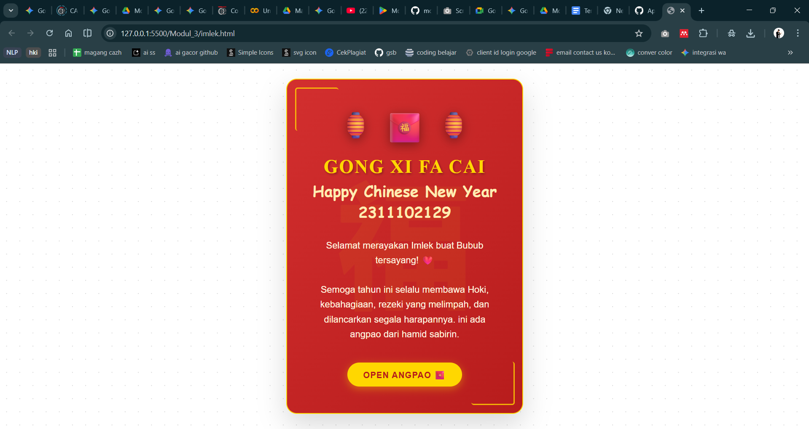

<div align="center">
  <br />
  <h1>LAPORAN PRAKTIKUM <br>APLIKASI BERBASIS PLATFORM</h1>
  <br />
  <h3>MODUL 3 <br> CSS - CASCADING STYLE SHEET</h3>
  <br />
  <br />
   
  <br />
  <br />
  <br />
  <br />
  <h3>Disusun Oleh :</h3>
  <p>
    <strong>HAMID SABIRIN</strong><br>
    2311102129<br>
    S1 IF-11-REG01
  </p>
  <br />
  <br />
  <h3>Dosen Pengampu :</h3>
  <p>
    <strong>Dimas Fanny Hebrasianto Permadi, S.ST., M.Kom</strong>
  </p>
  <br />
  <br />
  <br />
  <h3>PROGRAM STUDI S1 INFORMATIKA <br>FAKULTAS INFORMATIKA <br>UNIVERSITAS TELKOM PURWOKERTO <br>2025/2026</h3>
</div>

---

## 1. Dasar Teori

**CSS (Cascading Style Sheet)** adalah bahasa pendamping HTML yang berfungsi untuk mendesain, mengatur, dan membentuk tampilan pada sebuah halaman website. Jika HTML diibaratkan sebagai kerangka dari sebuah bangunan, maka CSS adalah cat, dekorasi, tata letak, dan desain interior yang memperindah bangunan tersebut.

CSS bekerja dengan cara memilih elemen HTML menggunakan *selektor* (seperti tag, *class*, atau *id*) lalu menerapkan aturan gaya padanya (properti warna, ukuran, posisi, dsb). Penggunaan CSS memungkinkan para pengembang web untuk memisahkan antara konten (HTML) dan desain visual (CSS), sehingga kode menjadi lebih bersih dan mudah dipelihara.

Terdapat tiga cara umum untuk menambahkan CSS ke dalam HTML:
1. **Inline CSS:** Menuliskan gaya langsung pada elemen HTML menggunakan atribut `style`.
2. **Internal CSS:** Mendeklarasikan aturan gaya di dalam blok `<style>` yang berada di dalam tag `<head>` dokumen.
3. **External CSS:** Menempatkan seluruh aturan gaya dalam file terpisah berekstensi `.css`, kemudian menghubungkannya dengan tag `<link>` di dalam file HTML. Pendekatan ini adalah *best practice* untuk proyek berskala besar karena memisahkan struktur dan tampilan secara bersih.

Konsep CSS lain yang dipakai dalam praktikum ini:
- **Pseudo-elemen (`::before`, `::after`):** Menyisipkan konten dekoratif sebelum atau sesudah elemen tanpa menambah markup HTML.
- **`z-index`:** Mengatur urutan tumpukan (*stacking order*) elemen yang saling bertindih.
- **`filter`:** Memberikan efek visual seperti bayangan, blur, atau saturasi warna pada elemen.
- **`:nth-child()`:** Selektor yang memilih elemen berdasarkan urutannya di antara saudara-saudara elemennya.

---

## 2. Penjelasan Kode HTML dan CSS

Berikut ini adalah implementasi desain kartu ucapan Imlek yang menggabungkan struktur HTML murni dan desain visual modern dari *External CSS*, beserta hasil tampilannya.

### Kode HTML (`imlek.html`)

```html
<!doctype html>
<html lang="id">
  <head>
    <meta charset="UTF-8" />
    <meta name="viewport" content="width=device-width, initial-scale=1.0" />
    <title>Gong Xi Fa Cai!</title>
    <link rel="stylesheet" href="style.css" />
  </head>
  <body>
    <div class="card">
      <div class="chinese-char">福</div>

      <div class="content-wrapper">
        <div class="decoration">
          <span class="lantern">🏮</span>
          <span class="lantern">🧧</span>
          <span class="lantern">🏮</span>
        </div>

        <h1 class="title">Gong Xi Fa Cai</h1>
        <div class="subtitle">Happy Chinese New Year 2311102129</div>

        <p class="message">
          Selamat merayakan Imlek buat Bubub tersayang! ❤️<br /><br />
          Semoga tahun ini selalu membawa Hoki, kebahagiaan, rezeki yang
          melimpah, dan dilancarkan segala harapannya. ini ada angpao dari hamid
          sabirin.
        </p>

        <a href="#" class="envelope">Open Angpao 🧧</a>
      </div>
    </div>
  </body>
</html>
```

### Kode CSS (`style.css`)

```css
* {
    box-sizing: border-box;
}

body {
    margin: 0;
    padding: 0;
    min-height: 100vh;
    display: flex;
    justify-content: center;
    align-items: center;
    background-color: #ffffff;
    background-image: radial-gradient(#d5d5d5 1px, transparent 1px);
    background-size: 25px 25px;
    font-family: 'Noto Sans SC', sans-serif;
}

.card {
    position: relative;
    width: 450px;
    padding: 50px 40px;
    background: linear-gradient(135deg, #d32f2f 0%, #b71c1c 100%);
    border-radius: 20px;
    box-shadow: 0 20px 50px rgba(0, 0, 0, 0.15);
    text-align: center;
    color: #fff;
    border: 2px solid #ffd700;
    overflow: hidden;
}

.card::before,
.card::after {
    content: '';
    position: absolute;
    width: 80px;
    height: 80px;
    border: 3px solid #ffd700;
    border-radius: 5px;
    opacity: 0.8;
}

.card::before {
    top: 15px;
    left: 15px;
    border-right: none;
    border-bottom: none;
}

.card::after {
    bottom: 15px;
    right: 15px;
    border-left: none;
    border-top: none;
}

.title {
    font-family: 'Cinzel', serif;
    font-size: 2.2em;
    color: #ffd700;
    margin: 20px 0 5px;
    text-transform: uppercase;
    letter-spacing: 2px;
    text-shadow: 2px 2px 4px rgba(0, 0, 0, 0.3);
}

.subtitle {
    font-family: 'Dancing Script', cursive;
    font-size: 1.8em;
    color: #ffecb3;
    margin-bottom: 30px;
    font-weight: 700;
}

.message {
    font-size: 1.1em;
    line-height: 1.6;
    color: #fff8e1;
    margin-bottom: 30px;
    padding: 0 15px;
}

.decoration {
    display: flex;
    justify-content: center;
    gap: 20px;
    font-size: 3.5em;
}

.lantern {
    display: inline-block;
    filter: drop-shadow(0 5px 10px rgba(0, 0, 0, 0.4));
}

.lantern:nth-child(odd) {
    font-size: 0.9em;
}

.chinese-char {
    position: absolute;
    top: 50%;
    left: 50%;
    transform: translate(-50%, -50%);
    font-size: 16em;
    color: rgba(255, 215, 0, 0.06);
    z-index: 0;
    font-weight: bold;
    pointer-events: none;
    line-height: 1;
}

.content-wrapper {
    position: relative;
    z-index: 1;
}

.envelope {
    display: inline-block;
    margin-top: 10px;
    padding: 12px 30px;
    background-color: #ffd700;
    color: #b71c1c;
    text-decoration: none;
    font-weight: bold;
    border-radius: 25px;
    text-transform: uppercase;
    letter-spacing: 1px;
    box-shadow: 0 4px 15px rgba(255, 215, 0, 0.4);
}
```

### Hasil Tampilan (Screenshot)



### Penjelasan code:

#### 1. HTML (`imlek.html`)

- Pada baris **7**, tag `<link rel="stylesheet" href="style.css">` digunakan untuk menghubungkan file HTML ini dengan file `style.css` eksternal. Pendekatan *External CSS* ini memisahkan struktur dan tampilan ke file berbeda sehingga kode lebih rapi dan mudah dipelihara.
- Pada baris **10–11**, dua `<div>` bersarang dideklarasikan: `.card` sebagai kartu utama pembungkus seluruh konten, dan `.chinese-char` yang menjadi latar karakter Mandarin 福 (*fú*, berarti keberuntungan). Keduanya menggunakan atribut `class` agar dapat diidentifikasi dan diberi gaya dari CSS.
- Pada baris **13–18**, `<div class="decoration">` berisi tiga elemen `<span class="lantern">` yang memuat emoji lampion dan angpao. Karena `<span>` bersifat *inline*, ketiga emoji berjajar rapi secara horizontal. Kelas `lantern` memungkinkan CSS memilih setiap elemen emoji secara individual untuk diberi efek bayangan atau ukuran berbeda.
- Pada baris **20–21**, tag `<h1 class="title">` dipakai untuk judul utama kartu agar memiliki ukuran teks terbesar secara semantik. Sementara `<div class="subtitle">` digunakan untuk subjudul karena tidak memerlukan bobot semantik heading, cukup diberi gaya melalui CSS.
- Pada baris **23–28**, tag `<p class="message">` menampung teks ucapan paragraf dengan tag `<br />` di dalamnya untuk memaksa pindah baris di tengah paragraf, menghasilkan jeda visual seperti menekan tombol Enter.
- Pada baris **30**, tag `<a href="#" class="envelope">` membuat tombol interaktif bertuliskan *Open Angpao*. Atribut `href="#"` menjaga elemen tetap bersifat tautan yang bisa diklik tanpa mengarahkan pengguna ke URL lain, sementara tampilan tombolnya sepenuhnya dibentuk oleh kelas CSS `.envelope`.

#### 2. Styling CSS (`style.css`)

- Pada baris **1–3**, blok `* { box-sizing: border-box; }` diterapkan secara universal ke semua elemen. Properti ini mengubah model perhitungan lebar elemen agar `padding` dan `border` sudah termasuk di dalam nilai `width` yang ditetapkan, mencegah elemen "membengkak" melebihi lebar yang diinginkan.
- Pada baris **5–16**, elemen `body` diberi `display: flex` bersama `justify-content: center` dan `align-items: center` sehingga seluruh konten anak berada tepat di tengah layar baik secara horizontal maupun vertikal. Properti `background-image: radial-gradient(...)` dengan `background-size: 25px 25px` menghasilkan pola titik-titik abu-abu yang berulang sebagai tekstur latar belakang.
- Pada baris **18–29**, kelas `.card` menggunakan `position: relative` agar elemen turunannya yang diposisikan secara absolut (seperti `.chinese-char`) dihitung relatif terhadap kartu ini. `background: linear-gradient(135deg, #d32f2f, #b71c1c)` menghasilkan gradasi warna merah tua bertingkat, `border-radius: 20px` membulatkan sudut kartu, dan `overflow: hidden` memotong semua konten yang melebihi batas tepi kartu.
- Pada baris **31–54**, *pseudo-elemen* `::before` dan `::after` digunakan untuk membuat ornamen bingkai sudut emas di pojok kiri atas dan kanan bawah kartu tanpa menambahkan elemen HTML baru. `content: ''` diperlukan agar pseudo-elemen dapat dirender, lalu `position: absolute` memposisikannya relatif terhadap `.card`. Masing-masing pseudo-elemen menghapus sisi border yang berbeda (`border-right: none` dan `border-bottom: none` untuk sudut kiri atas, sebaliknya untuk sudut kanan bawah) sehingga berbentuk seperti tanda kurung siku.
- Pada baris **56–72**, `.title` dan `.subtitle` masing-masing menggunakan `font-family` yang berbeda untuk menciptakan kontras tipografi: `'Cinzel'` (serif klasik) untuk judul utama yang tegas, dan `'Dancing Script'` (kursif) untuk subjudul yang lebih elegan. Kedua font ini adalah font Google Fonts yang dapat dimuat secara daring.
- Pada baris **82–92**, `.decoration` menggunakan `display: flex` dengan `gap: 20px` untuk memberikan jarak seragam antara ketiga emoji lampion, sementara `.lantern` diberi `filter: drop-shadow(...)` yang menghasilkan efek bayangan jatuh (*drop shadow*) yang lebih presisi dibandingkan `box-shadow` karena menyesuaikan bentuk konten emoji secara transparan.
- Pada baris **94–96**, selektor `.lantern:nth-child(odd)` secara spesifik menarget elemen `.lantern` yang berada di posisi ganjil (ke-1 dan ke-3), yaitu kedua emoji lampion merah 🏮 di posisi tepi, lalu mengecilkan ukurannya menjadi `0.9em` dibanding emoji tengah, menciptakan efek kedalaman visual yang lebih hidup.
- Pada baris **98–109**, `.chinese-char` diberi `position: absolute` dengan kombinasi `top: 50%`, `left: 50%`, dan `transform: translate(-50%, -50%)` — teknik standar CSS untuk memusatkan elemen secara absolut di tengah induknya tanpa bergantung pada ukuran elemen. `color: rgba(255, 215, 0, 0.06)` menjadikannya sangat transparan sehingga tampil sebagai watermark halus, `z-index: 0` menempatkannya di lapisan paling bawah, dan `pointer-events: none` memastikan elemen ini tidak mencegat interaksi klik pengguna.

## Refrensi
- [Materi Modul 3](https://drive.google.com/file/d/1kd7ogQkR_rsNCnKDcJDmavY8FiOyTLzs/view?usp=sharing)
- [MDN Web Docs — CSS Pseudo-elements](https://developer.mozilla.org/en-US/docs/Web/CSS/Pseudo-elements)
- [MDN Web Docs — CSS filter](https://developer.mozilla.org/en-US/docs/Web/CSS/filter)
- [Google Fonts — Cinzel & Dancing Script](https://fonts.google.com/)