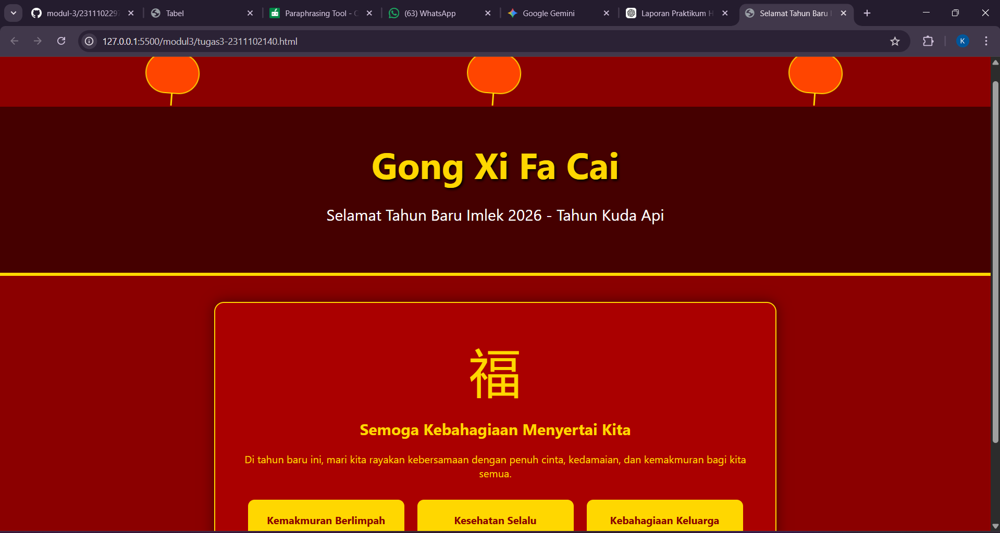

<div align="center">

# LAPORAN PRAKTIKUM

## Aplikasi Berbasis Platform

### Modul 3

### CSS – Cascading Style Sheet

<br>


<br>

### Disusun Oleh

**Kanasya Abdi Aziz**  
2311102140  
S1 IF-11-01  

<br>

### Dosen Pengampu

**Dimas Fanny Hebrasianto Permadi, S.ST., M.Kom**

<br>

### Asisten Praktikum

Apri Pandu Wicaksono  
Rangga Pradarrell Fathi  

<br>

### Laboratorium High Performance

Fakultas Informatika  
Universitas Telkom Purwokerto  
2026

</div>

---

# 1. Dasar Teori

**CSS (Cascading Style Sheets)** adalah bahasa yang digunakan bersama dengan HTML untuk mengatur bagaimana tampilan visual halaman web ditampilkan.

Jika HTML berfungsi sebagai **struktur utama halaman**, maka CSS digunakan untuk mengatur tampilan seperti:

- warna
- layout
- ukuran teks
- jarak antar elemen
- serta berbagai efek visual lainnya

CSS bekerja menggunakan **selector** untuk memilih elemen HTML, kemudian menerapkan berbagai properti gaya seperti `color`, `font-size`, `margin`, dan `padding`.

Dengan memisahkan HTML dan CSS, pengembang dapat membuat kode yang:

- lebih terorganisir  
- lebih mudah dipahami  
- lebih mudah dikelola dan diperbarui  

### Cara Menggunakan CSS

Terdapat **tiga cara utama** untuk menggunakan CSS dalam HTML:

1. **Inline CSS**  
   CSS ditulis langsung pada elemen HTML menggunakan atribut `style`.

2. **Internal CSS**  
   CSS ditulis di dalam tag `<style>` pada bagian `<head>`.

3. **External CSS**  
   CSS disimpan dalam file `.css` terpisah dan dihubungkan menggunakan tag `<link>`.  
   Metode ini **paling disarankan** karena membuat struktur kode lebih rapi dan mudah dikelola.

---

# 2. Penjelasan Kode

## Source Code (`tugas3-2311102140.html`)

```html
<!DOCTYPE html>
<html lang="id">
<head>
    <meta charset="UTF-8">
    <title>Selamat Tahun Baru Imlek 2026</title>
    <style>
        body {
            margin: 0;
            padding: 0;
            font-family: 'Segoe UI', Tahoma, Geneva, Verdana, sans-serif;
            background-color: #8B0000; 
            color: #FFD700; 
            text-align: center;
        }

        .banner {
            padding: 50px 20px;
            background: linear-gradient(rgba(0,0,0,0.5), rgba(0,0,0,0.5)), url('chinese-pattern.jpg');
            border-bottom: 5px solid #FFD700;
        }

        h1 {
            font-size: 3.5rem;
            margin: 0;
            text-shadow: 2px 2px 4px #000;
        }

        .sub-text {
            font-size: 1.5rem;
            color: #FFF;
        }

        .lantern-container {
            display: flex;
            justify-content: space-around;
            padding: 20px;
        }

        .lantern {
            width: 80px;
            height: 60px;
            background-color: #FF4500;
            border-radius: 40px;
            position: relative;
            border: 2px solid #FFD700;
            animation: swing 3s ease-in-out infinite alternate;
            transform-origin: top center;
        }

        @keyframes swing {
            from { transform: rotate(-10deg); }
            to { transform: rotate(10deg); }
        }

        .lantern::after {
            content: "";
            position: absolute;
            bottom: -20px;
            left: 50%;
            width: 2px;
            height: 20px;
            background: #FFD700;
        }

        .content {
            max-width: 800px;
            margin: 40px auto;
            background-color: #AA0000;
            padding: 30px;
            border: 2px solid #FFD700;
            border-radius: 15px;
            box-shadow: 0 0 20px rgba(0,0,0,0.5);
        }

        .chinese-char {
            font-size: 5rem;
            margin: 20px 0;
            display: block;
        }

        .grid-container {
            display: flex;
            gap: 20px;
            justify-content: center;
            flex-wrap: wrap;
            margin-top: 30px;
        }

        .card {
            background: #FFD700;
            color: #8B0000;
            padding: 20px;
            width: 200px;
            border-radius: 10px;
            font-weight: bold;
            transition: transform 0.3s;
        }

        .card:hover {
            transform: scale(1.1);
        }

        footer {
            margin-top: 50px;
            padding: 20px;
            background-color: #222;
            color: #888;
            font-size: 0.9rem;
        }
    </style>
</head>
````

---

# Hasil Tampilan



---

# Penjelasan Kode

## 1. Bagian CSS (Styling dan Visual)

Bagian di dalam tag `<style>` merupakan bagian yang mengatur tampilan halaman web.

### Warna dan Tipografi

Pada kode ini digunakan kombinasi warna khas perayaan Imlek, yaitu:

* merah gelap `#8B0000` sebagai latar belakang
* emas `#FFD700` sebagai warna teks

Kombinasi warna ini memberikan kesan **meriah dan khas budaya Tiongkok**.

### Animasi Lampion (`@keyframes swing`)

Kode ini membuat animasi bernama **swing** yang digunakan untuk menggerakkan elemen lampion.

Animasi tersebut membuat elemen berputar dari **-10 derajat ke 10 derajat** secara berulang (`infinite`). Akibatnya, lampion terlihat seperti **berayun tertiup angin**.

### Flexbox (`display: flex`)

Flexbox digunakan pada:

* `.lantern-container`
* `.grid-container`

Properti ini membuat elemen tersusun secara **horizontal dan rapi**, serta memudahkan pengaturan jarak antar elemen.

### Efek Interaktif (`.card:hover`)

Saat kursor diarahkan ke elemen `.card`, elemen akan sedikit membesar menggunakan transformasi:

`transform: scale(1.1)`

Efek ini membuat halaman menjadi **lebih interaktif bagi pengguna**.

---

## 2. Struktur Konten (HTML)

Konten pada bagian `<body>` dibagi menjadi beberapa bagian utama.

### Lampion (`lantern-container`)

Bagian ini berisi **tiga lampion** yang dibuat menggunakan elemen `<div>`. Bentuk lampion dibuat menggunakan properti CSS `border-radius`.

### Banner Utama

Bagian ini menampilkan ucapan **“Gong Xi Fa Cai”** menggunakan tag `<h1>`. Properti `text-shadow` digunakan untuk memberikan bayangan pada teks agar lebih mudah dibaca.

### Konten Utama (`content`)

Bagian ini berisi isi utama halaman.

* `<span class="chinese-char">福</span>`
  Menampilkan karakter Mandarin **“Fu”** yang berarti keberuntungan atau kebahagiaan.

* **Grid kartu**
  Terdiri dari tiga kotak yang berisi doa dan harapan baik untuk tahun baru.

### Footer

Bagian paling bawah halaman yang berisi informasi hak cipta. Warna teks dibuat lebih redup agar tidak terlalu mencolok dibandingkan konten utama.

---

## 3. Catatan Kecil (Koreksi Lembut)

Pada bagian teks disebutkan **Tahun Kuda Api**.

Menurut siklus **zodiak Tiongkok**, tahun 2026 memang merupakan **Tahun Kuda Api (Fire Horse)**. Oleh karena itu, penulisan pada kode sudah sesuai secara astrologi.

---

# Referensi

* [Materi Modul 3](https://drive.google.com/file/d/1kd7ogQkR_rsNCnKDcJDmavY8FiOyTLzs/view?usp=sharing)D:\Sem6\Praktikum-ABP\modul3