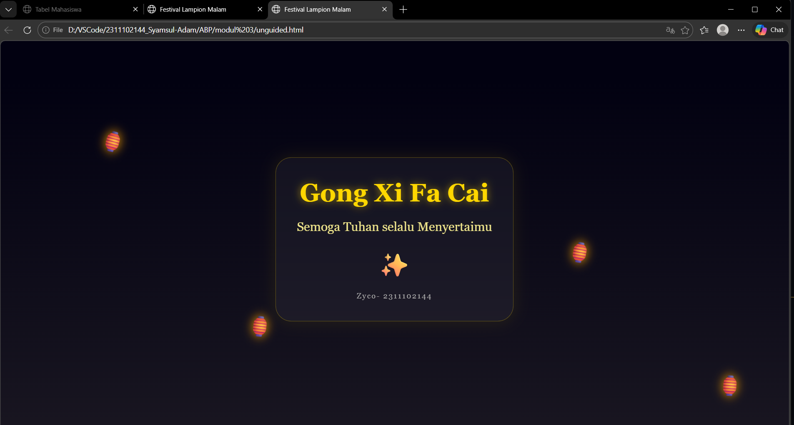

<div align="center">
  <br />
  <h1>LAPORAN PRAKTIKUM <br>APLIKASI BERBASIS PLATFORM</h1>
  <br />
  <h3>MODUL 3 <br> CSS - CASCADING STYLE SHEET</h3>
  <br />
  <br />
   
  <br />
  <br />
  <br />
  <br />
  <h3>Disusun Oleh :</h3>
  <p>
    <strong>Syamsul Adam</strong><br>
    <strong>2311102144</strong><br>
    <strong>S1 IF-11-REG01</strong>
  </p>
  <br />
  <h3>Dosen Pengampu :</h3>
  <p>
    <strong>Dimas Fanny Hebrasianto Permadi, S.ST., M.Kom</strong>
  </p>
  <br />
  <br />
    <h4>Asisten Praktikum :</h4>
    <strong> Apri Pandu Wicaksono </strong> <br>
    <strong>Rangga Pradarrell Fathi</strong>
  <br />
  <h3>LABORATORIUM HIGH PERFORMANCE
 <br>FAKULTAS INFORMATIKA <br>UNIVERSITAS TELKOM PURWOKERTO <br>2026</h3>
</div>

---

## 1. Dasar Teori

**CSS (Cascading Style Sheets)** adalah bahasa yang dirancang khusus untuk mempercantik tampilan halaman web. Jika kita mengibaratkan HTML sebagai kerangka atau struktur bangunan, maka CSS berperan sebagai desain interiornya mulai dari pemilihan warna cat, pengaturan tata letak furnitur, hingga dekorasi visual lainnya agar halaman terlihat lebih estetik dan profesional.

Prinsip kerja CSS adalah dengan menargetkan elemen HTML menggunakan **selector** (seperti tag, *class*, atau *id*), lalu memberikan instruksi gaya melalui berbagai properti, misalnya mengatur ukuran teks, memberikan jarak antar elemen, hingga menentukan skema warna. Pemisahan antara struktur (HTML) dan desain (CSS) ini sangat penting karena membuat kode lebih rapi, terorganisir, dan mudah dimodifikasi di kemudian hari.

Dalam penerapannya, ada tiga cara utama untuk menyisipkan CSS ke dalam dokumen HTML:

1.  **Inline CSS** Metode ini dilakukan dengan menuliskan langsung aturan gaya pada elemen HTML tertentu menggunakan atribut `style`. Biasanya cara ini hanya digunakan untuk perubahan kecil yang sangat spesifik.

2.  **Internal CSS** Aturan gaya dikumpulkan di dalam tag `<style>` yang diletakkan pada bagian `<head>` dokumen HTML. Metode ini sangat praktis untuk mengatur tampilan satu halaman penuh dalam satu file tunggal.

3.  **External CSS** Gaya desain disimpan dalam file terpisah dengan format `.css`, kemudian dipanggil ke file HTML melalui tag `<link>`. Ini adalah metode yang paling direkomendasikan dalam pengembangan web profesional karena memungkinkan satu file CSS digunakan untuk banyak halaman sekaligus, sehingga pengelolaan proyek besar menjadi jauh lebih efisien.

## 2. Penjelasan Kode 

### Kode 

```html
<!DOCTYPE html>
<html lang="id">
<head>
    <meta charset="UTF-8">
    <meta name="viewport" content="width=device-width, initial-scale=1.0">
    <title>Festival Lampion Malam</title>
    <style>
        body {
            margin: 0;
            padding: 0;
            background: linear-gradient(to bottom, #020111 10%, #191621 100%);
            color: #ffffff;
            font-family: 'Georgia', serif;
            display: flex;
            justify-content: center;
            align-items: center;
            height: 100vh;
            overflow: hidden;
            position: relative;
        }

        /* Efek Bintang Berkelip */
        .stars {
            position: absolute;
            top: 0; left: 0; width: 100%; height: 100%;
            z-index: 0;
        }

        /* Kontainer Utama */
        .card {
            z-index: 10;
            text-align: center;
            background: rgba(255, 255, 255, 0.05);
            backdrop-filter: blur(10px);
            padding: 40px;
            border-radius: 30px;
            border: 1px solid rgba(255, 215, 0, 0.3);
            box-shadow: 0 0 30px rgba(255, 215, 0, 0.1);
        }

        h1 {
            font-size: 3em;
            color: #ffd700;
            margin: 0;
            text-shadow: 0 0 15px rgba(255, 215, 0, 0.6);
        }

        p {
            font-size: 1.5em;
            color: #f0e68c;
        }

        /* Animasi Lampion Terbang */
        .floating-lantern {
            position: absolute;
            bottom: -100px;
            font-size: 40px;
            opacity: 0.8;
            filter: drop-shadow(0 0 10px orange);
            animation: flyUp 10s linear infinite;
        }

        @keyframes flyUp {
            0% { transform: translateY(0) translateX(0) rotate(0deg); opacity: 0; }
            10% { opacity: 1; }
            90% { opacity: 1; }
            100% { transform: translateY(-110vh) translateX(50px) rotate(20deg); opacity: 0; }
        }

        /* Variasi posisi lampion */
        .l1 { left: 10%; animation-duration: 8s; }
        .l2 { left: 30%; animation-duration: 12s; animation-delay: 2s; }
        .l3 { left: 70%; animation-duration: 10s; animation-delay: 1s; }
        .l4 { left: 90%; animation-duration: 15s; animation-delay: 3s; }

        .signature {
            margin-top: 20px;
            font-size: 0.9em;
            color: #aaa;
            letter-spacing: 2px;
        }
    </style>
</head>
<body>

    <div class="floating-lantern l1">🏮</div>
    <div class="floating-lantern l2">🏮</div>
    <div class="floating-lantern l3">🏮</div>
    <div class="floating-lantern l4">🏮</div>

    <div class="card">
        <h1>Gong Xi Fa Cai</h1>
        <p>Semoga Tuhan selalu Menyertaimu</p>
        <div style="font-size: 50px; margin: 15px 0;">✨</div>
        <div class="signature">Zyco- 2311102144</div>
    </div>

</body>
</html>
```

### Hasil Tampilan (Screenshot)



### Penjelasan Code
Program ini merupakan halaman web interaktif yang menggabungkan estetika desain modern dengan teknik animasi murni berbasis CSS3. Secara visual, program menciptakan suasana malam yang elegan melalui penggunaan gradasi warna linear-gradient dan efek glassmorphism pada kartu ucapan pusat, di mana teks tampak seolah melayang di atas latar belakang yang transparan dan kabur. Fokus utama dari desain ini adalah memberikan pengalaman pengguna yang dinamis namun ringan, menggunakan pendaran cahaya (glow effect) pada elemen teks dan lampion untuk memperkuat tema festival yang hangat dan eksklusif.

Dari sisi teknis, seluruh pergerakan objek dalam program ini dijalankan tanpa bantuan JavaScript, melainkan mengandalkan fitur @keyframes dan properti animasi CSS untuk mengontrol alur gerak vertikal lampion. Dengan menerapkan variasi waktu tunggu (animation-delay) dan durasi yang berbeda pada setiap elemen lampion, program berhasil menciptakan ilusi gerakan yang acak dan alami seolah lampion-lampion tersebut terbang menuju langit secara organik. Selain itu, penggunaan Flexbox memastikan bahwa seluruh konten tetap presisi di tengah layar pada berbagai ukuran perangkat, menjadikannya sebuah contoh efisien dari pemanfaatan fitur-fitur tingkat lanjut HTML dan CSS untuk kebutuhan web krea

## Refrensi
- [Materi Modul 3](https://drive.google.com/file/d/1kd7ogQkR_rsNCnKDcJDmavY8FiOyTLzs/view?usp=sharing)