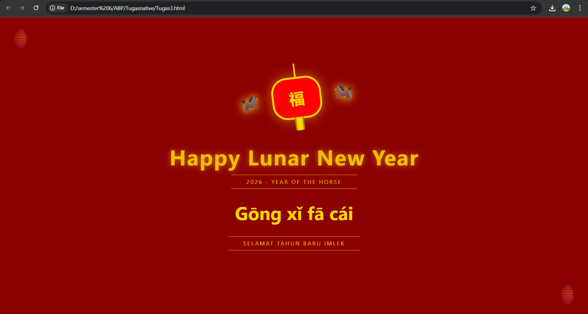

<div align="center">
  <br />
  <h1>LAPORAN PRAKTIKUM <br>APLIKASI BERBASIS PLATFORM</h1>
  <br />
  <h3>MODUL  <br> CSS - CASCADING STYLE SHEET</h3>
  <br />
  <br />
   
  <br />
  <br />
  <br />
  <h3>Disusun Oleh :</h3>
  <p>
    <strong>Avrizal Setyo Aji Nugroho</strong><br>
    <strong>2311102145</strong><br>
    <strong>S1 IF-11-01</strong>
  </p>
  <br />
  <h3>Dosen Pengampu :</h3>
  <p>
    <strong>Dimas Fanny Hebrasianto Permadi, S.ST., M.Kom</strong>
  </p>
  <br />
  <br />
    <h4>Asisten Praktikum :</h4>
    <strong> Apri Pandu Wicaksono </strong> <br>
    <strong>Rangga Pradarrell Fathi</strong>
  <br />
  <h3>LABORATORIUM HIGH PERFORMANCE
 <br>FAKULTAS INFORMATIKA <br>UNIVERSITAS TELKOM PURWOKERTO <br>2026</h3>
</div>

---

## 1. Dasar Teori

**CSS (Cascading Style Sheets)** adalah bahasa yang dirancang khusus untuk mempercantik tampilan halaman web. Jika kita mengibaratkan HTML sebagai kerangka atau struktur bangunan, maka CSS berperan sebagai desain interiornya mulai dari pemilihan warna cat, pengaturan tata letak furnitur, hingga dekorasi visual lainnya agar halaman terlihat lebih estetik dan profesional.

Prinsip kerja CSS adalah dengan menargetkan elemen HTML menggunakan **selector** (seperti tag, _class_, atau _id_), lalu memberikan instruksi gaya melalui berbagai properti, misalnya mengatur ukuran teks, memberikan jarak antar elemen, hingga menentukan skema warna. Pemisahan antara struktur (HTML) dan desain (CSS) ini sangat penting karena membuat kode lebih rapi, terorganisir, dan mudah dimodifikasi di kemudian hari.

Dalam penerapannya, ada tiga cara utama untuk menyisipkan CSS ke dalam dokumen HTML:

1.  **Inline CSS** Metode ini dilakukan dengan menuliskan langsung aturan gaya pada elemen HTML tertentu menggunakan atribut `style`. Biasanya cara ini hanya digunakan untuk perubahan kecil yang sangat spesifik.

2.  **Internal CSS** Aturan gaya dikumpulkan di dalam tag `<style>` yang diletakkan pada bagian `<head>` dokumen HTML. Metode ini sangat praktis untuk mengatur tampilan satu halaman penuh dalam satu file tunggal.

3.  **External CSS** Gaya desain disimpan dalam file terpisah dengan format `.css`, kemudian dipanggil ke file HTML melalui tag `<link>`. Ini adalah metode yang paling direkomendasikan dalam pengembangan web profesional karena memungkinkan satu file CSS digunakan untuk banyak halaman sekaligus, sehingga pengelolaan proyek besar menjadi jauh lebih efisien.

---

## 2. Penjelasan Kode HTML

Berikut ini adalah implementasi tabel berdasarkan struktur dasar HTML murni beserta hasil tampilannya.

### Kode HTML (`table.html`)

```html
<!DOCTYPE html>
<html lang="id">
  <head>
    <meta charset="UTF-8" />
    <meta name="viewport" content="width=device-width, initial-scale=1.0" />
    <title>Tugas3_Avrizal Setyo Aji Nugroho</title>
    <link href="Tugas3.css" rel="stylesheet" />

    <style>
      body {
        background-color: #8b0000;
        background-image: radial-gradient(circle, #a30000 1px, transparent 1px);
        background-size: 50px 50px;
        margin: 0;
        display: flex;
        justify-content: center;
        align-items: center;
        min-height: 100vh;
        font-family: "Segoe UI", serif;
        overflow: hidden;
      }
      .main-container {
        display: flex;
        flex-direction: column;
        align-items: center;
        gap: 40px;
      }

      body::before,
      body::after {
        content: "🏮";
        position: fixed;
        font-size: 50px;
        opacity: 0.3;
      }

      body::before {
        top: 20px;
        left: 20px;
      }

      body::after {
        bottom: 20px;
        right: 20px;
      }

      .lantern-wrapper {
        position: relative;
        display: flex;
        align-items: center;
        justify-content: center;
        animation: swing 3s ease-in-out infinite;
        transform-origin: top center;
        margin-bottom: 20px;
      }

      .shio {
        font-size: 45px;
        position: absolute;
        filter: drop-shadow(0 0 10px #ffd700);
      }

      .side-left {
        left: -90px;
        transform: scaleX(-1);
      }

      .side-right {
        right: -90px;
      }
      .content {
        text-align: center;
        color: #ffd700;
      }

      .lantern-wrapper:hover .shio {
        filter: drop-shadow(0 0 20px #ffffff);
        font-size: 60px;
      }

      .lantern {
        width: 120px;
        height: 100px;
        background: #ff0000;
        border-radius: 40px;
        position: relative;
        border: 5px solid #ffd700;
        box-shadow: 0 0 30px rgba(255, 215, 0, 0.5);
        display: flex;
        justify-content: center;
        align-items: center;
        color: #ffd700;
        font-size: 40px;
        font-weight: bold;
      }

      .lantern::before {
        content: "";
        position: absolute;
        top: -40px;
        left: 50%;
        width: 4px;
        height: 40px;
        background: #ffd700;
      }

      .lantern::after {
        content: "";
        position: absolute;
        bottom: -35px;
        left: 50%;
        width: 15px;
        height: 35px;
        background: #ffd700;
        transform: translateX(-50%);
        border-radius: 0 0 5px 5px;
        box-shadow:
          4px 0 0 #b8860b,
          -4px 0 0 #b8860b;
      }

      .coin-drop {
        position: fixed;
        top: -10%;
        color: #ffd700;
        font-size: 24px;
        user-select: none;
        z-index: 1;
        animation: fall linear infinite;
      }

      h1 {
        color: #ffd700;
        font-size: 4rem;
        text-shadow:
          0 0 20px rgba(255, 215, 0, 0.8),
          2px 2px 5px #000;
        margin-top: 50px;
        text-align: center;
        letter-spacing: 5px;
        animation: shimmer 2s infinite;
      }
      h1 {
        font-size: 3.5rem;
        margin: 0;
        text-shadow: 0 0 15px rgba(255, 215, 0, 0.6);
        letter-spacing: 2px;
      }
      .chinese-text {
        font-size: 3rem;
        margin: 20px 0;
        font-weight: bold;
      }
      .divider {
        border-top: 1px solid #ffd700;
        border-bottom: 1px solid #ffd700;
        padding: 8px 40px;
        margin: 10px auto;
        display: inline-block;
        letter-spacing: 3px;
        font-size: 0.9rem;
        opacity: 0.9;
      }

      p {
        color: #ffd700;
        font-size: 1.5rem;
        font-weight: 300;
        letter-spacing: 4px;
        text-transform: uppercase;
        border-top: 2px solid #ffd700;
        border-bottom: 2px solid #ffd700;
        padding: 10px 20px;
      }

      @keyframes swing {
        0%,
        100% {
          transform: rotate(-8deg);
        }

        50% {
          transform: rotate(8deg);
        }
      }

      @keyframes glow {
        from {
          box-shadow: 0 0 20px rgba(255, 215, 0, 0.4);
        }

        to {
          box-shadow: 0 0 50px rgba(255, 215, 0, 0.8);
        }
      }

      @keyframes shimmer {
        0% {
          opacity: 0.8;
        }

        50% {
          opacity: 1;
          transform: scale(1.05);
        }

        100% {
          opacity: 0.8;
        }
      }

      @keyframes fall {
        to {
          transform: translateY(110vh) rotate(360deg);
        }
      }
    </style>
  </head>

  <body>
    <div class="main-container">
      <div class="lantern-wrapper">
        <span class="shio side-left">🐎</span>
        <div class="lantern">福</div>
        <span class="shio side-right">🐎</span>
      </div>

      <div class="content">
        <h1>Happy Lunar New Year</h1>
        <div class="divider">
          <span>2026 - YEAR OF THE HORSE</span>
        </div>

        <h2 class="chinese-text">Gōng xǐ fā cái</h2>

        <div class="divider">
          <span>SELAMAT TAHUN BARU IMLEK</span>
        </div>
      </div>
    </div>
  </body>
</html>
```

### Hasil Tampilan (Screenshot)



### Penjelasan Code

#### A. Struktur HTML

- **Viewport Metadata**: Menggunakan tag `<meta name="viewport">` agar tampilan kartu tetap proporsional dan tidak terpotong saat dibuka di perangkat mobile.
- **Elemen Kontainer**: Seluruh konten dibungkus dalam `<div class="main-container">` yang menyatukan lampion dan teks ucapan.
- **Lantern Wrapper**: Bagian ini membungkus elemen lampion (`福`) dan dua simbol Shio Kuda (`🐎`) menggunakan tag `<span>`.
- **Content Section**: Berisi teks utama "Happy Lunar New Year" (`h1`) dan ucapan Mandarin "Gōng xǐ fā cái" (`h2`) yang dipisahkan oleh elemen `divider`.

#### B. Analisis Styling CSS

- **Pusat Tata Letak (Flexbox)**: Pada bagian `body`, diterapkan `display: flex`, `justify-content: center`, dan `align-items: center` untuk memastikan kartu selalu berada di titik tengah layar secara vertikal dan horizontal.
- **Efek Background**: Menggunakan `radial-gradient` untuk membuat pola titik-titik pada latar belakang merah agar terlihat lebih elegan.
- **Animasi Ayunan (Swing)**: Melalui `@keyframes swing`, lampion diberikan efek gerak melengkung. Penggunaan `transform-origin: top center` membuat lampion seolah-olah berayun dari poros atas.
- **Animasi Kilau (Shimmer)**: Teks `h1` diberikan animasi `shimmer` yang mengatur perubahan `opacity` dan `scale`, memberikan efek teks yang berdenyut/bercahaya.
- **Interaksi Hover**: Saat kursor diletakkan di atas lampion (`:hover`), simbol Shio Kuda akan membesar (`scale`) dan bayangan cahayanya berubah warna menjadi putih bersih.
- **Elemen Dekoratif**: Penggunaan `body::before` dan `body::after` untuk meletakkan emoji lampion statis di pojok layar sebagai pemanis tampilan.

## Refrensi

- [Materi Modul 3](https://drive.google.com/file/d/1kd7ogQkR_rsNCnKDcJDmavY8FiOyTLzs/view?usp=sharing)
