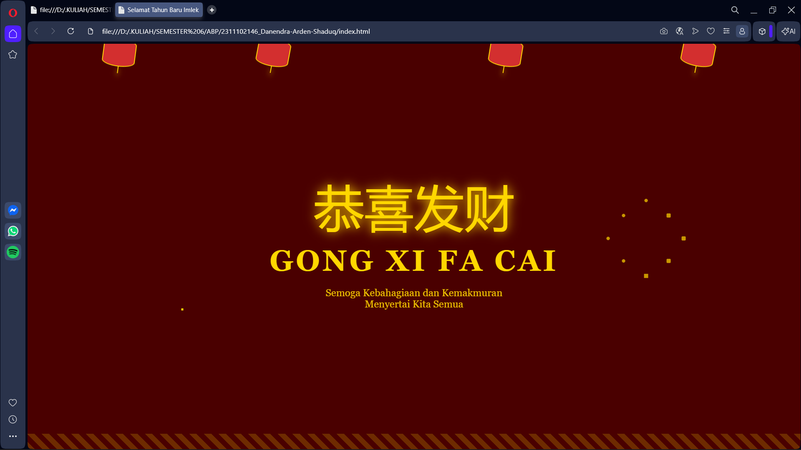

<div align="center">
  <br />
  <h1>LAPORAN PRAKTIKUM <br>APLIKASI BERBASIS PLATFORM</h1>
  <br />
  <h3>MODUL 3 <br> CSS - CASCADING STYLE SHEET</h3>
  <br />
  <br />
   
  <br />
  <br />
  <br />
  <br />
  <h3>Disusun Oleh :</h3>
  <p>
    <strong>DANENDRA ARDEN SHADUQ</strong><br>
    2311102146<br>
    S1 IF-11-REG01
  </p>
  <br />
  <br />
  <h3>Dosen Pengampu :</h3>
  <p>
    <strong>Dimas Fanny Hebrasianto Permadi, S.ST., M.Kom</strong>
  </p>
  <br />
  <br />
  <br />
  <h3>PROGRAM STUDI S1 INFORMATIKA <br>FAKULTAS INFORMATIKA <br>UNIVERSITAS TELKOM PURWOKERTO <br>2025/2026</h3>
</div>

---

## 1. Dasar Teori

Cascading Style Sheets (CSS) merupakan bahasa yang digunakan untuk mengatur tampilan dan tata letak halaman web yang dibuat menggunakan HTML. CSS berfungsi untuk mendeskripsikan bagaimana elemen-elemen HTML ditampilkan pada browser, seperti pengaturan warna, ukuran teks, jenis font, hingga tata letak halaman. Dengan menggunakan CSS, tampilan sebuah website dapat dibuat lebih menarik, rapi, dan konsisten tanpa harus mengubah struktur dasar dari HTML. Selain itu, CSS juga memudahkan pengembang dalam memisahkan antara struktur konten dan desain tampilan sehingga pengelolaan kode menjadi lebih efisien.

Dalam penerapannya, CSS dapat disisipkan ke dalam dokumen HTML dengan beberapa cara, yaitu external stylesheet, internal stylesheet, dan inline style. External stylesheet digunakan dengan memanggil file CSS terpisah yang berisi aturan-aturan desain sehingga dapat digunakan oleh banyak halaman sekaligus. Internal stylesheet ditulis langsung di dalam tag `<style>` pada bagian `<head>` dokumen HTML, sedangkan inline style ditambahkan langsung pada elemen HTML tertentu melalui atribut style. Dengan berbagai cara tersebut, CSS memberikan fleksibilitas dalam mengatur tampilan web, mulai dari pengaturan teks, warna, daftar (list), hingga perataan teks agar halaman web terlihat lebih terstruktur dan mudah dibaca.

---

## 2. Penjelasan Kode HTML dan CSS

Berikut merupakan penerapan desain kartu ucapan Imlek yang memadukan struktur halaman menggunakan HTML murni dengan tampilan visual yang dirancang menggunakan External CSS, serta disertai dengan hasil tampilan dari desain tersebut.

### Kode HTML (`index.html`)

```html
<!DOCTYPE html>
<html lang="id">
<head>
    <meta charset="UTF-8">
    <meta name="viewport" content="width=device-width, initial-scale=1.0">
    <title>Selamat Tahun Baru Imlek</title>
    <link rel="stylesheet" href="style.css">
</head>
<body>

    <div class="lantern-container">
        <div class="lantern" style="left: 10%; animation-delay: 0.1s;"></div>
        <div class="lantern" style="left: 30%; animation-delay: 0.5s;"></div>
        <div class="lantern" style="left: 60%; animation-delay: 0.3s;"></div>
        <div class="lantern" style="left: 85%; animation-delay: 0.7s;"></div>
    </div>

    <div class="firework"></div>
    <div class="firework"></div>
    <div class="firework"></div>

    <main class="content">
        <span class="chinese-text">恭喜发财</span>
        <h1>Gong Xi Fa Cai</h1>
        <p>Semoga Kebahagiaan dan Kemakmuran <br> Menyertai Kita Semua</p>
    </main>

    <div class="footer-pattern"></div>

</body>
</html>
```

### Kode CSS (`style.css`)

```css
:root {
    --red: #d32f2f;
    --gold: #ffd700;
    --dark-red: #4a0000;
}

body {
    margin: 0;
    padding: 0;
    background-color: var(--dark-red);
    font-family: 'Georgia', serif;
    display: flex;
    align-items: center;
    justify-content: center;
    min-height: 100vh;
    overflow: hidden;
    color: var(--gold);
}

@keyframes firework {
    0% { transform: translate(-50%, 60vh); width: 4px; opacity: 1; }
    50% { width: 4px; opacity: 1; }
    100% { width: 500px; opacity: 0; }
}

.firework,
.firework::before,
.firework::after {
    content: "";
    position: absolute;
    top: 50%;
    left: 50%;
    aspect-ratio: 1;
    background: 
        radial-gradient(circle, var(--gold) 0.2rem, transparent 0) 50% 0%,
        radial-gradient(circle, var(--gold) 0.3rem, transparent 0) 100% 50%,
        radial-gradient(circle, var(--gold) 0.5rem, transparent 0) 50% 100%,
        radial-gradient(circle, var(--gold) 0.2rem, transparent 0) 0% 50%,
        radial-gradient(circle, var(--gold) 0.3rem, transparent 0) 80% 80%,
        radial-gradient(circle, var(--gold) 0.2rem, transparent 0) 20% 20%,
        radial-gradient(circle, var(--gold) 0.3rem, transparent 0) 80% 20%,
        radial-gradient(circle, var(--gold) 0.2rem, transparent 0) 20% 80%;
    background-size: 0.5rem 0.5rem;
    background-repeat: no-repeat;
    transform: translate(-50%, -50%);
    animation: firework 2s infinite;
}

.firework:nth-child(2) { left: 20%; top: 30%; animation-delay: -0.5s; }
.firework:nth-child(3) { left: 80%; top: 40%; animation-delay: -1.2s; }


.lantern-container {
    position: fixed;
    top: -10px;
    width: 100%;
    height: 100%;
    pointer-events: none;
}

.lantern {
    position: absolute;
    width: 60px;
    height: 50px;
    background-color: var(--red);
    border-radius: 50% / 20%;
    border: 2px solid var(--gold);
    animation: swing 3s ease-in-out infinite alternate;
    transform-origin: top center;
}

.lantern::after {
    content: "";
    position: absolute;
    bottom: -15px;
    left: 50%;
    width: 2px;
    height: 15px;
    background: var(--gold);
    box-shadow: 0 5px 10px var(--gold);
}

@keyframes swing {
    from { transform: rotate(-12deg); }
    to { transform: rotate(12deg); }
}


.content {
    text-align: center;
    position: relative;
    z-index: 5;
}

.chinese-text {
    font-size: 6rem;
    display: block;
    margin-bottom: 10px;
    filter: drop-shadow(0 0 10px var(--gold));
}

h1 {
    font-size: 3.5rem;
    margin: 0;
    text-transform: uppercase;
    letter-spacing: 5px;
}

p {
    font-size: 1.2rem;
    opacity: 0.9;
}


.footer-pattern {
    position: fixed;
    bottom: 0;
    width: 100%;
    height: 30px;
    background: repeating-linear-gradient(45deg, var(--gold), var(--gold) 10px, transparent 10px, transparent 20px);
    opacity: 0.2;
}
```

### Hasil Tampilan (Screenshot)



### Penjelasan code:

#### 1. HTML (`index.html`)

Struktur HTML dirancang dengan mengutamakan hierarki elemen yang bersih dan semantik agar mudah dikelola meskipun tanpa bantuan skrip eksternal. Di bagian atas, terdapat kontainer khusus untuk lampion (`lantern-container`) yang menampung beberapa elemen `div` lampion sebagai dekorasi gantung. Area utama diisi oleh elemen `main` yang berfungsi sebagai pusat perhatian, berisi teks ucapan dalam karakter Mandarin, judul utama, dan pesan harapan yang disusun menggunakan tag `span`, `h1`, dan `p`. Selain itu, terdapat elemen `div` dengan class `firework` yang ditempatkan secara strategis untuk menjadi "kanvas" bagi efek visual kembang api, serta elemen dekoratif di bagian bawah untuk memperkuat estetika tradisional tanpa mengganggu aksesibilitas teks utama.

#### 2. Styling CSS (`style.css`)

Logika CSS bertanggung jawab penuh atas seluruh aspek visual dan animasi dinamis melalui penggunaan properties modern seperti `radial-gradient` dan `keyframes`. Efek kembang api diciptakan dengan memanipulasi ukuran dan transparansi gradien lingkaran yang membesar secara eksponensial untuk meniru ledakan cahaya di langit malam. Sementara itu, animasi lampion menggunakan `transform-origin` di bagian atas agar gerakan ayunannya terlihat alami seperti tertiup angin. Penggunaan variabel CSS (`:root`) memungkinkan konsistensi warna merah dan emas di seluruh halaman, sedangkan teknik drop-shadow dan animation-delay memberikan kedalaman visual serta variasi gerakan yang membuat halaman terasa hidup dan meriah tanpa beban eksekusi dari JavaScript.

## Refrensi
- [Materi Modul 3](https://drive.google.com/file/d/1kd7ogQkR_rsNCnKDcJDmavY8FiOyTLzs/view?usp=sharing)