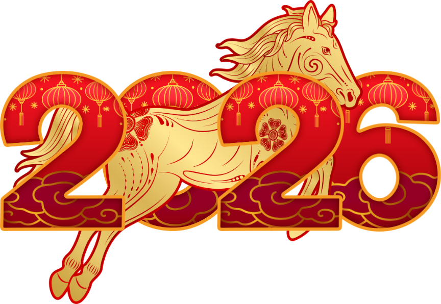
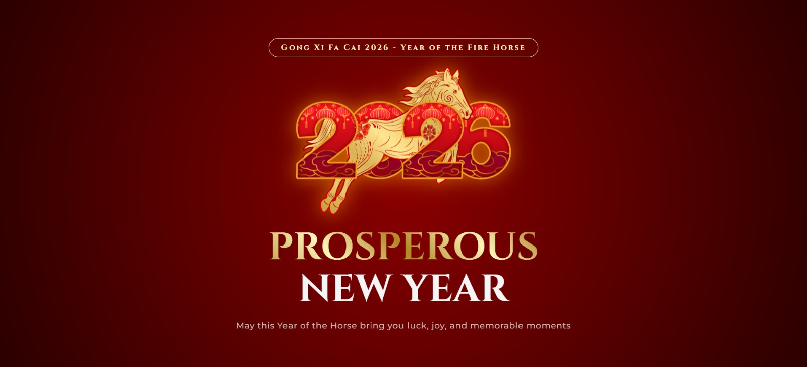
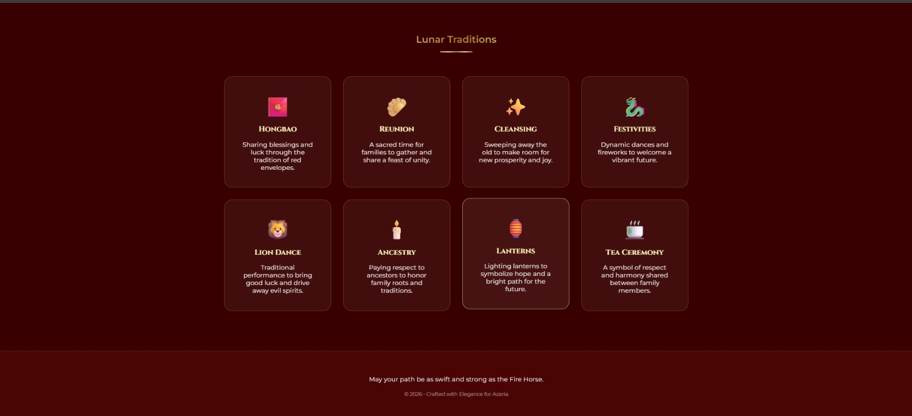

<div align="center">
  <br />
  <h1>LAPORAN PRAKTIKUM <br>APLIKASI BERBASIS PLATFORM</h1>
  <br />
  <h2>MODUL 3 <br> CSS - CASCADING STYLE SHEET </h2>
  <br />
  <br />
   
  <br />
  <br />
  <br />
  <h3>Disusun Oleh :</h3>
  <p>
    <strong>Azaria Nanda Putri</strong><br>
    <strong>2311102147</strong><br>
    <strong>S1 IF-11-REG 01</strong>
  </p>
  <br />
  <h3>Dosen Pengampu :</h3>
  <p>
    <strong>Dimas Fanny Hebrasianto Permadi, S.ST., M.Kom</strong>
  </p>
  <br />
  <br />
    <h4>Asisten Praktikum :</h4>
    <strong> Apri Pandu Wicaksono </strong> <br>
    <strong>Rangga Pradarrell Fathi</strong>
  <br />
  <h2>LABORATORIUM HIGH PERFORMANCE
 <br>FAKULTAS INFORMATIKA <br>UNIVERSITAS TELKOM PURWOKERTO <br>2026</h2>
</div>

---

# 1. Dasar Teori

## Mengenal CSS: Penata Gaya Visual Halaman Web

**CSS (Cascading Style Sheets)** merupakan bahasa yang digunakan bersama HTML untuk mengatur tampilan visual sebuah halaman web. Jika HTML berperan sebagai struktur dasar atau kerangka dari sebuah halaman, maka CSS berfungsi sebagai elemen yang memperindah tampilannya, seperti warna, tata letak, ukuran teks, hingga gaya tipografi. Dengan CSS, halaman web dapat terlihat lebih menarik, rapi, dan mudah dibaca oleh pengguna.

## Bagaimana Cara Kerja CSS?
CSS bekerja dengan cara memilih elemen HTML tertentu menggunakan **selector**, seperti nama tag, class, atau ID. Setelah elemen tersebut dipilih, CSS akan menerapkan aturan gaya tertentu pada elemen tersebut. Pemisahan antara struktur konten (HTML) dan tampilan visual (CSS) membuat kode lebih terstruktur, mudah dipelihara, serta lebih fleksibel ketika ingin melakukan perubahan desain. lebih rapi, terorganisir, dan mudah diperbarui.

## 3 Metode Penerapan CSS pada HTML
Secara umum, CSS dapat diterapkan ke dalam dokumen HTML melalui tiga metode berikut:

1. **Inline CSS**  
   Gaya dituliskan langsung pada elemen HTML menggunakan atribut `style`. Metode ini biasanya digunakan untuk perubahan kecil pada elemen tertentu.

2. **Internal CSS**  
   Aturan CSS ditempatkan di dalam tag `<style>` yang berada pada bagian `<head>` dalam dokumen HTML.

3. **External CSS**  
   Seluruh aturan CSS disimpan dalam file terpisah dengan ekstensi `.css`, kemudian dihubungkan ke dokumen HTML menggunakan tag `<link>`.  
   **Catatan:** Metode **External CSS** merupakan praktik terbaik dalam pengembangan web modern karena memudahkan pengelolaan kode, terutama ketika proyek semakin besar dan kompleks.


# 2. Penjelasan Kode HTML dan CSS

Pada contoh berikut, dibuat sebuah halaman **kartu ucapan Chinese New Year** yang memanfaatkan kombinasi antara struktur dasar **HTML** dan desain visual dari **External CSS**. HTML digunakan untuk menyusun struktur konten halaman, sedangkan CSS berfungsi memperindah tampilan dengan pengaturan warna, tata letak, tipografi, serta efek visual modern. Hasil akhirnya adalah halaman web yang tidak hanya terstruktur dengan baik, tetapi juga memiliki tampilan yang lebih menarik dan responsif.

### Kode HTML (`Tugas-3.html`)

```html
<!DOCTYPE html>
<html lang="en">
<head>
    <meta charset="UTF-8">
    <meta name="viewport" content="width=device-width, initial-scale=1.0">
    <title>Gong Xi Fa Cai 2026 - Year of the Fire Horse</title>
    <link rel="stylesheet" href="style.css">
    <link href="https://fonts.googleapis.com/css2?family=Cinzel:wght@400;700&family=Montserrat:wght@300;400;600&display=swap" rel="stylesheet">
</head>
<body>

    <header class="hero">
        <div class="overlay"></div>
        <div class="container">
            <div class="badge">Gong Xi Fa Cai 2026 - Year of the Fire Horse</div>
            
            <div class="horse-container">
                
            </div>

            <h1 class="main-title">
                <span class="gold-text">PROSPEROUS</span><br>
                <span class="red-text">NEW YEAR</span>
            </h1>
            
            <p class="subtitle">May this Year of the Horse bring you luck, joy, and memorable moments</p>
            
            <div class="scroll-indicator"></div>
        </div>
    </header>

    <section class="traditions">
        <div class="container">
            <div class="section-header">
                <h2 class="gold-text">Lunar Traditions</h2>
                <div class="divider"></div>
            </div>

            <div class="grid">
                <div class="glass-card">
                    <div class="icon">🧧</div>
                    <h3>Hongbao</h3>
                    <p>Sharing blessings and luck through the tradition of red envelopes.</p>
                </div>
                <div class="glass-card">
                    <div class="icon">🥟</div>
                    <h3>Reunion</h3>
                    <p>A sacred time for families to gather and share a feast of unity.</p>
                </div>
                <div class="glass-card">
                    <div class="icon">✨</div>
                    <h3>Cleansing</h3>
                    <p>Sweeping away the old to make room for new prosperity and joy.</p>
                </div>
                <div class="glass-card">
                    <div class="icon">🐉</div>
                    <h3>Festivities</h3>
                    <p>Dynamic dances and fireworks to welcome a vibrant future.</p>
                </div>
                <div class="glass-card">
                    <div class="icon">🦁</div>
                    <h3>Lion Dance</h3>
                    <p>Traditional performance to bring good luck and drive away evil spirits.</p>
                </div>
                <div class="glass-card">
                    <div class="icon">🕯️</div>
                    <h3>Ancestry</h3>
                    <p>Paying respect to ancestors to honor family roots and traditions.</p>
                </div>
                <div class="glass-card">
                    <div class="icon">🏮</div>
                    <h3>Lanterns</h3>
                    <p>Lighting lanterns to symbolize hope and a bright path for the future.</p>
                </div>
                <div class="glass-card">
                    <div class="icon">🍵</div>
                    <h3>Tea Ceremony</h3>
                    <p>A symbol of respect and harmony shared between family members.</p>
                </div>
            </div>
        </div>
    </section>

    <footer>
        <div class="footer-content">
            <p class="wish">May your path be as swift and strong as the Fire Horse.</p>
            <div class="small-divider"></div>
            <p class="copyright">&copy; 2026 • Crafted with Elegance for Azaria</p>
        </div>
    </footer>

</body>
</html>
```

### Kode css (`style.css`)

```css
*:root {
    --gold: linear-gradient(45deg, #bf953f, #fcf6ba, #b38728, #fbf5b7, #aa771c);
    --deep-red: #4a0404;
    --bright-red: #8b0000;
    --text-light: #f5f5f5;
}

* {
    margin: 0;
    padding: 0;
    box-sizing: border-box;
}

body {
    font-family: 'Montserrat', sans-serif;
    background-color: var(--deep-red);
    color: var(--text-light);
    overflow-x: hidden;
}

.container {
    max-width: 1200px;
    margin: 0 auto;
    padding: 0 20px;
}

/* HERO SECTION */
.hero {
    height: 100vh;
    display: flex;
    align-items: center;
    justify-content: center;
    text-align: center;
    position: relative;
    background: radial-gradient(circle, #8b0000 0%, #2b0000 100%);
}

.badge {
    display: inline-block;
    padding: 8px 25px;
    border: 1px solid #fcf6ba;
    border-radius: 50px;
    font-family: 'Cinzel', serif;
    font-weight: bold;
    color: #fcf6ba;
    margin-bottom: 20px;
    letter-spacing: 3px;
}

.horse-img {
    width: 100%;
    max-width: 450px;
    filter: drop-shadow(0 0 20px rgba(255, 165, 0, 0.6));
    animation: float 4s ease-in-out infinite;
}

.main-title {
    font-family: 'Cinzel', serif;
    font-size: clamp(2.5rem, 8vw, 5rem);
    line-height: 1.1;
    margin: 20px 0;
}

.gold-text {
    background: var(--gold);
    -webkit-background-clip: text;
    background-clip: text;
    -webkit-text-fill-color: transparent;
    font-weight: 700;
}

.subtitle {
    font-size: 1.1rem;
    letter-spacing: 1px;
    opacity: 0.8;
}

/* CARDS SECTION */
.traditions {
    padding: 100px 0;
    background: #380000;
}

.section-header {
    text-align: center;
    margin-bottom: 60px;
}

.divider {
    width: 80px;
    height: 3px;
    background: var(--gold);
    margin: 15px auto;
}

.grid {
    display: grid;
    grid-template-columns: repeat(auto-fit, minmax(250px, 1fr));
    gap: 30px;
}

.glass-card {
    background: rgba(255, 255, 255, 0.05);
    backdrop-filter: blur(10px);
    border: 1px solid rgba(191, 149, 63, 0.3);
    padding: 40px;
    border-radius: 20px;
    transition: all 0.4s ease;
    text-align: center;
}

.glass-card:hover {
    transform: translateY(-10px);
    background: rgba(255, 255, 255, 0.1);
    border-color: #fcf6ba;
    box-shadow: 0 10px 30px rgba(0,0,0,0.5);
}

.icon {
    font-size: 3rem;
    margin-bottom: 15px;
    display: block;
}

.glass-card h3 {
    font-family: 'Cinzel', serif;
    margin-bottom: 15px;
    color: #fcf6ba;
}

/* FOOTER */
footer {
    padding: 60px 0;
    text-align: center;
    border-top: 1px solid rgba(191, 149, 63, 0.2);
}

.copyright {
    font-size: 0.8rem;
    opacity: 0.5;
    margin-top: 20px;
}

/* ANIMATIONS */
@keyframes float {
    0%, 100% { transform: translateY(0); }
    50% { transform: translateY(-20px); }
}

@media (max-width: 768px) {
    .main-title { font-size: 2.5rem; }
}
```

### Hasil Tampilan (Screenshot)

 <br>
 <br>

# 3. Penjelasan Code

# 1. HTML (`Tugas-3.html`)

File HTML berfungsi sebagai kerangka utama halaman web. Kode ini menggunakan standar **HTML5** dan menyusun elemen halaman secara terstruktur agar mudah dipahami serta mudah dikembangkan.

## A. Bagian Kepala (`<head>`)

Bagian ini tidak tampil langsung pada halaman, tetapi sangat penting untuk pengaturan dasar halaman web.

- **`<!DOCTYPE html>` dan `<html lang="en">`**  
  Menyatakan bahwa dokumen menggunakan standar **HTML5** serta menggunakan bahasa Inggris sebagai bahasa utama halaman.

- **`<meta charset="UTF-8">`**  
  Mengatur jenis encoding karakter agar semua huruf dan simbol dapat ditampilkan dengan benar di browser.

- **`<meta name="viewport" content="width=device-width, initial-scale=1.0">`**  
  Digunakan agar tampilan website dapat menyesuaikan ukuran layar perangkat, sehingga halaman tetap terlihat proporsional pada perangkat mobile maupun desktop.

- **`<title>`**  
  Menampilkan judul halaman pada tab browser yaitu **“Gong Xi Fa Cai 2026 - Year of the Fire Horse”**.

- **`<link rel="stylesheet" href="style.css">`**  
  Menghubungkan halaman HTML dengan file CSS eksternal agar seluruh gaya tampilan dapat diterapkan.

- **Google Fonts (`Cinzel` dan `Montserrat`)**  
  Digunakan untuk memberikan tampilan tipografi yang lebih elegan dan modern pada teks di halaman web.

---

## B. Bagian Isi (`<body>`)

Bagian ini merupakan area utama yang terlihat oleh pengguna dan berisi seluruh konten halaman.

### 1. Hero Section (`<header class="hero">`)

Bagian ini merupakan **tampilan pembuka halaman** yang memberikan kesan pertama kepada pengguna.

- **`<div class="overlay">`**  
  Digunakan sebagai lapisan visual tambahan pada latar belakang agar tampilan terlihat lebih dramatis.

- **`<div class="container">`**  
  Berfungsi sebagai pembungkus utama agar konten tetap berada di tengah dan memiliki lebar yang terkontrol.

- **`<div class="badge">`**  
  Menampilkan teks **“Gong Xi Fa Cai 2026 - Year of the Fire Horse”** sebagai label perayaan tahun baru.

- **`<div class="horse-container">` dan ``**  
  Menampilkan ilustrasi gambar **Fire Horse 2026** yang menjadi elemen visual utama pada halaman.

- **`<h1 class="main-title">`**  
  Menampilkan judul utama halaman yang terdiri dari dua bagian teks yaitu **“PROSPEROUS”** dan **“NEW YEAR”**.  
  Tag `<br>` digunakan untuk memisahkan kedua kata tersebut agar berada pada baris yang berbeda.

- **`<p class="subtitle">`**  
  Berisi pesan singkat mengenai harapan agar tahun baru membawa keberuntungan dan kebahagiaan.

- **`<div class="scroll-indicator">`**  
  Elemen visual kecil yang memberi petunjuk kepada pengguna bahwa halaman dapat digulir ke bawah.

---

### 2. Traditions Section (`<section class="traditions">`)

Bagian ini menampilkan berbagai **tradisi yang berkaitan dengan perayaan Tahun Baru Imlek**.

- **`<div class="container">`**  
  Digunakan untuk menjaga tata letak konten agar tetap rapi dan berada di tengah halaman.

- **`<div class="section-header">`**  
  Berisi judul bagian **“Lunar Traditions”** serta garis pembatas dekoratif (`divider`).

- **`<div class="grid">`**  
  Merupakan wadah yang menampung beberapa kartu tradisi yang ditampilkan dalam bentuk grid.

Setiap tradisi ditampilkan dalam elemen **`<div class="glass-card">`** yang berisi:

- **`<div class="icon">`** → ikon emoji sebagai simbol tradisi  
- **`<h3>`** → judul tradisi  
- **`<p>`** → penjelasan singkat mengenai tradisi tersebut  

Tradisi yang ditampilkan meliputi:

- Hongbao  
- Reunion  
- Cleansing  
- Festivities  
- Lion Dance  
- Ancestry  
- Lanterns  
- Tea Ceremony  

---

### 3. Footer (`<footer>`)

Bagian ini merupakan **penutup halaman** yang berada di bagian paling bawah.

- **`<p class="wish">`**  
  Menampilkan pesan harapan yang berkaitan dengan simbol **Fire Horse**.

- **`<div class="small-divider">`**  
  Garis pemisah kecil sebagai elemen dekoratif.

- **`<p class="copyright">`**  
  Menampilkan informasi hak cipta halaman web.

---

# 2. Penjelasan Kode CSS (`style.css`)

File CSS digunakan untuk mengatur tampilan visual halaman sehingga terlihat lebih menarik, elegan, dan modern.

---

## A. Variabel Warna dan Reset Dasar

- **`:root`**  
  Digunakan untuk menyimpan variabel warna seperti **gold**, **deep-red**, dan **bright-red** sehingga warna dapat digunakan berulang dengan lebih mudah.

- **`* { margin:0; padding:0; box-sizing:border-box; }`**  
  Berfungsi sebagai **CSS Reset** untuk menghilangkan margin dan padding bawaan browser agar tampilan lebih konsisten.

---

## B. Pengaturan Body dan Container

- **`body`**  
  Menggunakan font **Montserrat** sebagai font utama serta warna latar merah gelap yang memberi nuansa khas perayaan Imlek.

- **`.container`**  
  Membatasi lebar konten maksimal serta menjaga posisi konten tetap berada di tengah halaman.

---

## C. Hero Section

- **`.hero`**  
  Menggunakan **Flexbox** dengan `display:flex`, `align-items:center`, dan `justify-content:center` sehingga seluruh konten berada tepat di tengah layar.

- **`background radial-gradient`**  
  Memberikan efek latar belakang merah dengan gradasi yang membuat tampilan terlihat lebih dramatis.

- **`.badge`**  
  Membuat label berbentuk kapsul dengan border emas dan font dekoratif **Cinzel**.

- **`.horse-img`**  
  Mengatur ukuran gambar kuda serta menambahkan efek bayangan menggunakan `drop-shadow`.

- **Animasi `float`**  
  Gambar kuda diberi animasi bergerak naik turun secara perlahan agar halaman terasa lebih hidup.

- **`.main-title`**  
  Menggunakan fungsi `clamp()` pada `font-size` sehingga ukuran judul dapat menyesuaikan ukuran layar secara otomatis.

- **`.gold-text`**  
  Memberikan efek teks berwarna emas dengan teknik **gradient text** menggunakan `background-clip`.

---

## D. Section Tradisi

- **`.traditions`**  
  Memberikan jarak ruang yang cukup pada bagian tradisi serta menggunakan warna latar yang sedikit berbeda dari hero section.

- **`.section-header`**  
  Mengatur posisi judul bagian agar berada di tengah halaman.

- **`.divider`**  
  Garis dekoratif berwarna emas yang menjadi pemisah antara judul dan konten.

---

## E. Layout Grid dan Kartu Tradisi

- **`.grid`**  
  Menggunakan **CSS Grid** dengan aturan `repeat(auto-fit, minmax(250px, 1fr))` sehingga kartu tradisi dapat menyesuaikan jumlah kolom secara otomatis berdasarkan ukuran layar.

- **`.glass-card`**  
  Menggunakan efek **glassmorphism** dengan latar transparan dan efek blur (`backdrop-filter: blur`).

- **Efek Hover**  
  Saat kursor diarahkan ke kartu (`.glass-card:hover`), kartu akan sedikit terangkat menggunakan `transform: translateY(-10px)` dan menampilkan bayangan tambahan sehingga terasa lebih interaktif.

- **`.icon`**  
  Mengatur ukuran dan posisi ikon emoji pada setiap kartu tradisi.

---

## F. Footer

- **`footer`**  
  Memberikan jarak ruang pada bagian bawah halaman serta menambahkan garis pembatas tipis.

- **`.copyright`**  
  Menampilkan teks hak cipta dengan ukuran lebih kecil agar tidak terlalu mencolok tetapi tetap terbaca.

---

## G. Responsivitas

- **`@media (max-width:768px)`**  
  Digunakan untuk menyesuaikan tampilan pada perangkat dengan layar kecil seperti smartphone.

- Pada kondisi ini ukuran judul utama (`.main-title`) akan diperkecil agar tetap nyaman dibaca pada layar yang lebih sempit.
---

# 4. Refrensi

- [Materi Modul 3](https://drive.google.com/file/d/1YZ4-EXXFpIfaoV6P8ZpeixciZLjrFiy5/view?usp=drive_link)