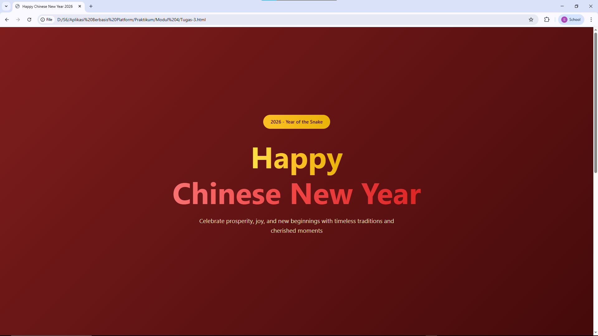
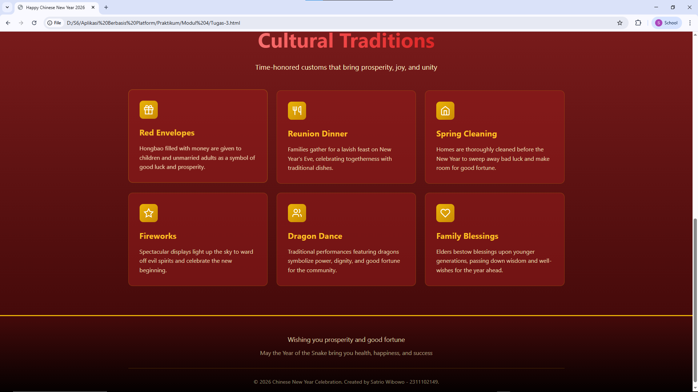

<div align="center">
  <br />
  <h1>LAPORAN PRAKTIKUM <br>APLIKASI BERBASIS PLATFORM</h1>
  <br />
  <h2>MODUL 3 <br> CSS - CASCADING STYLE SHEET </h2>
  <br />
  <br />
   
  <br />
  <br />
  <br />
  <h3>Disusun Oleh :</h3>
  <p>
    <strong>Satrio Wibowo</strong><br>
    <strong>2311102149</strong><br>
    <strong>S1 IF-11-REG 01</strong>
  </p>
  <br />
  <h3>Dosen Pengampu :</h3>
  <p>
    <strong>Dimas Fanny Hebrasianto Permadi, S.ST., M.Kom</strong>
  </p>
  <br />
  <br />
    <h4>Asisten Praktikum :</h4>
    <strong> Apri Pandu Wicaksono </strong> <br>
    <strong>Rangga Pradarrell Fathi</strong>
  <br />
  <h2>LABORATORIUM HIGH PERFORMANCE
 <br>FAKULTAS INFORMATIKA <br>UNIVERSITAS TELKOM PURWOKERTO <br>2026</h2>
</div>

---

# 1. Dasar Teori

## Mengenal CSS: Penata Gaya Visual Halaman Web

**CSS (Cascading Style Sheets)** adalah bahasa pendamping HTML yang berfungsi khusus untuk mengatur tampilan dan desain visual sebuah situs web. Analogi sederhananya: jika HTML adalah kerangka atau tulang punggung bangunan web, maka CSS adalah cat, dekorasi, dan desain interior yang membuatnya tampak menarik. Melalui CSS, Anda bisa mengontrol warna, tata letak, ukuran elemen, hingga tipografi.

## Bagaimana Cara Kerja CSS?
CSS beroperasi dengan cara menargetkan elemen HTML tertentu melalui selector (seperti tag, class, atau ID). Setelah elemen terpilih, CSS akan menerapkan aturan gaya (style rules) spesifik pada elemen tersebut. Pemisahan fungsi antara struktur konten (HTML) dan desain visual (CSS) ini membuat baris kode menjadi jauh lebih rapi, terorganisir, dan mudah diperbarui.

## 3 Metode Penerapan CSS pada HTML
Secara umum, ada tiga cara untuk memasukkan aturan CSS ke dalam dokumen HTML:

1. **Inline CSS**  
   Menuliskan gaya desain secara langsung di dalam elemen HTML menggunakan atribut `style`.

2. **Internal CSS**  
   Menyematkan aturan CSS di dalam tag `<style>` yang diletakkan pada bagian `<head>` dalam dokumen HTML.

3. **External CSS**  
   Menyimpan seluruh aturan desain pada sebuah file khusus berekstensi `.css`, File ini kemudian dihubungkan ke dokumen HTML menggunakan tag `<link>`. <br>
   **Catatan**: Metode External CSS adalah standar terbaik (best practice) yang paling direkomendasikan dalam pengembangan web modern, karena sangat memudahkan pengelolaan kode, terutama untuk proyek berskala besar.


# 2. Penjelasan Kode HTML dan CSS

Berikut ini adalah implementasi desain kartu ucapan yang digabungkan antara struktur kerangka dasar HTML murni dan desain modern visual yang diambil dari *External CSS*, beserta hasil tampilannya.

### Kode HTML (`Tugas-3.html`)

```html
<!DOCTYPE html>
<html lang="en">
<head>
    <meta charset="UTF-8">
    <meta name="viewport" content="width=device-width, initial-scale=1.0">
    <title>Happy Chinese New Year 2026</title>
    <link rel="stylesheet" href="style.css">
</head>
<body>
    <!-- Hero Section -->
    <section class="hero">
        <div class="hero-content">
            <div class="badge">2026 - Year of the Snake</div>
            
            <h1>
                <span class="gold-text">Happy</span><br>
                <span class="red-text">Chinese New Year</span>
            </h1>

      

            <p class="hero-description">
                Celebrate prosperity, joy, and new beginnings with timeless traditions and cherished moments
            </p>
        </div>
    </section>

    <!-- Traditions Section -->
    <section class="traditions-section">
        <div class="container">
            <div class="section-header">
                <h2 class="section-title">
                    <span class="red-text">Cultural Traditions</span>
                </h2>
                <p class="section-description">
                    Time-honored customs that bring prosperity, joy, and unity
                </p>
            </div>

            <div class="traditions-grid">
                <div class="tradition-card">
                    <div class="tradition-icon">
                        <svg viewBox="0 0 24 24">
                            <path d="M20 12v10H4V12"/>
                            <path d="M2 7h20v5H2z"/>
                            <path d="M12 22V7"/>
                            <path d="M12 7H7.5a2.5 2.5 0 0 1 0-5C11 2 12 7 12 7z"/>
                            <path d="M12 7h4.5a2.5 2.5 0 0 0 0-5C13 2 12 7 12 7z"/>
                        </svg>
                    </div>
                    <h3 class="tradition-title">Red Envelopes</h3>
                    <p class="tradition-description">Hongbao filled with money are given to children and unmarried adults as a symbol of good luck and prosperity.</p>
                </div>

                <div class="tradition-card">
                    <div class="tradition-icon">
                        <svg viewBox="0 0 24 24">
                            <path d="M3 2v7c0 1.1.9 2 2 2h4a2 2 0 0 0 2-2V2"/>
                            <path d="M7 2v20"/>
                            <path d="M21 15V2v0a5 5 0 0 0-5 5v6c0 1.1.9 2 2 2h3Zm0 0v7"/>
                        </svg>
                    </div>
                    <h3 class="tradition-title">Reunion Dinner</h3>
                    <p class="tradition-description">Families gather for a lavish feast on New Year's Eve, celebrating togetherness with traditional dishes.</p>
                </div>

                <div class="tradition-card">
                    <div class="tradition-icon">
                        <svg viewBox="0 0 24 24">
                            <path d="m3 9 9-7 9 7v11a2 2 0 0 1-2 2H5a2 2 0 0 1-2-2z"/>
                            <polyline points="9 22 9 12 15 12 15 22"/>
                        </svg>
                    </div>
                    <h3 class="tradition-title">Spring Cleaning</h3>
                    <p class="tradition-description">Homes are thoroughly cleaned before the New Year to sweep away bad luck and make room for good fortune.</p>
                </div>

                <div class="tradition-card">
                    <div class="tradition-icon">
                        <svg viewBox="0 0 24 24">
                            <path d="M12 2l3.09 6.26L22 9.27l-5 4.87 1.18 6.88L12 17.77l-6.18 3.25L7 14.14 2 9.27l6.91-1.01L12 2z"/>
                        </svg>
                    </div>
                    <h3 class="tradition-title">Fireworks</h3>
                    <p class="tradition-description">Spectacular displays light up the sky to ward off evil spirits and celebrate the new beginning.</p>
                </div>

                <div class="tradition-card">
                    <div class="tradition-icon">
                        <svg viewBox="0 0 24 24">
                            <path d="M16 21v-2a4 4 0 0 0-4-4H6a4 4 0 0 0-4 4v2"/>
                            <circle cx="9" cy="7" r="4"/>
                            <path d="M22 21v-2a4 4 0 0 0-3-3.87"/>
                            <path d="M16 3.13a4 4 0 0 1 0 7.75"/>
                        </svg>
                    </div>
                    <h3 class="tradition-title">Dragon Dance</h3>
                    <p class="tradition-description">Traditional performances featuring dragons symbolize power, dignity, and good fortune for the community.</p>
                </div>

                <div class="tradition-card">
                    <div class="tradition-icon">
                        <svg viewBox="0 0 24 24">
                            <path d="M20.84 4.61a5.5 5.5 0 0 0-7.78 0L12 5.67l-1.06-1.06a5.5 5.5 0 0 0-7.78 7.78l1.06 1.06L12 21.23l7.78-7.78 1.06-1.06a5.5 5.5 0 0 0 0-7.78z"/>
                        </svg>
                    </div>
                    <h3 class="tradition-title">Family Blessings</h3>
                    <p class="tradition-description">Elders bestow blessings upon younger generations, passing down wisdom and well-wishes for the year ahead.</p>
                </div>
            </div>
        </div>
    </section>

    <!-- Footer -->
    <footer>
        <div class="container">
           
            <p class="footer-subtitle">Wishing you prosperity and good fortune</p>
            <p class="footer-text">May the Year of the Snake bring you health, happiness, and success</p>
            <p class="footer-copyright">
                © 2026 Chinese New Year Celebration. Created by Satrio Wibowo - 2311102149.
            </p>
        </div>
    </footer>
</body>
</html>
    
```

### Kode css (`style.css`)

```css
* {
    margin: 0;
    padding: 0;
    box-sizing: border-box;
}

html {
    scroll-behavior: smooth;
}

body {
    font-family: -apple-system, BlinkMacSystemFont, 'Segoe UI', Roboto, 'Helvetica Neue', Arial, sans-serif;
    background: linear-gradient(to bottom, #7f1d1d, #450a0a);
    color: #fff;
    line-height: 1.6;
}

/* Hero Section */
.hero {
    min-height: 100vh;
    display: flex;
    align-items: center;
    justify-content: center;
    text-align: center;
    padding: 40px 20px;
    background: linear-gradient(135deg, #7f1d1d 0%, #450a0a 100%);
}

.hero-content {
    max-width: 1000px;
}

.badge {
    display: inline-block;
    background: linear-gradient(to right, #fbbf24, #eab308);
    color: #450a0a;
    padding: 10px 24px;
    border-radius: 50px;
    margin-bottom: 30px;
    font-weight: 600;
    font-size: 0.95rem;
}

.hero h1 {
    font-size: clamp(3rem, 8vw, 6rem);
    font-weight: bold;
    margin-bottom: 20px;
    line-height: 1.2;
}

.gold-text {
    background: linear-gradient(to right, #fde047, #fbbf24, #eab308);
    -webkit-background-clip: text;
    -webkit-text-fill-color: transparent;
    background-clip: text;
}

.red-text {
    background: linear-gradient(to right, #f87171, #ef4444, #dc2626);
    -webkit-background-clip: text;
    -webkit-text-fill-color: transparent;
    background-clip: text;
}

.hero-subtitle {
    font-size: clamp(1.5rem, 3vw, 2rem);
    color: #fef3c7;
    margin-bottom: 20px;
}

.hero-description {
    font-size: clamp(1rem, 2vw, 1.2rem);
    color: rgba(254, 243, 199, 0.9);
    margin-bottom: 40px;
    max-width: 700px;
    margin-left: auto;
    margin-right: auto;
}

/* Sections */
section {
    padding: 80px 20px;
}

.container {
    max-width: 1200px;
    margin: 0 auto;
}

.section-header {
    text-align: center;
    margin-bottom: 50px;
}

.section-title {
    font-size: clamp(2rem, 5vw, 3.5rem);
    font-weight: bold;
    margin-bottom: 15px;
}

.section-description {
    font-size: clamp(1rem, 2vw, 1.2rem);
    color: #fef3c7;
    max-width: 700px;
    margin: 0 auto;
}

/* Traditions Section */
.traditions-section {
    background: linear-gradient(to bottom, #7f1d1d, #450a0a);
}

.traditions-grid {
    display: grid;
    grid-template-columns: repeat(auto-fit, minmax(300px, 1fr));
    gap: 25px;
}

.tradition-card {
    background: rgba(153, 27, 27, 0.5);
    border-radius: 12px;
    padding: 30px;
    border: 1px solid rgba(202, 138, 4, 0.3);
    transition: transform 0.2s ease, border-color 0.2s ease;
}

.tradition-card:hover {
    transform: translateY(-5px);
    border-color: rgba(234, 179, 8, 0.5);
}

.tradition-icon {
    width: 50px;
    height: 50px;
    background: linear-gradient(to bottom right, #eab308, #ca8a04);
    border-radius: 10px;
    display: inline-flex;
    align-items: center;
    justify-content: center;
    margin-bottom: 20px;
}

.tradition-icon svg {
    width: 28px;
    height: 28px;
    stroke: white;
    stroke-width: 2;
    fill: none;
}

.tradition-title {
    font-size: 1.4rem;
    font-weight: bold;
    color: #fbbf24;
    margin-bottom: 12px;
}

.tradition-description {
    color: rgba(254, 243, 199, 0.85);
    line-height: 1.6;
}

/* Footer */
footer {
    background: linear-gradient(to bottom, #450a0a, #000);
    padding: 50px 20px 30px;
    text-align: center;
    border-top: 3px solid #eab308;
}

.footer-title {
    font-size: 2rem;
    color: #fbbf24;
    margin-bottom: 15px;
}

.footer-subtitle {
    color: rgba(254, 243, 199, 0.8);
    font-size: 1.1rem;
    margin-bottom: 10px;
}

.footer-text {
    color: rgba(254, 243, 199, 0.6);
    margin-bottom: 30px;
}

.footer-copyright {
    color: rgba(254, 243, 199, 0.5);
    font-size: 0.9rem;
    padding-top: 25px;
    border-top: 1px solid rgba(202, 138, 4, 0.3);
}

/* Responsive */
@media (max-width: 768px) {
    .traditions-grid {
        grid-template-columns: 1fr;
    }
}
    
```

### Hasil Tampilan (Screenshot)

 <br>


# 3. Penjelasan Code

### 1. HTML (`Tugas-3.html`)

File HTML bertindak sebagai kerangka tulang dari halaman web. Kode ini menggunakan standar HTML5 dengan penulisan yang bersih dan menggunakan tag-tag semantik (sesuai maknanya).

### A. Bagian Kepala (`<head>`)
Bagian ini tidak terlihat langsung oleh pengguna, namun sangat penting untuk browser dan mesin pencari:
* **`<!DOCTYPE html>` & `<html lang="en">`**: Mendeklarasikan bahwa ini adalah dokumen HTML5 modern dan kontennya menggunakan bahasa Inggris.
* **`<meta charset="UTF-8">`**: Memastikan browser dapat membaca semua jenis karakter (termasuk simbol atau huruf khusus) dengan benar tanpa menjadi *error/glitch*.
* **`<meta name="viewport" ...>`**: **Sangat Krusial!** Baris ini wajib ada agar website bisa responsif (menyesuaikan layar HP). Tanpa ini, website di HP akan terlihat seperti website komputer yang di-zoom out.
* **`<link rel="stylesheet" href="style.css">`**: Jembatan yang menghubungkan file HTML ini dengan file CSS agar gaya/desainnya bisa diterapkan.

### B. Bagian Utama (`<body>`)
Ini adalah area yang terlihat oleh pengguna. Konten dibagi menggunakan tag semantik agar terstruktur dengan baik:

1. **Hero Section (`<section class="hero">`)**
   * Berfungsi sebagai *banner* penyambutan (kesan pertama).
   * Terdapat elemen `<div class="badge">` untuk menampilkan label tahun (2026 - Year of the Snake).
   * Penggunaan tag `<br>` memisahkan teks "Happy" dan "Chinese New Year" agar berada di baris yang berbeda, memberikan penekanan visual.

2. **Traditions Section (`<section class="traditions-section">`)**
   * Area untuk menampilkan 6 tradisi budaya Imlek.
   * **Penggunaan Inline SVG (`<svg>`)**: Alih-alih menggunakan file gambar (`.png` atau `.jpg`), kode ini menggunakan format vektor (SVG) yang disematkan langsung di dalam HTML. Keuntungannya adalah ukuran file menjadi sangat kecil, *loading* website sangat cepat, dan gambar tidak akan pernah pecah (pixelated) meskipun di-zoom sedekat mungkin.

3. **Footer (`<footer>`)**
   * Bagian penutup di paling bawah halaman yang berisi pesan harapan serta *Copyright* pembuat website (Satrio Wibowo - 2311102149).

---

###  2. CSS (`style.css`)

File CSS ini menggunakan teknik tata letak (layout) dan desain modern (seperti *glassmorphism* ringan dan gradasi) untuk menciptakan nuansa Imlek yang elegan.

### A. Reset Dasar & Pengaturan Global
* **`* { margin: 0; padding: 0; box-sizing: border-box; }`**: Ini disebut **CSS Reset**. Sangat penting untuk menghilangkan jarak (margin/padding) bawaan dari setiap browser yang berbeda-beda. `box-sizing: border-box` memastikan penambahan ketebalan garis (border) atau jarak dalam (padding) tidak akan merusak ukuran asli elemen.
* **`html { scroll-behavior: smooth; }`**: Memberikan efek transisi yang mulus saat halaman digulir, tidak patah-patah.
* **`body`**: Menggunakan sistem *font* bawaan perangkat (`-apple-system`, `BlinkMacSystemFont`, dll) sehingga teks terlihat natural dan rapi di perangkat Apple, Windows, maupun Android.

### B. Tipografi Dinamis (Fluid Typography)
* **Penggunaan fungsi `clamp()`**: Misalnya pada `font-size: clamp(3rem, 8vw, 6rem);`. Ini adalah teknik brilian di mana ukuran teks akan berubah secara otomatis menyesuaikan layar. Teks tidak akan lebih kecil dari `3rem`, akan membesar mengikuti lebar layar (`8vw`), namun maksimal hanya sampai `6rem`. Ini menghilangkan keharusan membuat banyak *media query* hanya untuk mengubah ukuran teks.
* **Gradient Text**: Kelas `.gold-text` dan `.red-text` menggunakan trik `-webkit-background-clip: text`. Ini membuat warna latar belakang (berupa gradasi emas/merah) dipotong mengikuti bentuk teks, menciptakan teks berwarna gradasi alih-alih warna solid biasa.

### C. Sistem Tata Letak (Layouting System)
* **Flexbox pada `.hero`**: Menggunakan `display: flex; align-items: center; justify-content: center;` dikombinasikan dengan `min-height: 100vh;`. Ini memastikan konten *Hero* akan selalu berada persis di tengah-tengah layar secara vertikal maupun horizontal, berapapun tinggi monitor pengguna.
* **CSS Grid pada `.traditions-grid`**: Menggunakan aturan `grid-template-columns: repeat(auto-fit, minmax(300px, 1fr))`. Ini adalah keajaiban tata letak modern. Grid akan otomatis menghitung: "Jika ada ruang, buat kolom minimal selebar 300px. Jika ruang menyempit, turunkan elemen ke baris bawahnya secara otomatis".

### D. Desain Kartu (Card Design) & Interaksi (Hover)
* **Transparansi Berpadu Garis**: Kartu tradisi `.tradition-card` menggunakan background transparan (`rgba(153, 27, 27, 0.5)`) dipadukan dengan garis tepi `border: 1px solid rgba(202, 138, 4, 0.3)`.
* **Animasi Hover**: Pada state `.tradition-card:hover`, terdapat properti `transform: translateY(-5px);` yang dipadukan dengan `transition: transform 0.2s ease`. Saat *mouse* diarahkan ke kartu, kartu akan bergerak naik 5 pixel secara mulus selama 0.2 detik, memberikan umpan balik visual (visual feedback) yang interaktif bagi pengguna.

### E. Responsivitas (Media Queries)
* **`@media (max-width: 768px)`**: Jika lebar layar perangkat pengguna sama dengan atau kurang dari 768 pixel (ukuran umum tablet ke bawah atau *smartphone*), maka grid kartu dipaksa menjadi 1 kolom (`1fr`). Ini memastikan pengguna HP tetap bisa membaca konten tanpa harus menggeser layar ke kanan-kiri (horizontal scroll).

---

# 4. Refrensi

- [Materi Modul 3](https://drive.google.com/file/d/1YZ4-EXXFpIfaoV6P8ZpeixciZLjrFiy5/view?usp=drive_link)