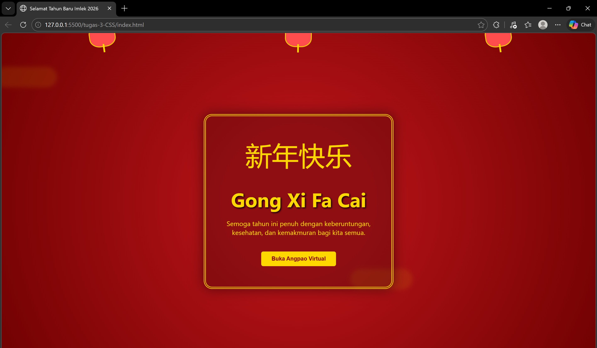

<div align="center">
  <br />
  <h1>LAPORAN PRAKTIKUM <br>APLIKASI BERBASIS PLATFORM</h1>
  <br />
  <h3>MODUL 3 <br> CSS </h3>
  <br />
   
  <br />
  <br />
  <br />
  <h3>Disusun Oleh :</h3>
  <p>
    <strong>Nisrina Amalia Iffatunnisa</strong><br>
    <strong>2311102156</strong><br>
    <strong>S1 IF-11-01</strong>
  </p>
  <br />
  <h3>Dosen Pengampu :</h3>
  <p>
    <strong>Dimas Fanny Hebrasianto Permadi, S.ST., M.Kom</strong>
  </p>
  <br />
  <br />
    <h4>Asisten Praktikum :</h4>
    <strong> Apri Pandu Wicaksono </strong> <br>
    <strong>Rangga Pradarrell Fathi</strong>
  <br />
  <h3>LABORATORIUM HIGH PERFORMANCE
 <br>FAKULTAS INFORMATIKA <br>UNIVERSITAS TELKOM PURWOKERTO <br>2026</h3>
</div>

---

## Dasar Teori
#### Pengenalan CSS
Cascading Style Sheets (CSS) merupakan bahasa yang membantu memperindah tampilan dari laman web yang telah dibangun dengan HTML. CSS mendeskripsikan bagaimana bentuk tampilan elemen HTML seharusnya saat ditampilkan pada laman browser. Selector merupakan elemen HTML yang akan ditambahkan CSS kemudian diikuti dengan declaration block yang terdiri dari property elemen yang akan dirubah beserta value dari property-nya. Setiap deklarasi selector dapat merubah banyak nilai property sekaligus dengan dipisahkan dengan titik koma dan untuk semua declaration block dari satu selector berada di antara kurung kurawal.</br>

Terdapat tiga cara untuk menyisipkan atau mendefinisikan CSS ke dalam HTML, antara lain:</br>
a. Eksternal Style Sheet merupakan cara menyisipkan atau mendefinisikan CSS ke dalam HTML dengan memanggil file dengan ekstensi .css ke dalam file HTML. Pemanggilannya diletakkan di antara elemen `<head></head>` dengan menggunakan tag `<link/>`.</br>
b. Internal Style Sheet merupakan cara menyisipkan atau mendefinisikan CSS ke dalam HTML dengan menggunakan tag `<style> </style>` pada elemen `<head></head>`. Biasanya digunakan ketika satu laman membutuhkan style CSS yang berbeda dari yang telah dipanggil pada Eksternal Style Sheet.</br>
c. Inline Style menyisipkan atau mendefinisikan CSS ke dalam HTML dengan menambahkan atribut style pada elemen yang ingin ditambahkan CSS. Biasanya digunakan hanya untuk satu elemen yang membutuhkan style CSS yang berbeda dari yang telah didefinisikan pada Internal Style atau Eksternal Style.</br>

Selector pada CSS digunakan untuk menemukan elemen HTML untuk diberi CSS berdasarkan selector yang didefinisikan. Bentuk selector ada beberapa antara lain nama elemen HTML, atribut ID dan atribut Class. </br>

Font Properties:
- Font-family: Menentukan jenis font yang digunakan </br>
- Font-size: Mengatur ukuran font </br>
- Font-style Mengatur style font (normal, italic, oblique) </br>
- Font-weight Mengatur style font (normal atau bold) </br>

List Properties: Tag yang digunakan adalah tag `<ul></ul>` atau `<ol></ol>`. Tag `<ul>` digunakan ketika akan menggunakan list dengan penanda berupa simbol atau bisa dikatakan unordered list, sedangkan tag `<ol>` digunakan ketika akan menggunakan list dengan penanda karakter yang memiliki urutan atau bisa dikatakan ordered list. </br>
1.) Lists Specified Properties
- List-style-image: Membuat sebuah gambar menjadi penanda list
- List-style-position: Mengatur posisi penanda list di dalam konten atau di luar konten
- List-style-type: Mengatur jenis penanda list
2.) Lists General Properties
- Background-color Mengatur warna latar belakang elemen list
- Padding Mengatur ruang jarak elemen konten dengan pembatas pada bagian dalam 
- Margin Mengatur ruang jarak elemen konten dengan pembatas pada bagian luar

Text-align 
- Center: Membuat teks menjadi rata tengah
- Left: Membuat teks menjadi rata kiri
- Right: Membuat teks menjadi rata kanan
- Justify: Membuat paragraf menjadi rata kanan dan kiri

Colors, CSS dapat menangani lebih baik dengan menawarkan pengaturan yang lebih lengkap.
- Background-color: Mengatur warna latar belakang elemen HTML, seperti: RGB Value (R, G, B), Hex Value (#FFFF00), HSL Value (Hue, Saturation, Light)
- Color Mengatur warna teks elemen HTML, seperti: RGBA (dengan Opacity) dan HSLA (dengan Opacity)

Span & Div: Span merupakan elemen HTML yang dapat menangani perubahan konten elemen pada satu baris. Tag yang digunakan adalah `<span></span>`. Sedangkan Div merupakan elemen HTML yang digunakan untuk membuat section untuk beberapa elemen HTML di dalamnya. Tag yang digunakan, yaitu `<div></div>`.

##  Unguided 

### 1. Implementasi CSS di dalam HTML

```HTML
<!DOCTYPE html>
<html lang="id">
<head>
    <meta charset="UTF-8">
    <meta name="viewport" content="width=device-width, initial-scale=1.0">
    <title>Selamat Tahun Baru Imlek 2026</title>
    <style>
        /* Dasar & Background */
        body {
            margin: 0;
            padding: 0;
            background-color: #8B0000; /* Merah Marun */
            background-image: radial-gradient(circle, #b31217 20%, #700101 100%);
            height: 100vh;
            display: flex;
            justify-content: center;
            align-items: center;
            font-family: 'Segoe UI', Tahoma, Geneva, Verdana, sans-serif;
            overflow: hidden;
            color: #FFD700; /* Emas */
        }

        /* Kontainer Utama */
        .card {
            text-align: center;
            border: 5px double #FFD700;
            padding: 50px;
            background: rgba(0, 0, 0, 0.2);
            border-radius: 20px;
            box-shadow: 0 0 30px rgba(0,0,0,0.5);
            position: relative;
            z-index: 2;
        }

        h1 {
            font-size: 3rem;
            margin-bottom: 10px;
            text-shadow: 2px 2px 4px #000;
        }

        .chinese-text {
            font-size: 4rem;
            display: block;
            margin-bottom: 20px;
        }

        /* Animasi Lampion */
        .lantern-container {
            position: absolute;
            top: -20px;
            width: 100%;
            display: flex;
            justify-content: space-around;
            pointer-events: none;
        }

        .lantern {
            width: 60px;
            height: 50px;
            background: #ff4d4d;
            border-radius: 40% 40% 40% 40%;
            position: relative;
            border: 2px solid #FFD700;
            animation: swing 3s ease-in-out infinite alternate;
            transform-origin: top center;
        }

        .lantern::before {
            content: "";
            position: absolute;
            top: -10px;
            left: 50%;
            transform: translateX(-50%);
            width: 20px;
            height: 10px;
            background: #FFD700;
        }

        .lantern::after {
            content: "";
            position: absolute;
            bottom: -15px;
            left: 50%;
            transform: translateX(-50%);
            width: 4px;
            height: 20px;
            background: #FFD700;
        }

        @keyframes swing {
            from { transform: rotate(-10deg); }
            to { transform: rotate(10deg); }
        }

        /* Ornamen Awan (CSS Shapes) */
        .cloud {
            position: absolute;
            width: 150px;
            height: 50px;
            background: rgba(255, 215, 0, 0.1);
            border-radius: 50px;
            filter: blur(5px);
            z-index: 1;
            animation: moveCloud 20s linear infinite;
        }

        @keyframes moveCloud {
            from { left: -200px; }
            to { left: 110%; }
        }

        /* Button Efek Hover (CSS Only) */
        .wish-btn {
            margin-top: 20px;
            padding: 10px 25px;
            background: #FFD700;
            color: #8B0000;
            border: none;
            font-weight: bold;
            border-radius: 5px;
            cursor: pointer;
            transition: transform 0.3s, box-shadow 0.3s;
        }

        .wish-btn:hover {
            transform: scale(1.1);
            box-shadow: 0 0 15px #FFD700;
        }
    </style>
</head>
<body>

    <div class="lantern-container">
        <div class="lantern"></div>
        <div class="lantern" style="animation-delay: -1s;"></div>
        <div class="lantern"></div>
    </div>

    <div class="cloud" style="top: 10%; animation-duration: 25s;"></div>
    <div class="cloud" style="top: 70%; animation-duration: 30s; animation-delay: -5s;"></div>

    <div class="card">
        <span class="chinese-text">新年快乐</span>
        <h1>Gong Xi Fa Cai</h1>
        <p>Semoga tahun ini penuh dengan keberuntungan, <br> kesehatan, dan kemakmuran bagi kita semua.</p>
        <button class="wish-btn">Buka Angpao Virtual</button>
    </div>

</body>
</html>
```

Kode HTML dan CSS di atas merupakan halaman perayaan Tahun Baru Imlek yang dibuat tanpa menggunakan library maupun JavaScript, melainkan murni dengan CSS. Pada bagian `<body>`, digunakan properti display: flex untuk memposisikan konten utama tepat di tengah layar secara horizontal dan vertikal. Latar belakang dibuat menggunakan kombinasi background-color dan radial-gradient bernuansa merah marun, yang identik dengan perayaan Imlek, serta warna teks emas (#FFD700) untuk memberikan kesan kemakmuran dan keberuntungan.

Elemen utama berada dalam div .card yang diberi border emas ganda, efek bayangan (box-shadow), serta sudut membulat (border-radius) agar terlihat elegan. Hiasan tambahan seperti lampion dibuat menggunakan CSS shape dan pseudo-element (::before dan ::after), kemudian dianimasikan dengan `@keyframes` swing bawaan CSS agar tampak bergoyang. Selain itu, terdapat ornamen awan yang bergerak menggunakan animasi moveCloud, serta tombol dengan efek hover yang memanfaatkan transition dan transform untuk memberikan interaksi visual tanpa JavaScript.

## SS Tugas


## Kesimpulan
Secara keseluruhan, halaman ini berhasil menampilkan suasana perayaan Imlek dengan memanfaatkan fitur CSS secara maksimal tanpa bantuan library atau JavaScript. Desain memadukan warna khas merah dan emas yang melambangkan keberuntungan dan kemakmuran. Animasi lampion dan awan memberikan kesan hidup dan dinamis pada halaman. Dengan demikian, tugas ini menunjukkan pemahaman yang baik dalam penggunaan CSS untuk membuat tampilan yang menarik dan interaktif secara mandiri.

## Referensi
[1] [Materi Modul 4 CSS](https://drive.google.com/file/d/1YZ4-EXXFpIfaoV6P8ZpeixciZLjrFiy5/view) </br>
