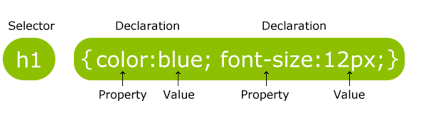
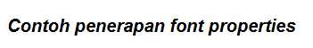
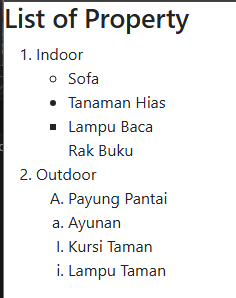
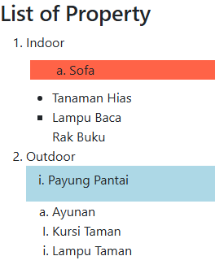
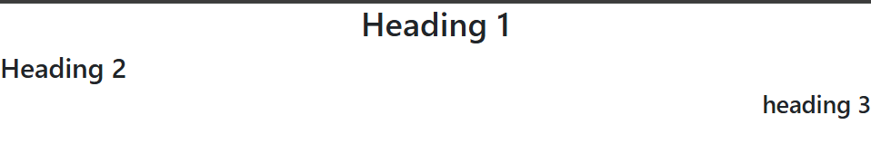
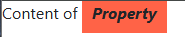
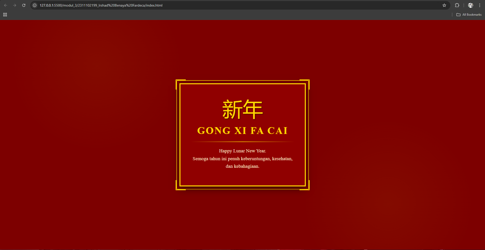

<div align="center">
  <br>

  <h1>LAPORAN PRAKTIKUM <br>
  APLIKASI BERBASIS PLATFORM
  </h1>

  <br>

  <h3>MODUL 3 <br>
  CSS
  </h3>

  <br>

  


  <br>
  <br>
  <br>

  <h3>Disusun Oleh :</h3>

  <p>
    <strong>Irshad Benaya Fardeca</strong><br>
    <strong>2311102199</strong><br>
    <strong>S1 IF-11-REG01</strong>
  </p>

  <br>

  <h3>Dosen Pengampu :</h3>

  <p>
    <strong>Dimas Fanny Hebrasianto Permadi, S.ST., M.Kom</strong>
  </p>
  
  <br>
  <br>
    <h4>Asisten Praktikum :</h4>
    <strong>Apri Pandu Wicaksono </strong> <br>
    <strong>Rangga Pradarrell Fathi</strong>
  <br>

  <h3>LABORATORIUM HIGH PERFORMANCE
 <br>FAKULTAS INFORMATIKA <br>UNIVERSITAS TELKOM PURWOKERTO <br>2026</h3>
</div>
<hr>

# Dasar Teori
## 4.1 Pengenalan CSS
Cascading Style Sheets (CSS) merupakan bahasa yang membantu memperindah tampilan dari laman web
yang telah dibangun dengan HTML. CSS mendeskripsikan bagaimana bentuk tampilan elemen HTML
seharusnya saat ditampilkan pada laman browser. Format penulisan CSS secara umum ditunjukkan pada
gambar berikut.

Selector merupakan elemen HTML yang akan ditambahkan CSS kemudian diikuti dengan declaration block
yang terdiri dari property elemen yang akan dirubah beserta value dari property-nya. Setiap deklarasi
selector dapat merubah banyak nilai property sekaligus dengan dipisahkan dengan titik koma dan untuk
semua declaration block dari satu selector berada di antara kurung kurawal.

### 4.1.1 Cara Menyisipkan CSS
Terdapat tiga cara untuk menyisipkan atau mendefinisikan CSS ke dalam HTML, antara lain:
1. External Style Sheet
Eksternal Style Sheet merupakan cara menyisipkan atau mendefinisikan CSS ke dalam HTML dengan
memanggil file dengan ekstensi .css ke dalam file HTML. Pemanggilannya diletakkan di antara elemen
```<head></head>``` dengan menggunakan tag ```<link/>```.
```
<head>
 <link rel="stylesheet" type="text/css" href="myStyleSheet.css"> </head>
```

2. Internal Style Sheet
Internal Style Sheet merupakan cara menyisipkan atau mendefinisikan CSS ke dalam HTML dengan
menggunakan tag ```<style> </style>``` pada elemen ```<head></head>```. Biasanya digunakan ketika satu
laman membutuhkan style CSS yang berbeda dari yang telah dipanggil pada Eksternal Style Sheet.
```
<head> 
 <style> 
 body { 
 background-color: blue; 
 } 
 h1 { 
 color: maroon; 
 margin-left: 40px; 
 } 
 </style> 
</head>
```
3. Inline Style
Inline Style menyisipkan atau mendefinisikan CSS ke dalam HTML dengan menambahkan atribut style
pada elemen yang ingin ditambahkan CSS. Biasanya digunakan hanya untuk satu elemen yang
membutuhkan style CSS yang berbeda dari yang telah didefinisikan pada Internal Style atau Eksternal
Style.
```
<h1 style="color:lightblue; font-size:30px;">Praktikum Web Programming</h1> 
```

### 4.1.2 Selector
Selector pada CSS digunakan untuk menemukan elemen HTML untuk diberi CSS berdasarkan selector yang
didefinisikan. Bentuk selector ada beberapa antara lain nama elemen HTML, atribut ID dan atribut Class.
```
/*Selector dengan Elemen  
HTML*/ 
p { 
 text-align: center; 
 color: red; 
} 
/*Selector dengan Id Elemen  
HTML*/ 
#para1 { 
 text-align: center; 
 color: red; 
} 
/*Selector dengan Class Elemen  
HTML*/ 
p.center { 
 text-align: center; 
 color: red; 
}
```

## 4.2 Font Properties
Sebuah laman web tentunya tidak lepas oleh penggunaan teks, oleh karena itu memiliki tampilan teks yang
tepat sangat diperlukan agar sebuah web memiliki tampilan yang baik dan menarik. CSS dapat menangani
kebutuhan tampilan teks dengan font properties.
| Property | Keterangan | Nilai Umum |
| :--- | :--- | :--- |
| `font-family` | Menentukan jenis font yang digunakan | `Arial`, `Roboto`, `sans-serif` |
| `font-size` | Mengatur ukuran font | `16px`, `1rem`, `120%` |
| `font-style` | Mengatur gaya font (normal, miring) | `normal`, `italic`, `oblique` |
| `font-weight` | Mengatur ketebalan huruf | `normal`, `bold`, `500`, `700` |

Contoh penerapannya sebagai berikut:  
```
        p.example {
            font-family: Arial;
            font-size: 20px;
            color: ligh;
            font-style: italic;
            font-weight: bold;
        }
```


## 4.3 List Properties
Dalam HTML terdapat elemen yang berguna membuat sebuah list menggunakan simbol dan karakter. Tag
yang digunakan adalah tag ```<ul></ul>``` atau ```<ol></ol>```. Tag <ul> digunakan ketika akan menggunakan list
dengan penanda berupa simbol atau bisa dikatakan unordered list, sedangkan tag ```<ol>``` digunakan ketika
akan menggunakan list dengan penanda karakter yang memiliki urutan atau bisa dikatakan ordered list.
Namun di dalam tag tersebut juga harus didefinisikan tag pendukung yaitu ```<li></li>``` untuk mendefinisikan
elemen-elemen list yang akan ditampilkan. Untuk setiap tag ordered list atau unordered list memiliki satu
atribut untuk mendefinisikan tipe simbol atau karakter yang akan digunakan yaitu atribut type. Contoh
penerapan dan tipe masing-masing tag sebagai berikut:
```
<h3>List of Property</h3> 
<ol type="1"> 
 <li>Indoor 
 <ul type="circle"> 
 <li>Sofa</li> 
 </ul> 
 <ul type="disc"> 
 <li>Tanaman Hias</li> 
 </ul> 
 <ul type="square"> 
 <li>Lampu Baca</li> 
 </ul> 
 <ul type="none"> 
 <li>Rak Buku</li> 
 </ul> 
 </li> 
 <li>Outdoor 
 <ol type="A">
 <li>Payung Pantai</li>  </ol> 
 <ol type="a"> 
 <li>Ayunan</li> 
 </ol> 
 <ol type="I"> 
 <li>Kursi Taman</li>  </ol> 
 <ol type="i"> 
 <li>Lampu Taman</li>  </ol> 
 </li> 
</ol> 
```


Dengan ditambahkan CSS pada elemen list, maka list yang ditampilkan dapat lebih menarik, berikut CSS  properties untuk elemen list.  
| Property | Keterangan | Nilai Umum |
| :--- | :--- | :--- |
| `list-style-image` | Menggunakan gambar sebagai penanda list | `url('icon.png')`, `none` |
| `list-style-position` | Mengatur posisi penanda di dalam/luar konten | `inside`, `outside` |
| `list-style-type` | Mengatur jenis penanda (bulat, kotak, angka) | `disc`, `circle`, `square`, `decimal` |

| Property | Keterangan | Fungsi Utama |
| :--- | :--- | :--- |
| `background-color` | Mengatur warna latar belakang elemen | Memberi warna pada area konten |
| `padding` | Mengatur jarak antara konten dan border (dalam) | Memberikan ruang napas di dalam elemen |
| `margin` | Mengatur jarak antara elemen dengan elemen lain (luar) | Mengatur spasi antar elemen |

Contoh penerapannya sebagai berikut:  

```
Ul.listsatu {
 background-color: tomato; 
 margin: 10px 5px 10px 5px; 
 list-style-type: lower-alpha; 
 list-style-position: inside; 
} 
ol.listdua { 
 background-color: lightblue; 
 list-style-type: lower-roman; 
 padding: 5px 5px 15px 15px; 
 list-style-position: inside; 
}
```

## 4.4 Alligment of Text
Pengaturan alignment pada sebuah teks juga dapat ditangani oleh CSS dengan properties
| Property | Value | Keterangan |
| :--- | :--- | :--- |
| `text-align` | `left` | Mengatur teks menjadi rata kiri (default) |
| `text-align` | `center` | Mengatur teks menjadi rata tengah |
| `text-align` | `right` | Mengatur teks menjadi rata kanan |
| `text-align` | `justify` | Mengatur paragraf menjadi rata kanan dan kiri |

Contoh penerapannya:

```
h1 { 
 text-align: center;  
}  
h2 {  
 text-align: left;  
}  
h3 {  
 text-align: right;  
} 
```

## 4.5 Colors
Jika berbicara desain antar muka web, permasalahan tentang warna merupakan salah satu hal yang
penting. Pada dasarnya Tag HTML dapat menangani pengaturan warna latar belakang atau teks
menggunakan atribut dari HTML sendiri, namun CSS dapat menangani lebih baik dengan menawarkan
pengaturan yang lebih lengkap.
| Property | Deskripsi | Format Value yang Didukung |
| :--- | :--- | :--- |
| `color` | Mengatur warna teks pada elemen | **Color Names** (Red, Blue, dll) |
| `background-color` | Mengatur warna latar belakang elemen | **Hex Value** (`#FFFFFF`) |
| | | **RGB / RGBA** (dengan Opacity) |
| | | **HSL / HSLA** (dengan Opacity) |

Contoh penerapannya sebagai berikut : 
```
body{ 
 background-color: HSL(20%, 40%, 70%);  
 color: orange;  
} 


#teks{ 
 color: #2F3CDF;  
} 


/*dengan opacity sebesar 0.5*/ 
input.text-field{  
 background-color: RGBA(32, 55, 122, 0.5);  
} 
```

## 4.6 Span & Div
Span merupakan elemen HTML yang dapat menangani perubahan konten elemen pada satu baris. Tag
yang digunakan adalah ```<span></span>```. Sedangkan Div merupakan elemen HTML yang digunakan untuk
membuat section untuk beberapa elemen HTML di dalamnya. Tag yang digunakan yaitu ```<div></div>```.
```
<div class=”section1”> 
 <p> Content of <span class=”mark”> Property </span> </p> 
</div> 
/*CSS Properties*/  
.section1 { 
 background-color: lightgrey; 
 padding: 10px 5px 10px 5px; 
} 
.mark { 
 background-color: tomato; 
 font-style: italic; 
 font-weight: bold; 
 padding: 10px 10px 10px 10px; 
}
```


## Unguided 
### 1. Buat halaman untuk merayakan imlek ("karena bubub gua cina") hanya menggunakan css tanpa library dan tanpa js

#### Source Code
```html
<!-- Irshad Benaya Fardeca -->
<!-- 2311102199 -->
<!-- S1IF-11-01 -->

<!DOCTYPE html>
<html lang="id">

<head>
    <meta charset="UTF-8">
    <meta name="viewport" content="width=device-width, initial-scale=1.0">
    <title>Tugas 3</title>
    <style>
        /* RESET */
        * {
            margin: 0;
            padding: 0;
            box-sizing: border-box;
        }

        body {
            background-color: #7d0000;
            background-image:
                radial-gradient(circle at 20% 20%, rgba(255, 215, 0, 0.05) 0%, transparent 20%),
                radial-gradient(circle at 80% 80%, rgba(255, 215, 0, 0.05) 0%, transparent 20%);
            height: 100vh;
            display: flex;
            justify-content: center;
            align-items: center;
            font-family: 'Times New Roman', serif;
            color: #ffd700;
        }

        /* FRAME LUAR */
        .outer-border {
            border: 2px solid #ffd700;
            padding: 10px;
            border-radius: 5px;
            position: relative;
        }

        /* CONTAINER UTAMA */
        .card {
            background-color: #900000;
            border: 4px solid #ffd700;
            padding: 60px 40px;
            text-align: center;
            max-width: 500px;
            box-shadow: 0 10px 30px rgba(0, 0, 0, 0.5);
        }

        /* ORNAMEN POJOK */
        .corner {
            position: absolute;
            width: 40px;
            height: 40px;
            border: 3px solid #ffd700;
        }

        .top-left {
            top: -5px;
            left: -5px;
            border-right: none;
            border-bottom: none;
        }

        .top-right {
            top: -5px;
            right: -5px;
            border-left: none;
            border-bottom: none;
        }

        .bottom-left {
            bottom: -5px;
            left: -5px;
            border-right: none;
            border-top: none;
        }

        .bottom-right {
            bottom: -5px;
            right: -5px;
            border-left: none;
            border-top: none;
        }

        /* KONTEN */
        .calligraphy {
            font-size: 80px;
            line-height: 1;
            margin-bottom: 20px;
            display: block;
            color: #ffd700;
            filter: drop-shadow(2px 2px 2px rgba(0, 0, 0, 0.5));
        }

        h1 {
            font-size: 2.5rem;
            letter-spacing: 3px;
            margin-bottom: 15px;
            text-transform: uppercase;
        }

        .divider {
            height: 2px;
            background: linear-gradient(to right, transparent, #ffd700, transparent);
            margin: 20px 0;
        }

        p {
            font-size: 1.2rem;
            line-height: 1.6;
            color: #ffebcd;
            /* Warna krem agar nyaman dibaca */
        }

        .footer-text {
            margin-top: 30px;
            font-size: 0.9rem;
            font-style: italic;
            opacity: 0.8;
        }
    </style>
</head>

<body>

    <div class="outer-border">
        <div class="corner top-left"></div>
        <div class="corner top-right"></div>
        <div class="corner bottom-left"></div>
        <div class="corner bottom-right"></div>

        <div class="card">
            <span class="calligraphy">新年</span>
            <h1>Gong Xi Fa Cai</h1>
            <div class="divider"></div>
            <p>Happy Lunar New Year.</p>
            <p>Semoga tahun ini penuh keberuntungan, kesehatan, dan kebahagiaan.</p>
        </div>
    </div>

</body>

</html>
```

Menggunakan HTML dan CSS untuk membuat halaman web sederhana berupa kartu ucapan Tahun Baru Imlek. CSS digunakan untuk mengatur tampilan halaman, seperti menempatkan kartu di tengah menggunakan Flexbox, memberikan background merah dengan efek dekoratif, serta membuat bingkai dan ornamen sudut. Di dalam kartu terdapat teks kaligrafi “新年”, judul “Gong Xi Fa Cai” dan pesan ucapan Tahun Baru.

#### Output:
