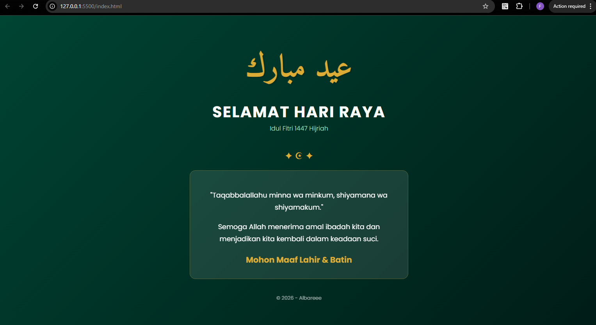

<div align="center">

# LAPORAN PRAKTIKUM

## Aplikasi Berbasis Platform

### Modul 3

### CSS – Cascading Style Sheet


### Disusun Oleh

**M. Faleno Albar Firjatulloh**
2311102297
S1 IF-11-01

### Dosen Pengampu

**Dimas Fanny Hebrasianto Permadi, S.ST., M.Kom**

### Asisten Praktikum

Apri Pandu Wicaksono
Rangga Pradarrell Fathi

### Laboratorium High Performance

Fakultas Informatika
Universitas Telkom Purwokerto
2026

</div>

---

# 1. Dasar Teori

**CSS (Cascading Style Sheets)** adalah bahasa yang digunakan bersama HTML untuk mengatur tampilan visual pada halaman web.

Jika **HTML** berfungsi sebagai struktur dasar sebuah halaman, maka **CSS** digunakan untuk mengatur tampilan seperti:

* Warna
* Tata letak
* Ukuran teks
* Jarak antar elemen
* Efek visual lainnya

CSS bekerja dengan **selector** untuk memilih elemen HTML, kemudian menerapkan aturan gaya berupa berbagai **property** seperti warna, ukuran font, margin, padding, dan lain-lain.

Dengan menggunakan CSS, pengembang dapat **memisahkan struktur (HTML) dan tampilan (CSS)** sehingga kode menjadi:

* Lebih rapi
* Mudah dipahami
* Mudah dikelola

### Cara Menggunakan CSS

Terdapat **tiga metode utama** dalam menerapkan CSS pada HTML:

1. **Inline CSS**
   CSS ditulis langsung pada elemen HTML menggunakan atribut `style`.

2. **Internal CSS**
   CSS ditulis di dalam tag `<style>` pada bagian `<head>`.

3. **External CSS**
   CSS disimpan pada file terpisah `.css` lalu dihubungkan menggunakan tag `<link>`.
   Metode ini **paling direkomendasikan** karena membuat kode lebih terstruktur.

---

# 2. Penjelasan Kode

## Source Code (`index.html`)

```html
<!DOCTYPE html>
<html lang="id">
<head>
    <meta charset="UTF-8">
    <meta name="viewport" content="width=device-width, initial-scale=1.0">
    <title>Selamat Idul Fitri - 1447 H</title>
    <style>
        @import url('https://fonts.googleapis.com/css2?family=Amiri:wght@700&family=Poppins:wght@300;400;700&display=swap');

        body {
            margin: 0;
            padding: 0;
            /* Latar belakang hijau gradasi */
            background: linear-gradient(135deg, #1b4332 0%, #081c15 100%);
            font-family: 'Poppins', sans-serif;
            display: flex;
            justify-content: center;
            align-items: center;
            min-height: 100vh;
            color: #ffffff;
        }

        .container {
            /* Menyesuaikan permintaan: Width 100% */
            width: 100%;
            max-width: 600px; /* Opsional: batas maksimal agar teks tidak terlalu melar di monitor besar */
            padding: 20px;
            text-align: center;
            box-sizing: border-box;
        }

        .arabic {
            font-family: 'Amiri', serif;
            font-size: clamp(3rem, 10vw, 5rem); /* Ukuran teks adaptif */
            color: #d4af37;
            margin-bottom: 10px;
            text-shadow: 2px 2px 4px rgba(0,0,0,0.3);
        }

        h1 {
            font-size: clamp(1.5rem, 5vw, 2.5rem);
            margin: 0;
            letter-spacing: 2px;
            text-transform: uppercase;
        }

        .subtitle {
            font-weight: 300;
            color: #b7e4c7;
            margin-bottom: 40px;
        }

        .message {
            background: rgba(255, 255, 255, 0.1);
            backdrop-filter: blur(10px);
            padding: 30px;
            border-radius: 15px;
            border: 1px solid rgba(212, 175, 55, 0.3);
            line-height: 1.8;
            font-size: 1.1rem;
        }

        .highlight {
            display: block;
            margin-top: 15px;
            font-weight: 700;
            color: #d4af37;
            font-size: 1.3rem;
        }

        /* Animasi Bintang Sederhana */
        .decoration {
            color: #d4af37;
            font-size: 1.5rem;
            margin: 20px 0;
        }

        @keyframes pulse {
            0% { transform: scale(1); opacity: 1; }
            50% { transform: scale(1.1); opacity: 0.7; }
            100% { transform: scale(1); opacity: 1; }
        }

        .arabic {
            animation: pulse 3s infinite ease-in-out;
        }
    </style>
</head>
<body>

    <div class="container">
        <div class="arabic">عيد مبارك</div>
        
        <h1>Selamat Hari Raya</h1>
        <div class="subtitle">Idul Fitri 1447 Hijriah</div>

        <div class="decoration">✦ ☪ ✦</div>

        <div class="message">
            <p>"Taqabbalallahu minna wa minkum, shiyamana wa shiyamakum."</p>
            <p>Semoga Allah menerima amal ibadah kita dan menjadikan kita kembali dalam keadaan suci.</p>
            <span class="highlight">Mohon Maaf Lahir & Batin</span>
        </div>

        <p style="margin-top: 40px; font-size: 0.8rem; opacity: 0.6;">
            &copy; 2026 - Albareee
        </p>
    </div>

</body>
</html>
```

---

## Hasil Tampilan



---

# Penjelasan Kode

## 1. Struktur Dokumen (HTML)

Kode menggunakan standar **HTML5** dengan beberapa elemen utama:

* **`<head>`**
  Berisi metadata halaman, judul, serta import font dari Google Fonts.

* **`<div class="container">`**
  Berfungsi sebagai pembungkus utama konten agar berada di tengah halaman.

* **`<div class="arabic">`**
  Menampilkan teks ucapan **Eid Mubarak** dalam bahasa Arab.

* **`<h1>` dan `<div class="subtitle">`**
  Digunakan untuk judul utama dan keterangan tahun Hijriah.

* **`<div class="message">`**
  Berisi doa dan ucapan Idul Fitri.

---

## 2. Desain Visual (CSS Layout)

Beberapa teknik CSS modern yang digunakan:

### Flexbox

Digunakan pada elemen `body`:

* `display: flex`
* `justify-content: center`
* `align-items: center`

Agar konten berada tepat di **tengah layar** secara horizontal dan vertikal.

### Background Gradient

Menggunakan:

```
linear-gradient(135deg, #1b4332, #081c15)
```

Memberikan efek **gradasi hijau elegan**.

### Glassmorphism

Efek kaca buram pada `.message` dibuat dengan:

```
background: rgba(255,255,255,0.1)
backdrop-filter: blur(10px)
```

---

## 3. Tipografi & Responsivitas

Beberapa teknik yang digunakan:

* **Google Fonts**

  * Amiri (teks Arab)
  * Poppins (teks utama)

* **Fluid Typography**
  Menggunakan fungsi:

```
clamp()
```

Agar ukuran font menyesuaikan ukuran layar.

* **Text Shadow**
  Memberikan bayangan pada teks Arab agar lebih kontras.

---

## 4. Animasi & Dekorasi

### Keyframes Pulse

Animasi dibuat menggunakan:

```
@keyframes pulse
```

Animasi ini mengubah:

* `scale`
* `opacity`

sehingga teks terlihat **berdenyut secara halus**.

Animasi diterapkan pada:

```
.arabic
```

dengan durasi **3 detik dan berjalan terus menerus**.

---

## 5. Meta & Footer

* **Viewport Tag**
  Agar tampilan responsif pada perangkat mobile.

* **Footer**
  Menggunakan opacity rendah (`0.6`) agar tidak mengganggu fokus utama halaman.

---

# Referensi

* [Materi Modul 3](https://drive.google.com/file/d/1kd7ogQkR_rsNCnKDcJDmavY8FiOyTLzs/view?usp=sharing)
