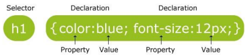
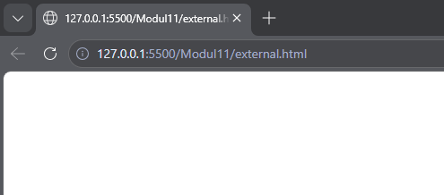
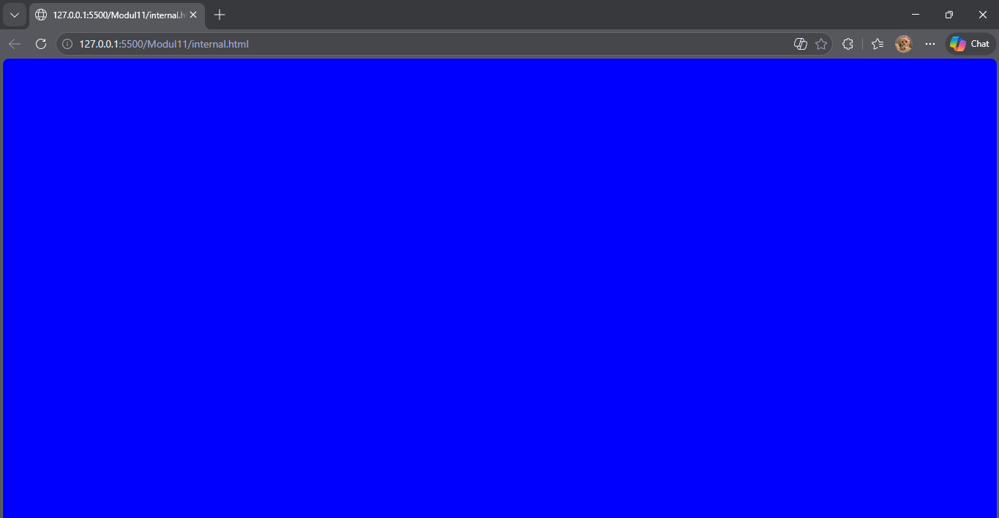
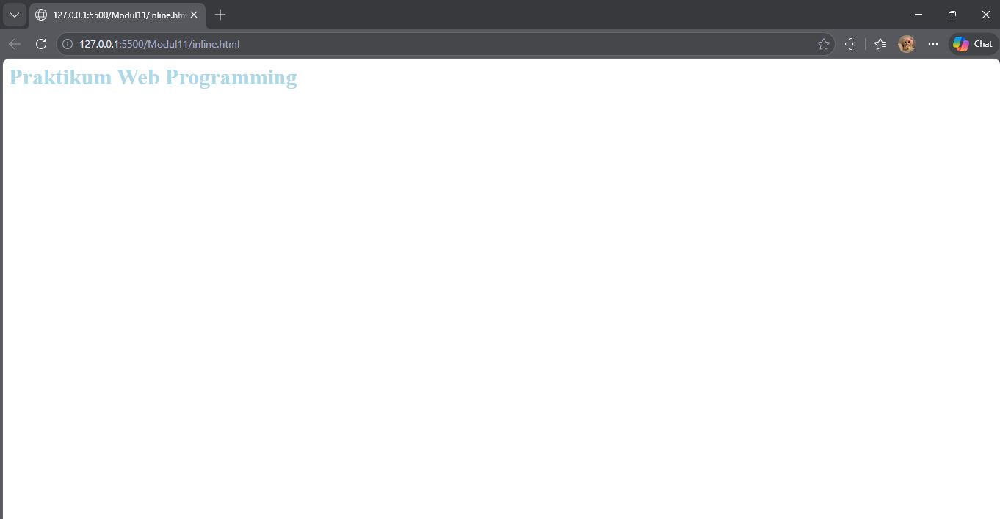
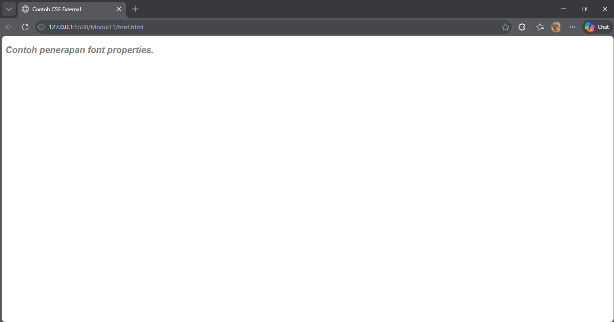
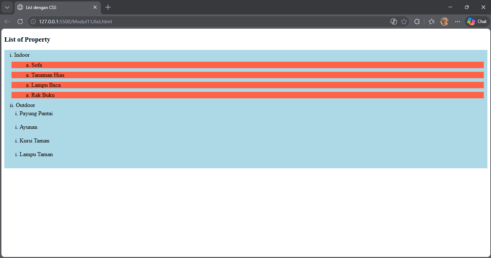
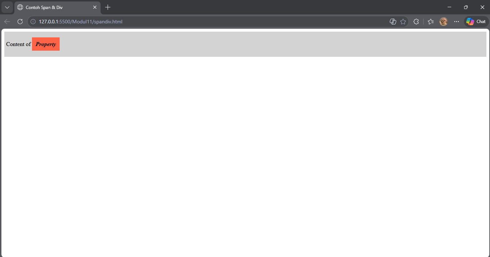

<div align="center">
  <br />

  <h1>LAPORAN PRAKTIKUM <br>
  APLIKASI BERBASIS PLATFORM
  </h1>

  <br />

  <h3>MODUL 4 <br>
  HTML
  </h3>

  <br />

  


  <br />
  <br />
  <br />

  <h3>Disusun Oleh :</h3>

  <p>
    <strong>Boutefhika Nuha Ziyadatul Khair</strong><br>
    <strong>2311102316</strong><br>
    <strong>S1 IF-11-01</strong>
  </p>

  <br />

  <h3>Dosen Pengampu :</h3>

  <p>
    <strong>Dimas Fanny Hebrasianto Permadi, S.ST., M.Kom</strong>
  </p>
  
  <br />
  <br />
    <h4>Asisten Praktikum :</h4>
    <strong>Apri Pandu Wicaksono </strong> <br>
    <strong>Rangga Pradarrell Fathi</strong>
  <br />

  <h3>LABORATORIUM HIGH PERFORMANCE
 <br>FAKULTAS INFORMATIKA <br>UNIVERSITAS TELKOM PURWOKERTO <br>2026</h3>
</div>

<hr>


# Dasar Teori

## 4.1. Pengenalan CSS
Cascading Style Sheets (CSS) merupakan bahasa yang membantu memperindah tampilan dari laman web
yang telah dibangun dengan HTML. CSS mendeskripsikan bagaimana bentuk tampilan elemen HTML
seharusnya saat ditampilkan pada laman browser. Format penulisan CSS secara umum ditunjukkan pada gambar berikut.

Selector merupakan elemen HTML yang akan ditambahkan CSS kemudian diikuti dengan declaration block yang terdiri dari property elemen yang akan dirubah beserta value dari property-nya. Setiap deklarasi selector dapat merubah banyak nilai property sekaligus dengan dipisahkan dengan titik koma dan untuk semua declaration block dari satu selector berada di antara kurung kurawal.

### 4.1.1. Cara Menyisipkan CSS
Terdapat tiga cara untuk menyisipkan atau mendefinisikan CSS ke dalam HTML, antara lain:
a. External Style Sheet
Eksternal Style Sheet merupakan cara menyisipkan atau mendefinisikan CSS ke dalam HTML dengan
memanggil file dengan ekstensi .css ke dalam file HTML. Pemanggilannya diletakkan di antara elemen <head></head> dengan menggunakan tag <link/>.
```
<head>
<link rel="stylesheet" type="text/css" href="myStyleSheet.css">
</head>
```

b. Internal Style Sheet
Internal Style Sheet merupakan cara menyisipkan atau mendefinisikan CSS ke dalam HTML dengan
menggunakan tag <style> </style> pada elemen <head></head>. Biasanya digunakan ketika satu
laman membutuhkan style CSS yang berbeda dari yang telah dipanggil pada Eksternal Style Sheet.
```
<head>
  <style>
    body {
      background-color: blue;
    }
    h1 {
      color: maroon;
      margin-left: 40px;
    }
  </style>
</head>
```

c. Inline Style
Inline Style menyisipkan atau mendefinisikan CSS ke dalam HTML dengan menambahkan atribut style
pada elemen yang ingin ditambahkan CSS. Biasanya digunakan hanya untuk satu elemen yang
membutuhkan style CSS yang berbeda dari yang telah didefinisikan pada Internal Style atau Eksternal Style.
```
<h1 style="color:lightblue; font-size:30px;">Praktikum Web Programming</h1>
```


### 4.1.2. Selector
Selector pada CSS digunakan untuk menemukan elemen HTML untuk diberi CSS berdasarkan selector yang didefinisikan. Bentuk selector ada beberapa antara lain nama elemen HTML, atribut ID dan atribut Class.
```
/*Selector dengan Elemen
HTML*/
p {
  text-align: center;
  color: red;
}

/*Selector dengan Id Elemen
HTML*/
#para1 {
  text-align: center;
  color: red;
}

/*Selector dengan Class Elemen
HTML*/
p.center {
  text-align: center;
  color:
}
```

## 4.2. Font Properties
Sebuah laman web tentunya tidak lepas oleh penggunaan teks, oleh karena itu memiliki tampilan teks yang tepat sangat diperlukan agar sebuah web memiliki tampilan yang baik dan menarik. CSS dapat menangani kebutuhan tampilan teks dengan font properties.

| Font Properties | Keterangan |
|-----------------|------------|
| `font-family` | Menentukan jenis font yang digunakan |
| `font-size` | Mengatur ukuran font |
| `font-style` | Mengatur style font (normal, italic, oblique) |
| `font-weight` | Mengatur ketebalan font (normal atau bold) |

Contoh penerapannya sebagai berikut:
```
p.example {
  font-family: Arial;
  font-size: 20px;
  color: ligh;
  dddddfont-style: italic;
  font-weight: bold;
}
```


## 4.3. List Properties
Dalam HTML terdapat elemen yang berguna membuat sebuah list menggunakan simbol dan karakter. Tag
yang digunakan adalah tag <ul></ul> atau <ol></ol>. Tag <ul> digunakan ketika akan menggunakan list dengan penanda berupa simbol atau bisa dikatakan unordered list, sedangkan tag <ol> digunakan ketika akan menggunakan list dengan penanda karakter yang memiliki urutan atau bisa dikatakan ordered list. Namun di dalam tag tersebut juga harus didefinisikan tag pendukung yaitu <li></li> untuk mendefinisikan elemen-elemen list yang akan ditampilkan. Untuk setiap tag ordered list atau unordered list memiliki satu atribut untuk mendefinisikan tipe simbol atau karakter yang akan digunakan yaitu atribut type. Contoh penerapan dan tipe masing-masing tag sebagai berikut:
```
<h3>List of Property</h3>
<ol type="1">
    <li>Indoor
        <ul type="circle">
            <li>Sofa</li>
        </ul>
        <ul type="disc">
            <li>Tanaman Hias</li>
        </ul>
        <ul type="square">
            <li>Lampu Baca</li>
        </ul>
        <ul type="none">
            <li>Rak Buku</li>
        </ul>
    </li>
    <li>Outdoor
        <ol type="A">
            <li>Payung Pantai</li>
        </ol>
        <ol type="a">
            <li>Ayunan</li>
        </ol>
        <ol type="I">
            <li>Kursi Taman</li>
        </ol>
        <ol type="i">
            <li>Lampu Taman</li>
        </ol>
    </li>
</ol>
```

Dengan ditambahkan CSS pada elemen list, maka list yang ditampilkan dapat lebih menarik, berikut CSS properties untuk elemen list.

| Lists Specified Properties | Keterangan |
|----------------------------|------------|
| `list-style-image` | Membuat sebuah gambar menjadi penanda list |
| `list-style-position` | Mengatur posisi penanda list di dalam konten atau di luar konten |
| `list-style-type` | Mengatur jenis penanda list |

| Lists General Properties | Keterangan |
|--------------------------|------------|
| `background-color` | Mengatur warna latar belakang elemen list |
| `padding` | Mengatur ruang jarak elemen konten dengan pembatas pada bagian dalam |
| `margin` | Mengatur ruang jarak elemen konten dengan pembatas pada bagian luar |

Contoh penerapannya sebagai berikut:


```
Ul.listsatu {
background-color: tomato;
margin: 10px 5px 10px 5px;
list-style-type: lower-alpha;
list-style-position: inside;
}
ol.listdua {
background-color: lightblue;
list-style-type: lower-roman;
padding: 5px 5px 15px 15px;
list-style-position: inside;
}
```

## 4.4. Alignment of Text
Pengaturan alignment pada sebuah teks juga dapat ditangani oleh CSS dengan properties pada tabel
| Properties | Value | Keterangan |
|-----------|-------|------------|
| `text-align` | `center` | Membuat teks menjadi rata tengah |
| `text-align` | `left` | Membuat teks menjadi rata kiri |
| `text-align` | `right` | Membuat teks menjadi rata kanan |
| `text-align` | `justify` | Membuat paragraf menjadi rata kanan dan kiri |

Contoh penerapannya pada gambar:


```
h1 {
  text-align: center;
}
h2 {
  text-align: left;
}
h3 {
  text-align: right;
}
```

## 4.5. Colors
Jika berbicara desain antar muka web, permasalahan tentang warna merupakan salah satu hal yang
penting. Pada dasarnya Tag HTML dapat menangani pengaturan warna latar belakang atau teks
menggunakan atribut dari HTML sendiri, namun CSS dapat menangani lebih baik dengan menawarkan
pengaturan yang lebih lengkap.

| Properties | Keterangan | Value |
|------------|------------|-------|
| `background-color` | Mengatur warna latar belakang elemen HTML | Color Names (Red, Green, Orange, dll.), RGB Value (R, G, B), Hex Value (#FFFF00), HSL Value (Hue, Saturation, Light) |
| `color` | Mengatur warna teks elemen HTML | Color Names, RGB Value, Hex Value, HSL Value, RGBA (dengan Opacity), HSLA (dengan Opacity) |

Contoh penerapannya sebagai berikut :
```
body{
  background-color: HSL(20%, 40%, 70%);
  color: orange;
}
```
```
#teks{
  color: #2F3CDF;
}
```
```
/*dengan opacity sebesar 0.5*/
input.text-field{
  background-color: RGBA(32, 55, 122, 0.5);
}
```

## 4.6. Span & Div
Span merupakan elemen HTML yang dapat menangani perubahan konten elemen pada satu baris. Tag
yang digunakan adalah <span></span>. Sedangkan Div merupakan elemen HTML yang digunakan untuk
membuat section untuk beberapa elemen HTML di dalamnya. Tag yang digunakan yaitu <div></div>.
```
<div class=”section1”>
  <p> Content of <span class=”mark”> Property </span> </p>
</div>
/*CSS Properties*/
.section1 {
  background-color: lightgrey;
  padding: 10px 5px 10px 5px;
}
.mark {
  background-color: tomato;
  font-style: italic;
  font-weight: bold;
  padding: 10px 10px 10px 10px;
}
```



# UNGUIDED (Buat halaman untuk merayakan imlek ("karena bubub gua cina") hanya menggunakan css tanpa library dan tanpa js)
```
<!DOCTYPE html>
<html lang="id">
<head>
<meta charset="UTF-8">
<meta name="viewport" content="width=device-width, initial-scale=1.0">
<title>Selamat Imlek 2026</title>

<style>

:root{
--red:#c4001d;
--darkred:#7a0000;
--gold:#ffd700;
--light:#fff6e0;
}

*{
margin:0;
padding:0;
box-sizing:border-box;
}

body{
background:linear-gradient(180deg,var(--red),var(--darkred));
font-family: serif;
color:var(--light);
min-height:100vh;
overflow:hidden;
display:flex;
flex-direction:column;
justify-content:center;
align-items:center;
text-align:center;
}

/* lantern */

.lanterns{
position:absolute;
top:0;
width:100%;
display:flex;
justify-content:space-around;
padding-top:20px;
}

.lantern{
animation:swing 4s ease-in-out infinite;
}

.lantern-body{
width:40px;
height:55px;
background:radial-gradient(circle at 40% 30%,#ff7a00,#b30000);
border-radius:50%;
border:3px solid var(--gold);
box-shadow:0 0 20px orange;
}

.lantern-string{
width:2px;
height:40px;
background:var(--gold);
margin:auto;
}

@keyframes swing{
0%,100%{transform:rotate(-8deg)}
50%{transform:rotate(8deg)}
}

/* fireworks */

.firework{
position:absolute;
width:6px;
height:6px;
background:var(--gold);
border-radius:50%;
animation:boom 3s infinite;
}

.firework:nth-child(1){top:20%;left:20%;animation-delay:0s}
.firework:nth-child(2){top:10%;left:80%;animation-delay:1s}
.firework:nth-child(3){top:30%;left:50%;animation-delay:2s}

@keyframes boom{
0%{opacity:0;transform:scale(0)}
40%{opacity:1;box-shadow:0 0 10px 5px var(--gold)}
100%{opacity:0;transform:scale(3)}
}

/* title */

h1{
font-size:60px;
color:var(--gold);
text-shadow:0 0 15px gold;
}

h2{
font-size:48px;
margin-top:10px;
}

.subtitle{
margin-top:10px;
letter-spacing:3px;
}

/* blessing */

.blessing{
margin-top:30px;
max-width:500px;
line-height:1.8;
font-size:18px;
}

/* footer */

footer{
position:absolute;
bottom:30px;
text-align:center;
}

.footer-cn{
font-size:36px;
color:var(--gold);
text-shadow:0 0 20px gold;
}

.footer-id{
font-size:14px;
letter-spacing:2px;
margin-top:5px;
}

/* lucky coins */

.coins{
position:absolute;
bottom:100px;
display:flex;
gap:15px;
}

.coin{
width:50px;
height:50px;
border-radius:50%;
background:radial-gradient(circle at 40% 30%,#ffe680,var(--gold));
display:flex;
align-items:center;
justify-content:center;
font-weight:bold;
color:#900;
animation:spin 3s linear infinite;
}

@keyframes spin{
from{transform:rotate(0)}
to{transform:rotate(360deg)}
}

</style>
</head>

<body>

<!-- lanterns -->
<div class="lanterns">
<div class="lantern">
<div class="lantern-string"></div>
<div class="lantern-body"></div>
</div>

<div class="lantern">
<div class="lantern-string"></div>
<div class="lantern-body"></div>
</div>

<div class="lantern">
<div class="lantern-string"></div>
<div class="lantern-body"></div>
</div>
</div>

<!-- fireworks -->
<div class="firework"></div>
<div class="firework"></div>
<div class="firework"></div>

<!-- title -->
<h1>Selamat Hari Raya</h1>
<h2>新年快乐</h2>
<div class="subtitle">IMLEK 2026 · TAHUN KUDA KAYU</div>

<p class="blessing">
Semoga tahun baru ini membawa rezeki yang melimpah,
kesehatan, kebahagiaan, dan keberuntungan untuk
kamu dan keluarga tercinta.
</p>

<footer>
<div class="footer-cn">恭喜发财 🧧</div>
<div class="footer-id">GONG XI FA CAI</div>
</footer>

</body>
</html>
```
Output:


Deskripsi Program:
Program ini merupakan halaman web ucapan **Selamat Hari Raya Imlek 2026** yang dibuat menggunakan **HTML dan CSS**. HTML digunakan untuk menyusun struktur halaman seperti judul, teks ucapan, lampion, kembang api, dan bagian footer, sedangkan CSS digunakan untuk mengatur tampilan visual seperti warna, tata letak, serta efek animasi. Program ini juga memanfaatkan beberapa fitur CSS seperti **CSS Variable (`:root`) untuk pengaturan warna, Flexbox untuk penataan posisi elemen, Gradien untuk latar belakang, serta `@keyframes` untuk membuat animasi** seperti lampion yang bergoyang, efek kembang api, dan koin keberuntungan yang berputar. Kombinasi elemen tersebut membuat halaman terlihat lebih menarik dan sesuai dengan suasana perayaan Imlek.
